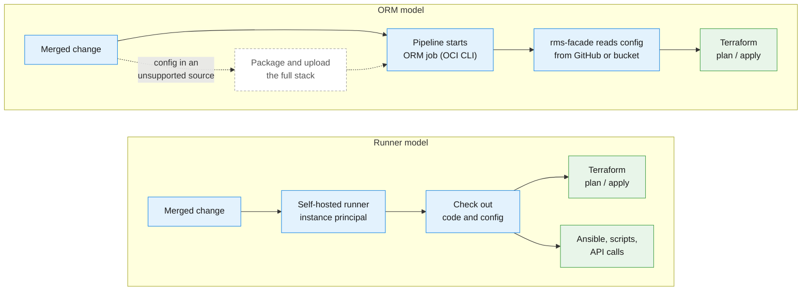

# Runtime: ORM vs. CI/CD Runners

[Back to overview](../README.md)

This page compares the two ways to run the stacks: Oracle Resource Manager (ORM) with the orchestrator `rms-facade`, or CI/CD pipelines that run Terraform CLI on runners you control.

## How each model runs a change

## Comparison

| Criteria | ORM with `rms-facade` | Terraform CLI on runners you control (OCI DevOps, GitHub Actions, GitLab, Azure DevOps) |
|---|---|---|
| State management | Built in, visible in the console, one lock per stack | Object Storage backend. Confirm that your Terraform version and backend support state locking. |
| Cost | No charge for the service | Compute for the runners |
| Maintenance | None | Runner OS patching (can be automated with OCI services) and scaling |
| Drift detection and job history | Built in, per stack | From the pipeline tool, or scheduled `plan` jobs |
| Configuration sources | Private GitHub (including Enterprise), private OCI bucket or plain URLs. Files from a bucket or GitHub must be 1 MB or smaller (see below). | Any Git platform, read from local files |
| Change workflow | A change is a new plan/apply job on the same stack. If the configuration lives in a source ORM cannot read (for example OCI DevOps), the pipeline must package and upload the full stack for every change, even a one-line change. | The runner checks out code and configuration and runs Terraform directly. |
| Authentication | ORM service | Instance principals; no long-lived keys in pipelines |
| Scale | Fine for a moderate number of stacks | Horizontal scale on VMs, or on OKE when there are many runners |
| Tools | **Terraform only** | Terraform, shell scripts, Ansible, API calls |

> [!WARNING]
> **1 MB file limit with `rms-facade`.** When configuration or dependency files are read from an OCI bucket or from GitHub, each file must be 1 MB or smaller. From a bucket, `rms-facade` uses the `oci_objectstorage_object` data source, whose `content_length_limit` defaults to 1 MB, and it does not change that default. From GitHub, the [repository contents API](https://docs.github.com/rest/repos/contents) returns no content for files between 1 and 100 MB unless the raw media type is used, and the `github_repository_file` data source fails ([terraform-provider-github#2836](https://github.com/integrations/terraform-provider-github/issues/2836)). Splitting one configuration family into several files of the same stack does not help, because only the first file that defines the family is used. Split into stacks so that each file stays below 1 MB, or run Terraform CLI with local files, where this limit does not apply.

## Day-2 operations

ORM runs Terraform and nothing else. Most workloads need more after provisioning:

- installing and configuring agents;
- creating default database users and schemas after a database is provisioned;
- hardening virtual machines;
- configuration management with Ansible;
- API calls for tasks that have no Terraform resource.

These tasks run many times during the life of a platform, so they should be automated. Forcing them into Terraform with `null_resource` and `remote-exec` is fragile. Some tasks, such as database patching (including out-of-place patching), are not a good fit for Terraform at all and need another tool or a managed service.

With runners, the same Git workflow and the same pipelines handle provisioning and operations. The [MCCP request lifecycle](../../multi-cloud-control-plane/docs/usage/request-lifecycle.md) shows this in practice: a Day-2 operation (for example starting or stopping an Autonomous Database) is a file in `lifecycle_operations/`, reviewed in a pull request like any Day-1 change and executed by Ansible on a trusted runner after merge.

## Recommendation

- **ORM is a valid starting point.** It is the default delivery path in the Operating Entities repository, with Terraform CLI and customer CI/CD as alternatives. Use one ORM stack per operation, never one stack for everything.
- **Plan the move to runners** when the number of stacks grows, when Day-2 automation beyond Terraform is needed, or when change time slows the teams down. The move adds cost and effort, so tie it to one of these triggers.
- **Separate runner boundaries.** Use different runners and identities for production and non-production, and for foundation and project pipelines. Restrict each runner group to the repositories it serves, and give each runner identity only the compartments and state it needs.
- **Keep runners simple.** One or two VM runners per boundary are enough for most Landing Zones. Runners on Kubernetes only pay off with many runners, because they add Kubernetes version maintenance.
