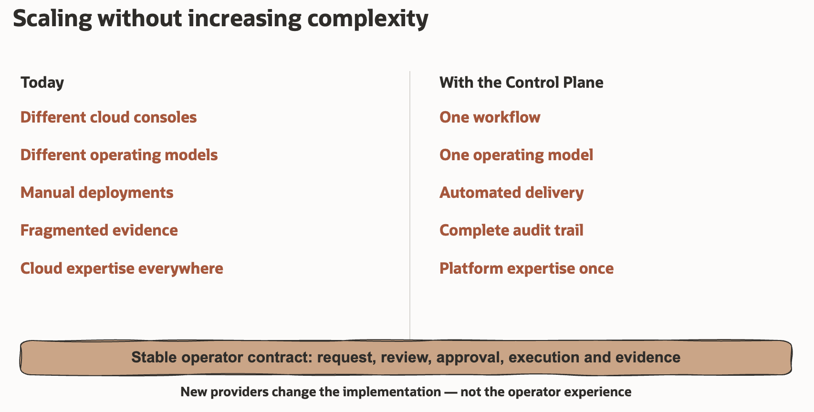

# Multi-Cloud Control Plane

> One governed way to request, review, execute, and record workload changes
> across clouds at scale.

Cloud gives organisations choice. It can also leave each team with a different
console, process, access model, and set of tools. As cloud use grows, teams
spend more time coordinating work and collecting evidence.

The Multi-Cloud Control Plane (MCCP) helps organisations keep that choice
without creating a different way of working for every cloud. It puts their
operating model into practice by connecting people, governance, security, and
automation in one delivery approach.

## WHY — Fragmented cloud operations do not scale

Cloud operations often grow one platform at a time. A process that works in a
small environment becomes difficult to manage when more teams, services, and
providers are added.

This usually leads to:

- slow delivery because teams depend on manual handovers and specialist help
- higher operational risk because controls are applied in different ways
- poor traceability because requests, approvals, and results are spread across
  several systems
- duplicated automation and skills for each provider
- limited self-service because Project Teams need direct cloud access or
  specialist help

The goal is not to add another console. The goal is to give every team the same
safe way to request, review, execute, and record a change.

## AT SCALE — Grow the cloud estate, not the operating complexity

The operating model behind MCCP is designed for organisations that need many
teams to operate large cloud estates without creating a separate process and
specialist operations team for every provider.

It provides:

- **One governed interface** — a single control-plane experience, with three
  ways to submit a request
- **One connected audit trail** — requests, approvals, execution, and results
- **Multiple providers** — the same governed workflow across clouds
- **One Cloud Operations team** — self-service for many Project Teams
- **Operations at scale** — thousands of virtual machines and tens of thousands
  of databases

Standard patterns and trusted automation make this scale possible without
changing the operating model for every new provider, service, or project.

## WHAT — A control plane for governed delivery

A multi-cloud operating model answers four simple questions: Who can request a
change? What can they request? Who approves it? Where is the result recorded?
MCCP turns these rules into a repeatable delivery process.

MCCP uses GitOps, where infrastructure changes follow a reviewed Git workflow.
Project Teams describe a change in a project repository. GitHub records the
request and its review. Trusted automation owned by Cloud Operations then
executes the approved change with the required cloud permissions.

MCCP provides one control-plane experience. Project Teams can submit a request
through the GitHub Interface, the optional Multi-Cloud Plane UI, or the optional
Codex plugin. All three routes create the same pull request and follow the same
controls. They cannot approve, merge, or deploy it.

## HOW — Establish the boundary, then enable self-service

MCCP separates platform control from the work done by Project Teams:

1. **Cloud Operations prepares the cloud foundation.** It sets up the
   environments, network boundaries, identities, and approved patterns before
   MCCP is used. MCCP consumes that foundation; it does not create it.
2. **Cloud Operations hands over a project repository.** The repository records
   the environments, regions, networks, and automation that the Project Team
   may use.
3. **The Project Team prepares a request.** It chooses an approved resource or
   operation and opens a pull request through GitHub, the optional UI, or the
   optional Codex plugin.
4. **People review the planned result.** Reviewers see the proposed change and
   approve it through the organisation's review process in GitHub.
5. **Trusted automation executes the approved change.** Project Teams do not
   receive deployment credentials or need personal cloud accounts.
6. **GitHub keeps the evidence.** The request, review, plan, and execution
   result remain connected to the same change history.

Every supported provider follows the same path:

**Project boundary → Request → Review → Approval → Execution → Evidence**

The technology behind the process can change without changing how teams request
and govern their work.

## What changes for each team

| Team | Experience |
| --- | --- |
| Cloud Operations | Defines approved patterns once, keeps control of identities and execution, and supports more projects through a standard process. |
| Project Teams | Create and operate approved resources without learning every provider tool or receiving cloud deployment credentials. |
| Reviewers and security teams | See the intended change before execution and keep a connected record of the decision and result. |

## REFERENCE IMPLEMENTATION — What the supplied MCCP package provides

The sections above describe the operating model and what it can enable at
scale. The supplied MCCP package is an MVP reference implementation that shows
how to put that model into practice. Its catalog is deliberately small and
focuses on demonstrating the complete governed path from request to evidence.

The package provides four MCCP building blocks:

| Building block | What it provides |
| --- | --- |
| Project repository templates | Separate non-production and production structures for handoff information and Project Team requests. |
| Approved catalogs | Versioned templates and schemas for supported resources and operations. |
| Platform CI | Shared validation, planning, and execution workflows controlled by Cloud Operations. |
| Request interfaces | The GitHub Interface and optional UI or Codex plugin, all producing the same governed pull request. |

Customers connect the package to their GitHub organisation, reviewed cloud
foundations, state storage, trusted runners, and cloud identities with limited
permissions. The [installation guide](docs/installation/README.md) explains how
Cloud Operations connects these prerequisites to the supplied package.

The supplied MVP can create selected resource types in OCI, Azure, and Google
Cloud. It also supports selected OCI lifecycle operations. See
[MVP capabilities](docs/reference/support.md) for the complete set.

The catalog can grow through reviewed provider integrations, resources, and
operations. Each extension must follow the same governance, security, and
approval process before Project Teams can use it.

The scale described earlier is the potential of the operating model. The
supplied MVP demonstrates the governed workflow with a deliberately small
catalog. Customers size their runners and installation according to provider
limits and their intended scale.

## Choose where to start

| Your need | Start here |
| --- | --- |
| Understand how MCCP works | [Architecture](docs/reference/architecture.md) |
| Install MCCP for a GitHub organisation | [Cloud Operations installation](docs/installation/README.md) |
| Use an already prepared project repository | [Project Team guide](docs/usage/README.md) |
| Review the supplied resources and operations | [MVP capabilities](docs/reference/support.md) |
| Review MCCP security controls | [Security](docs/reference/security.md) |

## Related guidance

These companion assets are outside MCCP:

- [OCI Landing Zone](../oci-landing-zone/README.md) can establish a governed OCI
  foundation. MCCP can also use an existing reviewed OCI foundation.
- [Operational Security](../operational-security/README.md) provides broader
  guidance for protecting Git, CI/CD automation, identities, and programmatic
  cloud access.

## License

Copyright (c) 2026 Oracle and/or its affiliates.

Licensed under the Universal Permissive License (UPL), Version 1.0. See
[LICENSE](https://github.com/oracle-devrel/technology-engineering/blob/main/LICENSE)
for more details.
