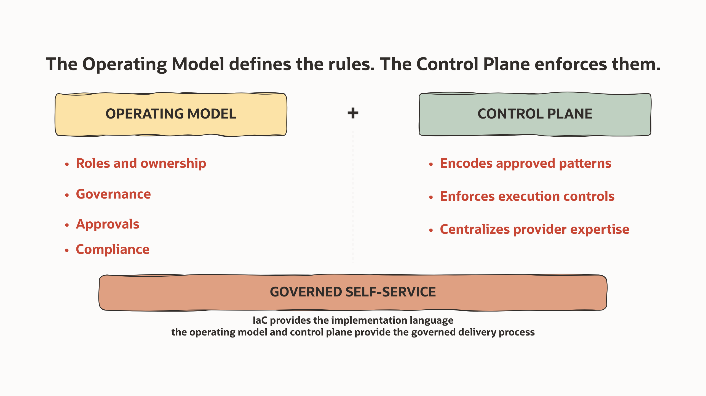
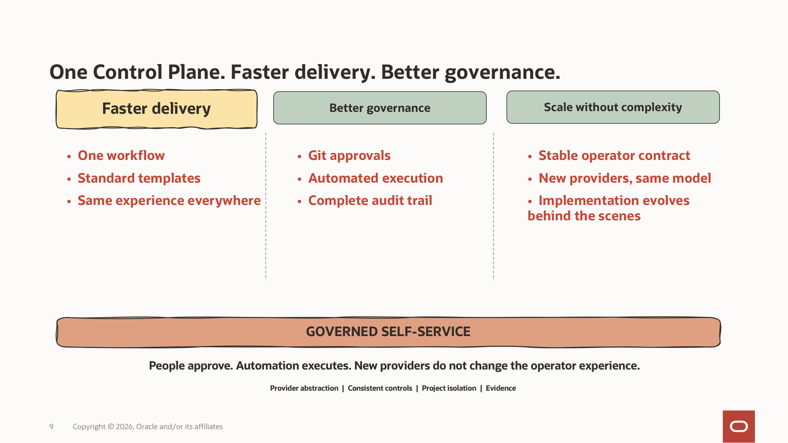

# Multi-Cloud Control Plane

## Introduction

Managing multiple cloud providers, different OCI realms or tenancies, and/or
private clouds at the same time is challenging. Multiple consoles, different
management interfaces and tools, and multiple services with their own options
increase complexity.

Tracking who did what, where, and when is also a challenge. During incidents,
tracing the root cause, gathering evidence, or reverting changes becomes more
difficult.

Multiple interfaces, manual steps, tools, automation, and versions can produce
unpredictable results. This complexity affects team specialisation and the
number of people needed in an organisation. Communication and coordination are
key, and complexity can lead to long delivery times for new projects and
workloads.

The Multi-Cloud Control Plane addresses this by providing a central way to
manage multi-cloud environments. It offers Cloud Operations and Project Teams a
self-service platform with versioned, controlled, automated, and traceable
changes throughout the workload lifecycle.

## What is the Multi-Cloud Control Plane?

The Multi-Cloud Control Plane uses GitOps as an operating model to manage Day 1
and Day 2 workload operations across cloud providers and regions from a common
Git repository. It provides governance so Project Teams can consume
multi-cloud resources in a secure and scalable way.

It combines the organisation's operating model — roles, ownership, required
approvals, and compliance — with the control plane that enforces those approved
delivery paths and abstracts provider complexity.

*The operating model defines the rules; the control plane implements and
enforces the approved delivery path.*

For more information about GitOps and the operating model used by this control
plane, see [GitOps](../gitops/README.md).

## What your teams can manage

This MVP reference blueprint demonstrates the governed delivery model with a
deliberately small set of representative Day 1 resources and OCI Day 2
operations. It is designed to be extended for each customer, not to prescribe
a fixed cloud-service catalogue.

- OCI Autonomous Database, Compute, and project network security groups.
- Private Azure Linux VMs and Oracle Autonomous Database.
- Private Google Cloud Linux VMs and Oracle Autonomous Database.
- OCI Autonomous Database start and stop operations.
- OCI Compute software-agent deployment as an SSH operations example.

These are the supplied and qualified examples. A customer can extend the
blueprint for installation-specific requirements, but each additional resource
or operation must implement and qualify the complete governed chain described
in the [extension model](docs/architecture.md#extension-model) before it is
enabled. Azure and GCP Day 2 operations are not included in this baseline.

## Scope and current limits

The fixed `repository-secrets` profile is qualified for controlled
non-production use on GitHub Free. The supplied production repository uses the
same mechanics, but live production requires a customer security review and an
isolated production runner. GitHub Free relies on restricted roles and recorded
independent review in every environment; use the paid-plan hardening model when
enforceable GitHub approval controls are required. See
[Security](docs/security.md) and
[Final-environment hardening](docs/final-environment-hardening.md).

Azure and GCP qualification uses provider-schema validation and
credential-free mocked Terraform lifecycle tests. No live target-cloud apply
was performed for this publication; do not represent either adapter as
live-cloud certified. See [Qualification](docs/qualification.md) for the
evidence boundary.

## What you get

Installation prepares four private repositories for your organization:

- `platform-ci` provides the approved Terraform and Ansible workflows.
- `nonprod-project-template` provides the standard shared non-production
  project repository structure.
- `prod-project-template` provides the separate production project structure.
- `gitops-templates` provides the approved resource and operation catalog.

GitHub pull requests are the standard path. The optional
[Multi-Cloud Plane UI](components/optional-ui/README.md) and optional
[Project GitOps skill](docs/codex-app.md) prepare the same governed artifacts;
neither is required by a workflow or can deploy resources itself. Both support
the supplied Day 1 requests and OCI ADB start/stop. The UI and direct GitHub
flow also expose the supplied OCI Compute software-agent operation; the Codex
assistant does not offer that operation until it is separately extended and
qualified.

## Choose a request interface

| Role | Starting point | Result |
| --- | --- | --- |
| Cloud Operations | Foundation, OP04, and the reviewed handoff | A handed-off project boundary for OCI, Azure, or GCP workloads. |
| Project Team | **Direct GitHub pull request** | The standard path, always available. |
| Project Team | **Optional Multi-Cloud Plane UI** | A form-led issue, branch, commit, and pull request. |
| Project Team | **Optional Codex assistant** | A confirmation-gated, conversational pull request. |
| Reviewer and trusted runner | GitHub review and merged workflow | Review the plan or check; the runner executes only after merge. |

Every request interface produces the same manifest and pull-request contract.
They do not approve, merge, or deploy infrastructure.

## Get started

You need Git, `jq`, Perl, a private GitHub organization, an OCI Object Storage
state backend, trusted Linux runners, and a completed project-foundation handoff.
Runners need Git, `jq`, `rg`, Python 3.11 or later, outbound access for the
pinned Terraform installer, and the authentication required by each enabled
cloud. The workflow installs Terraform 1.12.1. Use the
[OCI Landing Zone](../oci-landing-zone/README.md) if you need to
establish the OCI foundation first.

Follow the [deployment runbook](docs/deployment.md) to prepare, verify, and pin
the four repositories with standard file, Git, `jq`, and Perl commands. No
custom installation program is required.

Platform administrators: [architecture](docs/architecture.md),
[deployment](docs/deployment.md), and [security](docs/security.md).

Project Teams: [first request](docs/first-request.md),
[day-to-day operations](docs/operations.md), and the
[Multi-Cloud Plane UI](components/optional-ui/README.md) or
[Project GitOps skill](docs/codex-app.md).

This initial-installation package supports the
[shared non-production repository model](docs/shared-nonproduction.md) and the
separate [production repository model](docs/production.md).

## Glossary

- **OP04**: Landing Zone project-foundation phase that creates the project
  compartments, groups, and policies.
- **Cloud Operations / platform team**: the platform administrators who own
  foundation, OP04, runner routing, and the reviewed project handoff.
- **Handoff**: verified foundation references delivered by the platform team;
  executable request intent stays in JSON manifests.
- **Orchestrator**: the pinned Terraform repository that consumes a manifest.
- **Day 1**: provisioning a resource. **Day 2**: a supported operation on an
  existing resource, such as an ADB lifecycle request.
- **Handed-off project**: a repository whose foundation and access conventions
  have been supplied and accepted by the platform team.
- **Multi-Cloud Plane UI / Codex app**: optional request interfaces that prepare
  Git changes and pull requests; neither deploys cloud resources.

## License

Copyright (c) 2026 Oracle and/or its affiliates. Licensed under the Universal
Permissive License, Version 1.0. See [LICENSE](LICENSE).
