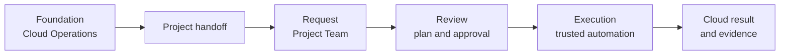
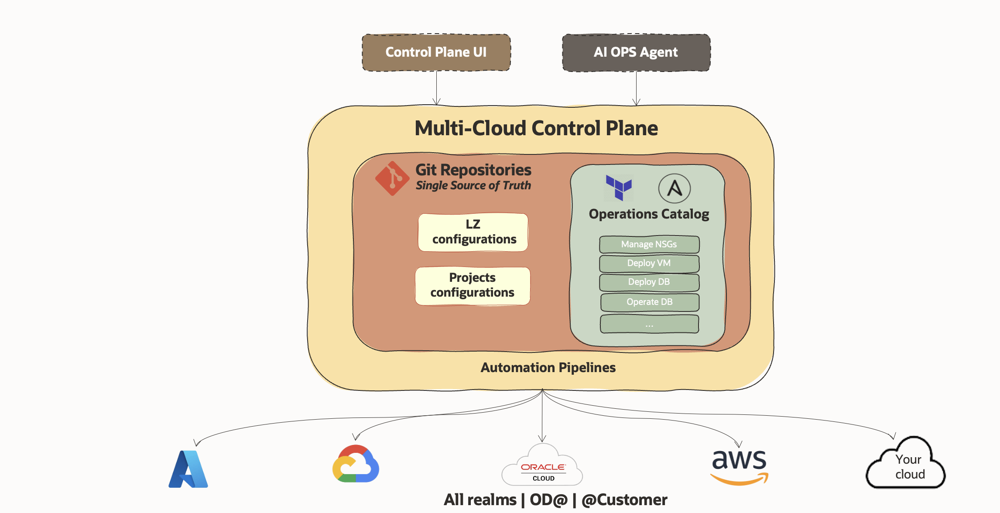
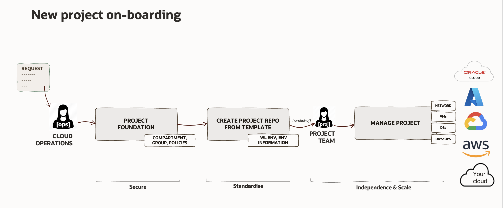

# Multi-Cloud Control Plane <!-- omit in toc -->

> *One governed way to request, review, execute, and record workload changes across clouds at scale.*

## Table of Contents <!-- omit in toc -->

- [What is this asset?](#what-is-this-asset)
- [How to use this asset?](#how-to-use-this-asset)
- [Why we need a Multi-Cloud Control Plane?](#why-we-need-a-multi-cloud-control-plane)
- [What is the Multi-Cloud Control Plane?](#what-is-the-multi-cloud-control-plane)
  - [The Multi-Cloud Operating Model.](#the-multi-cloud-operating-model)
    - [Who owns what](#who-owns-what)
    - [How a request moves](#how-a-request-moves)
- [How it works](#how-it-works)
  - [Onboarding a project](#onboarding-a-project)
  - [What the implementation provides](#what-the-implementation-provides)
  - [Reference](#reference)
- [Getting Started](#getting-started)
- [Related guidance](#related-guidance)
- [License](#license)

# What is this asset?

The Multi-Cloud Control Plane (MCCP) lets an organisation run Day 1 and Day 2 operations among several clouds without requiring a different way of working for each one. It connects people, governance, security, and automation into a single delivery path: a team proposes a change, a person approves it, and trusted automation executes it.

# How to use this asset?

Follow the following guidance and instructions.

# Why we need a Multi-Cloud Control Plane?

Fragmented cloud operations do not scale. Cloud operations usually grow one platform at a time. A process that works in a small environment becomes hard to manage once more teams, services, and providers are added.

Managing multi-cloud environments present difficult challenges as:

* Different consoles and management interfaces.
* Multiple services and endless options.
* Distributed traceability.
* Several tools, automations, manual steps and managing versioning.
* Leads to having big teams, requiring specialization.
* Increased delivery times, coordination between teams and delays on approvals.
* A challenging Operational Security.

This leads to a ***limited scalability***, ***high operational risk*** and experience a ***poor control***.

Each cloud adds another interface, another process, and another set of specialist skills, so work and evidence fragment. Delivery slows, operational risk rises, and control weakens as the estate grows.

The goal is not another console. It is to give every team the same safe way to request, review, execute, and record a change.

# What is the Multi-Cloud Control Plane?

The Multi-Cloud Control Plane is the response that satisfy the management of multiple clouds. It is composed of the different components:

* The Multi-Cloud Common Operating Model.
* Different User Interfaces managing the Git single-source of truth.
* Operations Catalogue.
* Automation pipelines implementing the changes.

## The Multi-Cloud Operating Model.

A multi-cloud operating model answers four questions: who can request a change, what they can request, who approves it, and where the result is recorded. MCCP turns those rules into a repeatable delivery pattern.

The operating model defines the rules — roles and ownership, approved boundaries, governance, approvals, and compliance. The control plane enforces
them by giving teams one controlled way to request, review, execute, and record changes. Teams work independently, but only inside a safe operating space established once by Cloud Operations.

The model does not depend on any one tool or cloud. The technology behind it can change without redefining how work is governed.

### Who owns what

| Responsibility | Owner |
| --- | --- |
| Cloud foundation, identities, networks, and runner hosts | Cloud Operations |
| Approved resource and operation catalog | Cloud Operations |
| Project boundary and the environment handoff that defines it | Cloud Operations |
| Workload requests inside the handed-off boundary | Project Team |
| Review and approval of each request | A reviewer who is not the author |
| Cloud deployment credentials | Trusted runner identities, never a Project Team |
| Execution of an approved change | Trusted automation, only after merge |
| Extending the catalog with a new resource or operation | Cloud Operations, through the extension model |

Project Teams never hold cloud deployment credentials and never execute changes themselves. That separation is the point of the model, not a limitation of the implementation.

### How a request moves

Day 1 provisioning and Day 2 operations are two kinds of request on this one path, not two automation systems. Day 1 creates, changes, or removes desired infrastructure. Day 2 runs a supported operation against a resource that already exists, such as starting or stopping an Autonomous Database.

# How it works

This repository is a reference implementation of the operating model above. It connects project boundaries, an approved catalog, trusted automation, and request interfaces into one governed delivery path. The implementation can evolve; the operating model and the operator experience stay the same.

Request interfaces prepare a change; Git preserves the approved intent and the evidence; the catalog defines what is supported; and trusted automation delivers the approved change to the chosen cloud. Every interface creates the same pull request and none of them can approve, merge, or deploy it.

This is the target control-plane architecture, so its labels are generic: the diagram's **Control Plane UI** is the optional Multi-Cloud Control Plane UI, and its **AI Ops Agent** is the optional Codex plugin. The cloud icons show where the model can
extend, not the currently qualified integrations — see [current capabilities](docs/reference/support.md). Every request still reaches the cloud through the pull request and review shown above.

## Onboarding a project

Cloud Operations creates the foundation and the safe boundary. A standard repository captures the approved project context and is handed to the Project Team, which then manages its approved workloads and operations. MCCP consumes the foundation rather than creating it.

## What the implementation provides

| Building block | What it provides |
| --- | --- |
| **Project boundaries** | Separate non-production and production repositories that define the handed-off scope for each Project Team. |
| **Approved catalog** | Versioned resource and operation patterns that make self-service predictable. |
| **Trusted automation** | Shared validation, planning, execution, and evidence controlled by Cloud Operations. |
| **Request interfaces** | GitHub, plus an optional UI and an optional Codex plugin, all creating the same governed pull request. |

Cloud Operations connects these to the organisation's reviewed cloud foundations, identities, runners, and state storage. The [installation runbook](docs/installation/installation-runbook.md) covers those prerequisites and the setup steps.

The supplied package deliberately qualifies a small catalog of OCI, Azure, and Google Cloud resource requests plus selected OCI lifecycle operations; see [current capabilities](docs/reference/support.md) for the current scope and its qualification evidence. The catalog grows through reviewed provider integrations, resources, and operations, and each extension follows the same governance, security, and approval process before Project Teams can use it.

## Reference

| Document | Description |
| --- | --- |
| [Architecture](docs/reference/architecture.md) | Explains roles, repositories, execution, and extensions. |
| [Current capabilities](docs/reference/support.md) | Lists the supplied Day 1 resources and Day 2 operations, and the qualification evidence behind them.|
| [Operational Security Controls](docs/reference/security.md) | Get insights of the built-in security controls. |
| [Verify environment secret isolation](docs/reference/verify-secret-isolation.md) | One-time acceptance check before the first workload request. |

# Getting Started

| Step | Start here |
| --- | --- |
| **STEP 1: Install MCCP for a GitHub organisation** | [Cloud Operations installation](docs/installation/installation-runbook.md) |
| **STEP 2: How to onboard projects** | [Project Team guide](docs/usage/README.md) |

# Related guidance

These companion assets are outside MCCP:

- [OCI Landing Zone](../../../landing-zones/README.md) can establish a governed OCI foundation and publishes the project-foundation handoff that MCCP consumes. MCCP can also use an existing reviewed OCI foundation.
- [Operational Security](../operational-security/README.md) provides broader guidance for protecting Git, CI/CD automation, identities, and programmatic cloud access.

# License

Copyright (c) 2026 Oracle and/or its affiliates.

Licensed under the Universal Permissive License (UPL), Version 1.0. See
[LICENSE](https://github.com/oracle-devrel/technology-engineering/blob/main/LICENSE)
for more details.
