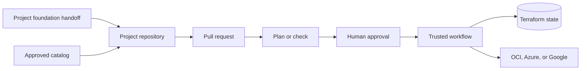

# How the Control Plane works

Project Teams describe the infrastructure they need in approved JSON manifests.
GitHub provides the change record, review, and approval gate. Trusted runners
provide the deployment authority.

Each project has its own repository and separate Terraform state for every cloud
and region. Project repositories contain configuration only. Shared workflows
generate the provider and backend settings, run Terraform or Ansible, and record
the result.

For OCI, onboarding starts with the handoff created after Landing Zone OP04. The
Control Plane checks the project name, environment, region, compartments,
network references, and source workflow before preparing the project repository.

For Azure and Google, the platform team adds direct foundation references to the same
environment handoff through a reviewed pull request. Workload adapters consume those values
without creating resource groups, projects, IAM, networks, subnets, NSGs, service accounts, ODB
Networks, or ODB Subnets.

Project Teams propose changes. Reviewers approve them. Runner identities hold
the cloud permissions. The optional Codex app assistant can prepare the same
Git changes but cannot deploy resources itself.

The initial MVP may route OCI, Azure, and Google jobs to one OCI-hosted runner with all three
cloud labels. OCI uses Instance Principal, Azure uses runner-local `ARM_*` service-principal
context, and Google uses runner-local Application Default Credentials. The final operating model
places each workload on a native runner in its target cloud without changing project manifests.
