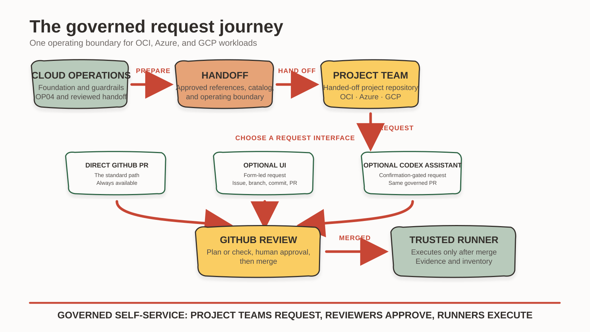
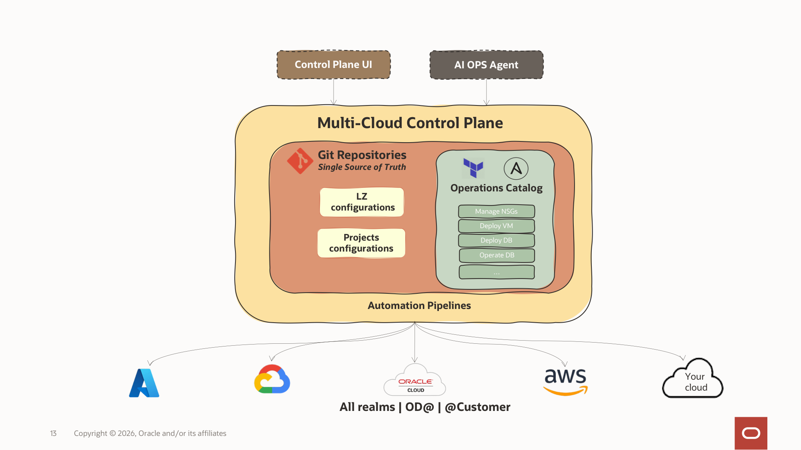
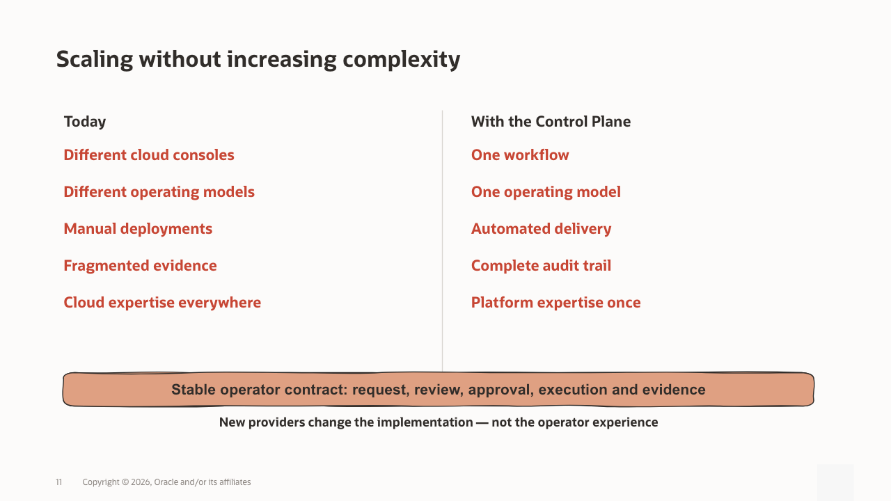

# How the Control Plane works

Project Teams describe the infrastructure they need in approved JSON manifests.
GitHub provides the change record, review, and approval gate. Trusted runners
provide the deployment authority.

## Governed request journey

## Control-plane components

The diagram includes examples of extensible cloud targets. Only the documented
V2 baseline is supplied and qualified by this publication.

Each project has its own repository and separate Terraform state for every
cloud, environment, and region. Project repositories contain configuration
only. Shared workflows generate the provider and backend settings, run
Terraform or Ansible, and record the result.

For OCI, onboarding starts with the handoff created after Landing Zone OP04. The
Control Plane checks the project name, environment, region, compartments,
network references, and source workflow before preparing the project repository.

For Azure and Google Cloud (GCP), the platform team adds direct foundation references to
the same environment handoff through a reviewed pull request. Workload adapters
consume those values without creating resource groups, projects, IAM, networks,
subnets, NSGs, service accounts, ODB Networks, or ODB Subnets.

## Execution and trust boundary

Project Teams propose changes. Reviewers approve them. Runner identities hold
the cloud permissions. The optional Multi-Cloud Plane UI and Codex assistant
can prepare the same Git changes but cannot deploy resources themselves.

The initial installation may route OCI, Azure, and GCP jobs to one OCI-hosted
runner with all three cloud labels. OCI uses Instance Principal, Azure uses
runner-local `ARM_*` service-principal context, and Google uses runner-local
Application Default Credentials. The final operating model places each workload
on a native runner in its target cloud without changing project manifests.

## Extension model

The supplied baseline is a starting point, not an unrestricted service catalog.

*Cloud-specific implementations may evolve; the governed operating contract
remains consistent for Project Teams.*

An installation-specific resource extension is ready only when the platform
team implements and qualifies the complete delivery chain:

- foundation references, permissions, and the reviewed handoff contract;
- an approved catalog template plus schema and semantic validation;
- a cloud adapter or execution implementation and explicit workflow routing;
- isolated state, an appropriately scoped runner identity, and required secrets;
- customer documentation, security review, and qualification evidence.

An operation extension also requires inventory extraction for its targets and a
provider-specific playbook or execution action. Until every required layer is
implemented and qualified, the extension is not part of the installed baseline.

Extensions preserve the same governance boundaries: private-by-default
workloads, one resource in one cloud, environment, and region per pull request,
human approval, least privilege, and separation of duties. Adding a template or
Terraform module alone does not authorize a new request path.
