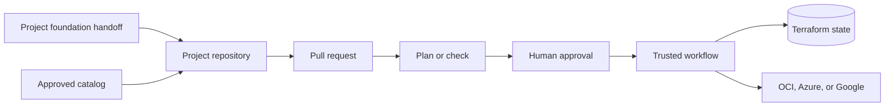

# How the Control Plane works

Project Teams describe the infrastructure they need in approved JSON manifests.
GitHub provides the change record, review, and approval gate. Trusted runners
provide the deployment authority.

Each project has its own repository and separate Terraform state for every cloud
and region. Project repositories contain configuration only. Shared workflows
generate the provider and backend settings, run Terraform or Ansible, and record
the result.

For OCI, onboarding starts with the handoff created after Landing Zone OP04. The
Control Plane checks the project name, environment, region, compartments,
network references, and source workflow before preparing the project repository.

Project Teams propose changes. Reviewers approve them. Runner identities hold
the cloud permissions. The optional UI and Codex app assistant help prepare the
same Git changes but do not deploy resources themselves.
