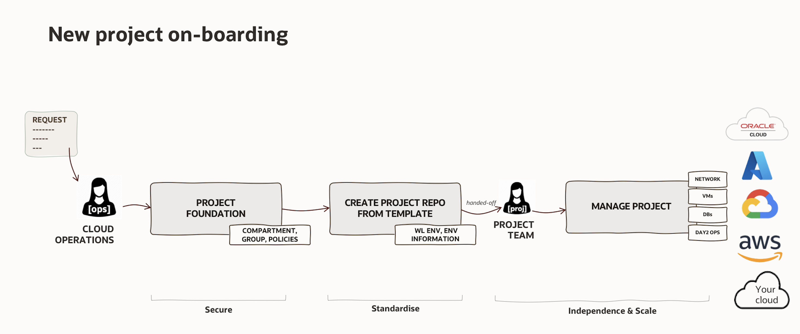

# Deployment runbook

This runbook uses standard file, Git, `jq`, and Perl commands. Run it from a
clean clone of this asset; no custom deployment program is required.

## Installation configuration

Cloud Operations renders one small, non-secret `mccp-installation.json` for
this customer installation. It contains only the customer GitHub organization
and the approved immutable catalog revision. The Optional UI and Project
GitOps skill read it before they prepare a change, so neither can be redirected
to a different organization or mutable catalog.

This is not a project handoff and it does not deploy infrastructure. OCI
foundation handoff remains a separate per-project artifact, validated before a
project repository is created in [Project onboarding](#3-onboard-a-project).

## 1. Prepare the shared repositories

```bash
export STAGE=/tmp/control-plane
export CUSTOMER_ORG=example-enterprise
export PROJECT_STATE_BUCKET=example-project-state
export OCI_ORCHESTRATOR_REF=fcf1d7f02c0b4faa1ff55f1776c396452dd51761
export AZURE_ORCHESTRATOR_REF=mccp-v2.1.0
export GCP_ORCHESTRATOR_REF=mccp-v2.1.0
export PLATFORM_OWNER='@example-platform-owner'
export ENVIRONMENT_OWNER="$PLATFORM_OWNER"
export PROD_OWNER="$PLATFORM_OWNER"

mkdir -p "$STAGE"
cp -R components/platform-ci "$STAGE/platform-ci"
cp -R components/nonprod-project-template "$STAGE/nonprod-project-template"
cp -R components/prod-project-template "$STAGE/prod-project-template"
cp -R components/gitops-templates "$STAGE/gitops-templates"
cp -R components/optional-ui "$STAGE/optional-ui"
cp LICENSE "$STAGE/platform-ci/LICENSE"
cp LICENSE "$STAGE/nonprod-project-template/LICENSE"
cp LICENSE "$STAGE/prod-project-template/LICENSE"
cp LICENSE "$STAGE/gitops-templates/LICENSE"
cp LICENSE "$STAGE/optional-ui/LICENSE"

find "$STAGE" -type d \( -name tests -o -name __pycache__ -o -name .venv \) \
  -prune -exec rm -rf {} +
find "$STAGE" -type f -name mccp-installation.json -delete

find "$STAGE" -type f -exec perl -pi -e \
  's/__CUSTOMER_ORG__/$ENV{CUSTOMER_ORG}/g; s/__STATE_BUCKET__/$ENV{PROJECT_STATE_BUCKET}/g' {} +
```

`STAGE` is a local build directory, not a Git repository or secret store. Use a
directory accessible only to the installation operator, keep credentials and
runtime secrets outside it, and remove it after the published repositories have
been verified.

`PROJECT_STATE_BUCKET` must name a dedicated private Object Storage bucket
with versioning enabled. Do not reuse the OCI Landing Zone foundation-state
bucket. When the Landing Zone asset creates the OP03 runner identity, its
`PROJECT_STATE_BUCKET` repository variable and this value must match exactly.

`OCI_ORCHESTRATOR_REF` pins OCI Landing Zones Orchestrator
[`release-2.1.4`](https://github.com/oci-landing-zones/terraform-oci-modules-orchestrator/tree/release-2.1.4).
The workflow uses that immutable commit.

`AZURE_ORCHESTRATOR_REF` and `GCP_ORCHESTRATOR_REF` name the reviewed
`mccp-v2.1.0` releases published by the external
[Azure adapter](https://github.com/oci-clickops/clickops-orchestrator-azure/tree/mccp-v2.1.0)
and [GCP adapter](https://github.com/oci-clickops/clickops-orchestrator-gcp/tree/mccp-v2.1.0).
Confirm that they resolve to the reviewed adapter commits before installation.

Create Platform CI first. Project workflows and its composite actions use its
protected `main` branch directly:

```bash
git -C "$STAGE/platform-ci" init -b main
git -C "$STAGE/platform-ci" add -A
git -C "$STAGE/platform-ci" -c user.name='Platform Administrator' \
  -c user.email='platform@invalid' commit -m 'Prepare Platform CI'
export PLATFORM_CI_COMMIT=$(git -C "$STAGE/platform-ci" rev-parse HEAD)

find "$STAGE/nonprod-project-template" "$STAGE/prod-project-template" -type f -exec perl -pi -e \
  's/__OCI_ORCHESTRATOR_REF__/$ENV{OCI_ORCHESTRATOR_REF}/g; s/__AZURE_ORCHESTRATOR_REF__/$ENV{AZURE_ORCHESTRATOR_REF}/g; s/__GCP_ORCHESTRATOR_REF__/$ENV{GCP_ORCHESTRATOR_REF}/g' {} +

for repository in nonprod-project-template prod-project-template gitops-templates; do
  git -C "$STAGE/$repository" init -b main
  git -C "$STAGE/$repository" add -A
  git -C "$STAGE/$repository" -c user.name='Platform Administrator' \
    -c user.email='platform@invalid' commit -m "Prepare $repository"
done

export PROJECT_TEMPLATE_REF=$(git -C "$STAGE/nonprod-project-template" rev-parse HEAD)
export PRODUCTION_PROJECT_TEMPLATE_REF=$(git -C "$STAGE/prod-project-template" rev-parse HEAD)
export CATALOGS_REF=$(git -C "$STAGE/gitops-templates" rev-parse HEAD)
cp installation/mccp-installation.template.json "$STAGE/mccp-installation.json"
perl -pi -e \
  's/__CUSTOMER_ORG__/$ENV{CUSTOMER_ORG}/g; s/__CATALOGS_REF__/$ENV{CATALOGS_REF}/g' \
  "$STAGE/mccp-installation.json"
if rg -n '__[A-Z0-9_]+__' "$STAGE/mccp-installation.json"
then
  echo 'Unresolved MCCP installation placeholders remain' >&2
  exit 1
fi
```

Keep the Platform CI `main` branch private and protected. Official GitHub
Actions use their reviewed major release tags.

The MVP uses the fixed `repository-secrets` profile on GitHub Free. Each
enabled environment receives its own repository secret bundle and readiness
variable; the reviewed pull request remains the human deployment gate. See the
[security model](security.md) and the separate
[final-environment hardening guide](final-environment-hardening.md) before
adding paid-plan controls.
Owner values must be existing `@user` or `@organization/team` identities with
write access. An isolated Free-plan acceptance test may use the same owner for
every path; production deployments should use separate environment reviewer
teams.

After pushing the prepared template repositories to the customer organization,
mark both of them as GitHub template repositories. Private templates remain
private; this setting is required before a Cloud Operator can create a project
repository from either template in the GitHub UI or API.

```bash
gh repo edit "$CUSTOMER_ORG/nonprod-project-template" --template
gh repo edit "$CUSTOMER_ORG/prod-project-template" --template
gh api "repos/$CUSTOMER_ORG/nonprod-project-template" --jq '.is_template'
gh api "repos/$CUSTOMER_ORG/prod-project-template" --jq '.is_template'
```

If the Codex app assistant is required, package it with the rendered MCCP
installation configuration and install that staged directory through the
approved plugin process:

```bash
cp -R plugins/project-gitops "$STAGE/project-gitops"
cp "$STAGE/mccp-installation.json" \
  "$STAGE/project-gitops/mccp-installation.json"
jq -e . "$STAGE/project-gitops/mccp-installation.json" >/dev/null
if rg -n '__[A-Z0-9_]+__' "$STAGE/project-gitops/mccp-installation.json"
then
  echo 'Unresolved MCCP installation placeholders remain' >&2
  exit 1
fi
```

The assistant remains optional and is not required by any workflow.

If the Multi-Cloud Plane UI is required, place the same rendered MCCP
installation configuration beside the staged UI runtime. Configure its OAuth
and session secrets outside Git.
The UI can only prepare a GitHub pull request; it uses the same V2 manifests,
review gate, and runner execution path as a direct GitHub request.

```bash
cp "$STAGE/mccp-installation.json" "$STAGE/optional-ui/mccp-installation.json"
test ! -e "$STAGE/optional-ui/.env"
```

Verify that no unresolved release placeholder or local test content is present:

```bash
rg '__CUSTOMER_ORG__|__[A-Z_]+_REF__|__STATE_BUCKET__|__PROJECT_STATE_BUCKET__' "$STAGE"
find "$STAGE" -type d -name tests
```

Both commands must return no output. Create the matching private GitHub
repositories and publish each prepared `main` branch through your approved Git
process. In the published `platform-ci` repository, allow project repositories
to call its reusable workflows at
**Settings → Actions → General → Access → Accessible from repositories in the
organization**.

Record the exact prepared commits, then confirm that every published branch
resolves to those commits:

```bash
printf '%s  %s\n' \
  "$PLATFORM_CI_COMMIT" platform-ci \
  "$PROJECT_TEMPLATE_REF" nonprod-project-template \
  "$PRODUCTION_PROJECT_TEMPLATE_REF" prod-project-template \
  "$CATALOGS_REF" gitops-templates

test "$(git ls-remote "https://github.com/$CUSTOMER_ORG/platform-ci.git" \
  refs/heads/main | cut -f1)" = "$PLATFORM_CI_COMMIT"
test "$(git ls-remote "https://github.com/$CUSTOMER_ORG/nonprod-project-template.git" \
  refs/heads/main | cut -f1)" = "$PROJECT_TEMPLATE_REF"
test "$(git ls-remote "https://github.com/$CUSTOMER_ORG/prod-project-template.git" \
  refs/heads/main | cut -f1)" = "$PRODUCTION_PROJECT_TEMPLATE_REF"
test "$(git ls-remote "https://github.com/$CUSTOMER_ORG/gitops-templates.git" \
  refs/heads/main | cut -f1)" = "$CATALOGS_REF"
```

Each `test` command must return exit code zero. Record the commits as
installation evidence. Runtime foundation, project, and disposable
acceptance repositories are validated by their pinned source commits and
handoff contracts, not by copying tenancy-specific files into this release
bundle.

Keep `platform-ci` private and configure its Actions access for organization
repositories. A private reusable workflow invokes its directly referenced
composite action on `main` with GitHub's scoped temporary token; project
onboarding creates no deploy key or other Platform CI source credential.

## 2. Configure trusted runners

| Setting | Purpose |
|---|---|
| `STATE_NAMESPACE` | OCI Object Storage namespace |
| `STATE_REGION` | Region of the OCI state bucket |
| `OCI_CLI_AUTH=instance_principal` | OCI state and inventory authentication |

Resolver runners need Git, `jq`, and `rg`. Execution runners need Git and
Python 3.11 or later; the workflow installs its pinned Terraform 1.12.1
runtime. On GitHub Free, use an organization runner group restricted to the
selected project repositories. Keep non-production and production in separate
groups, and add a repository only after its handoff is complete. GitHub Team
and Enterprise use the same model; Enterprise can also scope runner groups
across organizations. OCI runner instances must belong to an OCI dynamic group
with policies for Object Storage state access and only the
compartments/services required by their workload. Azure and Google runners need
equivalent workload-scoped identities. Azure additionally needs its approved
service-principal environment values. Google needs `GOOGLE_CREDENTIALS`,
`GOOGLE_APPLICATION_CREDENTIALS`, or Application Default Credentials. Keep
credentials outside Git.

The OP03 add-on creates one SSH key pair for each project-runner boundary. OCI
Compute manifests use only the public key at
`/home/github-runner/.ssh/oci_vm_key.pub`; supported Ansible operations use the
matching private key at `/home/github-runner/.ssh/oci_vm_key`. Project Teams do
not create, store, or rotate this key. Before enabling project automation,
verify as `github-runner` that both files exist and that the private key is
readable only by that service account. Non-production and production runners
must have separate key pairs.

## 3. Onboard an OCI project



Validate the handoff before copying the project template:

The canonical field contract is
`contracts/project-foundation-handoff.schema.json`.

```bash
export HANDOFF=/secure/project-foundation-handoff.json
export HANDOFF_DOCUMENT=/secure/environment_information.md
export PROJECT_OUTPUT=/tmp/project-repository
export PROJECT_REPOSITORY=$(jq -r .target_repository "$HANDOFF")
export PROJECT_TOKEN=${PROJECT_REPOSITORY#nonprod-}
export HANDOFF_ENVIRONMENT=$(jq -r .environment "$HANDOFF")
export HANDOFF_PATH=$(jq -r .handoff_path "$HANDOFF")

jq -e '
  .schema_version == 3 and .repository_layout == "shared-nonprod-v2" and .cloud == "oci" and
  (.environment == "dev" or .environment == "test" or .environment == "uat") and
  .project_slug == .target_repository and
  .handoff_path == ("environments/" + .environment + "/environment_information.md") and
  (.source_commit | test("^[0-9a-f]{40}$")) and
  (.source_run | test("^[0-9]+$")) and
  (.project_root_compartment | type == "string" and length > 0) and
  ([.project_root_compartment, .app_compartment, .database_compartment, .infrastructure_compartment] | unique | length == 4) and
  ((.subnets | keys | sort) == ["app","database","infrastructure","web"])
' "$HANDOFF"
test -f "$HANDOFF_DOCUMENT"

cp -R "$STAGE/nonprod-project-template" "$PROJECT_OUTPUT"
rm -rf "$PROJECT_OUTPUT/.git"
test "$PROJECT_REPOSITORY" = "nonprod-$PROJECT_TOKEN"
test "$HANDOFF_PATH" = \
  "environments/$HANDOFF_ENVIRONMENT/environment_information.md"

# Install the human-readable artifact emitted by the Landing Zone workflow.
cp "$HANDOFF_DOCUMENT" "$PROJECT_OUTPUT/$HANDOFF_PATH"
printf '\n' >> "$PROJECT_OUTPUT/$HANDOFF_PATH"
sed -n '/^## Azure$/,$p' \
  "$STAGE/nonprod-project-template/environments/$HANDOFF_ENVIRONMENT/environment_information.md" \
  >> "$PROJECT_OUTPUT/$HANDOFF_PATH"
rg -Fq '| Project |' "$PROJECT_OUTPUT/$HANDOFF_PATH"
rg -q '^## Azure$' "$PROJECT_OUTPUT/$HANDOFF_PATH"
rg -q '^## GCP$' "$PROJECT_OUTPUT/$HANDOFF_PATH"

# Generic templates deliberately ship CODEOWNERS.template, not active rules.
# Every owner must already exist and have repository write access.
export PLATFORM_OWNERS='@example-platform-admin'
export DEV_OWNERS='@example-dev-approver'
export TEST_OWNERS='@example-test-approver'
export UAT_OWNERS='@example-uat-approver'
cp "$PROJECT_OUTPUT/.github/CODEOWNERS.template" \
  "$PROJECT_OUTPUT/.github/CODEOWNERS"
find "$PROJECT_OUTPUT/.github/CODEOWNERS" -type f -exec perl -pi -e \
  's/__PLATFORM_OWNERS__/$ENV{PLATFORM_OWNERS}/g; s/__DEV_OWNERS__/$ENV{DEV_OWNERS}/g; s/__TEST_OWNERS__/$ENV{TEST_OWNERS}/g; s/__UAT_OWNERS__/$ENV{UAT_OWNERS}/g' {} +
! rg '__[A-Z_]+__' "$PROJECT_OUTPUT/.github/CODEOWNERS"

git -C "$PROJECT_OUTPUT" init -b main
git -C "$PROJECT_OUTPUT" add -A
git -C "$PROJECT_OUTPUT" -c user.name='Platform Administrator' \
  -c user.email='platform@invalid' commit -m 'Prepare project repository'
git -C "$PROJECT_OUTPUT" status --short
```

The final command must return no output. Repeat the verified handoff for each
enabled environment under `environments/<environment>/environment_information.md`.
The appended Azure and Google tables remain unusable until the platform team
fills them through a reviewed handoff pull request; external-cloud validation
rejects blank or mismatched references.
Confirm the project, environment,
region, compartments, VCN, subnets, workflow run, commit, and state keys against
the approved onboarding record. Then create the private project repository,
apply the same protections, and grant the Project Team access.

Keep `.github` and `environments` under platform ownership; only workload
subtrees are delegated. This GitHub Free MVP has a fixed
`repository-secrets` profile, and runner labels are derived from the request
cloud and environment. Record a human review and verify the plan/check on the
current commit before merging; private-repository branch protection and
enforced CODEOWNERS review are not claimed as technical controls in this MVP.

### Required GitHub Free bootstrap before Project GitOps

The Cloud Operator handoff is complete only after the repository administrator
has configured the project repository. Verify that private `platform-ci`
Actions access is available to organization repositories, then for each
handed-off environment set the corresponding
`GITOPS_SECRET_VALUES_<ENVIRONMENT>` repository secret and
`CONTROL_PLANE_READY_<ENVIRONMENT>=true`. Set
`PROJECT_AUTOMATION_READY=true` only after those values, CODEOWNERS, handoff,
runner routing, native Actions access, and procedural review are verified. For a non-production
repository, use the concise [shared non-production
checklist](shared-nonproduction.md); configure only its enabled environments.

Do not submit a Project GitOps workload request or merge one until this
bootstrap and the [repository-secret end-to-end verification](repository-secret-e2e.md)
have completed. This manual step exists because GitHub Free private
repositories cannot access organization secrets or variables.

For the paid-plan enforcement model, apply this branch-protection baseline now,
after rendering valid CODEOWNERS and creating the project repository. It
requires independent approval, CODEOWNERS review, approval of the latest push,
resolved conversations, and administrator enforcement:

```bash
export PROTECTED_REPOSITORY="$CUSTOMER_ORG/$PROJECT_REPOSITORY"
jq -n '{
  required_status_checks: null,
  enforce_admins: true,
  required_pull_request_reviews: {
    dismiss_stale_reviews: true,
    require_code_owner_reviews: true,
    required_approving_review_count: 1,
    require_last_push_approval: true
  },
  restrictions: null,
  allow_force_pushes: false,
  allow_deletions: false,
  required_conversation_resolution: true
}' | gh api --method PUT \
  "repos/$PROTECTED_REPOSITORY/branches/main/protection" --input -
gh api "repos/$PROTECTED_REPOSITORY/branches/main/protection"
```

The baseline deliberately does not register a static status-check context.
Terraform and Ansible use mutually exclusive path-filtered workflows; GitHub
leaves a required path-filtered workflow pending when that workflow is not
selected. Reviewers must verify the successful plan/check attached to the
current commit before merge. An organization that requires technical status
enforcement must first provide one stable, always-running aggregate gate and
then add only that context to `required_status_checks`.

Before handing off the first project, an organization owner must configure
**platform-ci → Settings → Actions → General → Access** as accessible from
repositories in the organization. Verify the native private-workflow access
without reading a credential:

```bash
gh api repos/$CUSTOMER_ORG/platform-ci/actions/permissions/access
```

The response must contain `"access_level":"organization"`. GitHub supplies a
scoped, temporary token to download the directly referenced private composite
action from Platform CI `main`. Do not use a deploy key, a personal access
token, or `secrets: inherit` for Platform CI source access.

Configure repository bundles and readiness variables for enabled environments:

```bash
gh secret set GITOPS_SECRET_VALUES_DEV --repo "$CUSTOMER_ORG/$PROJECT_REPOSITORY"
gh secret set GITOPS_SECRET_VALUES_TEST --repo "$CUSTOMER_ORG/$PROJECT_REPOSITORY"
gh secret set GITOPS_SECRET_VALUES_UAT --repo "$CUSTOMER_ORG/$PROJECT_REPOSITORY"
gh variable set CONTROL_PLANE_READY_DEV --body true --repo "$CUSTOMER_ORG/$PROJECT_REPOSITORY"
gh variable set CONTROL_PLANE_READY_TEST --body true --repo "$CUSTOMER_ORG/$PROJECT_REPOSITORY"
gh variable set CONTROL_PLANE_READY_UAT --body true --repo "$CUSTOMER_ORG/$PROJECT_REPOSITORY"
```

Only configure enabled environments. Every JSON member name must begin with
the corresponding uppercase environment. Never place multiple environments in
one bundle.

Project automation is disabled by default. Only after the rendered MCCP
installation configuration,
CODEOWNERS, handoff files, selected secret and readiness pairs, runner routing,
and manual-review process are verified, enable it once:

```bash
gh variable set PROJECT_AUTOMATION_READY --body true \
  --repo "$CUSTOMER_ORG/$PROJECT_REPOSITORY"
```

Do not set this variable while publishing or rendering a generic template. A
missing or any value other than `true` skips every project workflow before it
can allocate a runner.

## 4. Confirm the installation

Open one non-production manifest pull request. The installation is working when
the expected plan is tied to the current commit, a human review is recorded,
the trusted runner completes the merged change, and state is stored
under the expected project/cloud/environment/region key.

## 5. Verify secret isolation

Complete the mandatory [repository-secret end-to-end verification](repository-secret-e2e.md).
Do not allow workload requests until it passes. The paid-plan enforcement
model is documented separately in [final-environment-hardening.md](final-environment-hardening.md).
