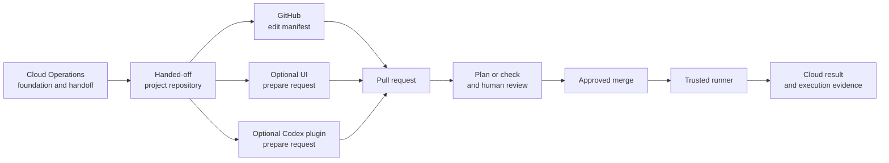

# How the Control Plane works

The [README](../../README.md) explains the operating model. This page focuses on
how the supplied MCCP reference implementation enforces it through repositories,
request flow, trust boundaries, and extensions.

## Governed request flow

All three routes prepare the same proposed manifests and pull requests. A
change is executed only after the organization's human review and approved
merge. The optional UI and Codex plugin do not bypass GitHub review, merge
changes, or hold cloud deployment authority.

The [Reference capabilities](support.md) page lists the resource and operation
patterns supplied with this reference. The operating pattern can extend beyond
that scope when its complete delivery chain is implemented.

## Repository model

The shared control plane contains four private repositories:

- `platform-ci` supplies the reusable workflows and validation actions;
- `gitops-templates` supplies the approved resource and operation catalogs;
- `nonprod-project-template` seeds shared non-production repositories; and
- `prod-project-template` seeds isolated production repositories.

Each project receives one `nonprod-<project>` repository for `dev`, `test`, and
`uat`. A project enabled for production also receives a separate
`prod-<project>` repository for `prod`. Terraform state is isolated by
repository, cloud, environment, and region.

Project repositories contain configuration and handoff metadata, not cloud
credentials. Before a Project Team receives a repository, Cloud Operations
records its approved project name, environments, regions, compartments,
networks, and execution settings in the environment handoff. MCCP validates
requests against that boundary.

For Azure and Google Cloud, the reference patterns consume direct references to
existing foundation resources. See [Reference capabilities](support.md)
for its exact boundaries.

## Execution and trust boundary

Project Teams propose changes and reviewers approve them. Runner identities
hold cloud permissions. Project repository workflows call the private shared
workflow, select the correct state and runner boundary, and record the plan,
check, and execution result in GitHub.

The supplied baseline may route OCI, Azure, and Google Cloud jobs to trusted
OCI-hosted runners carrying the required labels and workload identities.
Non-production and production retain separate runner boundaries.

## Target operating model

The completed MCCP model separates foundation governance from project delivery.
Cloud Operations owns the shared foundation, policy boundary, state, runner
identities, and project handoff. Project Teams request catalog-defined workload
and project-scoped resources within that handoff; they do not hold cloud
deployment credentials.

Each cloud integration can add further project-scoped resource families within
the approved boundary. The catalog, semantic validation, runner permissions,
and documentation define what is available for a specific cloud, environment,
and region. Foundation governance remains with Cloud Operations.

## Extension model

The supplied baseline is a governed starting point, rather than the completed
service catalog. A new resource is available only after Cloud Operations
implements the complete delivery chain:

- foundation references, permissions, and the handoff contract;
- an approved catalog template and semantic validation;
- a cloud orchestrator or execution implementation and explicit workflow routing;
- isolated state, a scoped runner identity, and required secrets; and
- customer documentation, security review, and validation.

A new operation also requires its allowed manifest fields, inventory
extraction for its targets, and a provider-specific playbook or execution
action. Adding only a template or
Terraform module does not authorize a new request path.

Extensions preserve the operating contract: private-by-default workloads, one
cloud/environment/region tuple per pull request, human approval, least
privilege, and separation of duties.

## Next steps

- Follow a request end to end in the [request lifecycle](../usage/request-lifecycle.md).
- Review the [security and trust controls](security.md).
- Prepare organization repositories and runners with the [installation runbook](../installation/installation-runbook.md).
- Check the [Reference capabilities](support.md) before preparing a request.
