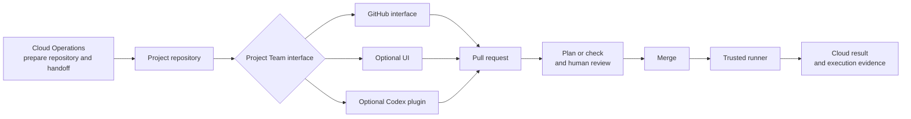

# How the Control Plane works

MCCP is a GitOps control plane. Project Teams describe approved changes in JSON
manifests, GitHub records and reviews those changes, and trusted runners execute
them with cloud identities managed by Cloud Operations.

## Operating model and control plane

Customer governance remains the authority. MCCP encodes it into a repeatable
request, review, and execution process.

## Governed request flow

All three interfaces prepare the same manifests and pull requests. The optional
UI and Codex plugin do not bypass GitHub review, merge changes, or hold cloud
deployment authority.

## Repository model

The shared control plane contains four private repositories:

- `platform-ci` supplies the reusable workflows and validation actions;
- `gitops-templates` supplies the approved resource and operation catalogs;
- `nonprod-project-template` seeds shared non-production repositories; and
- `prod-project-template` seeds isolated production repositories.

Each project receives one `nonprod-<project>` repository for `dev`, `test`, and
`uat`. A project enabled for production also receives a separate
`prod-<project>` repository for `prod`. Terraform state is isolated by
repository, cloud, environment, and region.

Project repositories contain configuration and handoff metadata, not cloud
credentials. Before a Project Team receives a repository, Cloud Operations
records its approved project name, environments, regions, compartments,
networks, and execution settings in the environment handoff. MCCP validates
requests against that boundary.

For Azure and Google Cloud, the handoff contains direct references to existing
foundation resources. The workload adapters consume those references; they do
not create resource groups, projects, IAM, networks, subnets, NSGs, service
accounts, ODB Networks, or ODB Subnets.

## Execution and trust boundary

Project Teams propose changes and reviewers approve them. Runner identities
hold cloud permissions. Project repository workflows call the private shared
workflow, select the correct state and runner boundary, and record the plan,
check, and execution result in GitHub.

The supplied baseline may route OCI, Azure, and Google Cloud jobs to trusted
OCI-hosted runners carrying the required labels and workload identities.
Non-production and production retain separate runner boundaries.

## Extension model

The supplied baseline is a governed starting point, not an unrestricted service
catalog. A new resource is available only after Cloud Operations implements and
qualifies the complete delivery chain:

- foundation references, permissions, and the handoff contract;
- an approved catalog template, schema, and semantic validation;
- a cloud adapter or execution implementation and explicit workflow routing;
- isolated state, a scoped runner identity, and required secrets; and
- customer documentation, security review, and qualification evidence.

A new operation also requires inventory extraction for its targets and a
provider-specific playbook or execution action. Adding only a template or
Terraform module does not authorize a new request path.

Extensions preserve the operating contract: private-by-default workloads, one
cloud/environment/region tuple per pull request, human approval, least
privilege, and separation of duties.
