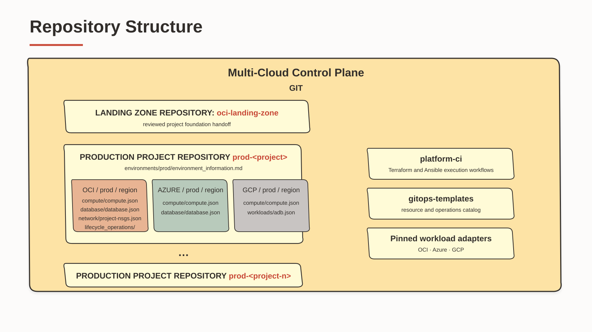

# Production repository model

Production uses a dedicated `prod-<project>` repository created from
`repository-sources/prod-project-template`. Its `production` contract permits only
the `prod` deployment environment and paths of the form
`<cloud>/prod/<region>/...`. Terraform state, runner labels, CODEOWNERS, and
handoffs are separate from `nonprod-<project>`.

The supplied production template supports Day 1 Terraform and the same supplied
OCI Day 2 lifecycle operations as non-production: ADB start/stop and
`deploy-agent`. The production Ansible caller retains the PR check, human merge,
and production runner. Azure and Google Day 2 operations are
not included in this MVP.



Publish the prepared `prod-project-template` repository from the deployment
runbook and create `prod-<project>` from that exact pinned template. Validate
the machine handoff and install the human-readable handoff at
`environments/prod/environment_information.md`. Then configure the fixed MVP
`repository-secrets` profile:

```bash
export HANDOFF=/secure/project-foundation-handoff.json
export HANDOFF_DOCUMENT=/secure/environment_information.md
export STAGE=/tmp/control-plane
export PROJECT_OUTPUT=/tmp/project-repository
export PROJECT_REPOSITORY=$(jq -r .target_repository "$HANDOFF")

jq -e '
  .schema_version == 3 and .repository_layout == "production" and
  .cloud == "oci" and .environment == "prod" and
  .project_slug == .target_repository and
  .handoff_path == "environments/prod/environment_information.md" and
  (.target_repository | test("^prod-[a-z][a-z0-9-]*$")) and
  (.source_commit | test("^[0-9a-f]{40}$")) and
  (.source_run | test("^[0-9]+$")) and
  (.project_root_compartment | type == "string" and length > 0) and
  ([.project_root_compartment, .app_compartment, .database_compartment, .infrastructure_compartment] | unique | length == 4) and
  ((.subnets | keys | sort) == ["app","database","infrastructure","web"])
' "$HANDOFF"
test -f "$HANDOFF_DOCUMENT"
test "$PROJECT_REPOSITORY" = "$(jq -r .project_slug "$HANDOFF")"

# Run these commands in the clone created from prod-project-template.
cp "$HANDOFF_DOCUMENT" \
  "$PROJECT_OUTPUT/environments/prod/environment_information.md"
printf '\n' >> "$PROJECT_OUTPUT/environments/prod/environment_information.md"
sed -n '/^## Azure$/,$p' \
  "$STAGE/prod-project-template/environments/prod/environment_information.md" \
  >> "$PROJECT_OUTPUT/environments/prod/environment_information.md"
rg -Fq '| Project |' \
  "$PROJECT_OUTPUT/environments/prod/environment_information.md"
rg -q '^## Azure$' \
  "$PROJECT_OUTPUT/environments/prod/environment_information.md"
rg -q '^## GCP$' \
  "$PROJECT_OUTPUT/environments/prod/environment_information.md"
```

The JSON artifact is validated as the machine contract. The Markdown artifact
is installed unchanged for the OCI handoff tables, then the Azure and Google
sections from the project template are appended for the later platform-owned
handoff pull request.

The appended Azure and Google tables remain unusable until the platform team
fills them through that reviewed pull request. External-cloud validation rejects
blank or mismatched references.

Render production CODEOWNERS with existing users or teams:

```bash
export PLATFORM_OWNERS='@example-platform-admin'
export PROD_OWNERS='@example-production-approver'
cp "$PROJECT_OUTPUT/.github/CODEOWNERS.template" \
  "$PROJECT_OUTPUT/.github/CODEOWNERS"
perl -pi -e \
  's/__PLATFORM_OWNERS__/$ENV{PLATFORM_OWNERS}/g; s/__PROD_OWNERS__/$ENV{PROD_OWNERS}/g' \
  "$PROJECT_OUTPUT/.github/CODEOWNERS"
! rg '__[A-Z_]+__' "$PROJECT_OUTPUT/.github/CODEOWNERS"
```

Configure the production secret bundle only when a workload manifest contains a
`__PROD_...__` placeholder:

```bash
gh secret set GITOPS_SECRET_VALUES_PROD --repo OWNER/prod-PROJECT
```

The secret command prompts for values; never put literal members on a command
line or in Git. GitHub Free private repositories cannot enforce private branch
protection, CODEOWNERS review, or Environment approval. Restrict repository
administration and direct pushes, record an independent PR review, and verify
the successful production plan on the current commit before merge.

Keep `.github` and `environments` under platform ownership. Every bundle key
and runtime placeholder must begin with `PROD_`. Use an
isolated production organization runner group restricted to selected production
repositories and run the
[repository-secret end-to-end verification](../installation/repository-secret-verification.md) with a
disposable manifest before accepting a real request.

The paid-platform hardening design is documented separately in
[future-hardening.md](../reference/future-hardening.md). It is not a
profile switch in this MVP.

The seeded OCI `lifecycle_operations/` directory is intentionally empty of
requests. Create an operation JSON from the approved catalog when it is needed;
after verifying the outcome, delete that request in a focused pull request.
