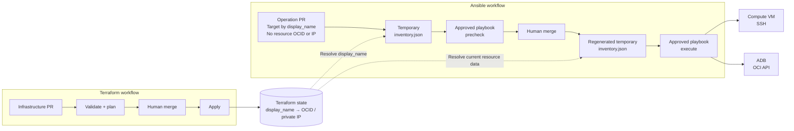

# Platform CI

This Cloud Operations-owned repository contains the reusable GitHub Actions workflows that validate and execute reviewed project changes. Project repositories call its Cloud Operations-controlled `main` branch with GitHub's scoped temporary token; they do not need a deploy key or personal access token for Platform CI.

## Published workflows

| Workflow | Purpose |
| --- | --- |
| `.github/workflows/terraform-shared.yaml` | Validate and plan resource requests on pull requests; after merge, plan again against current state and apply that plan |
| `.github/workflows/ansible-shared.yaml` | Check supported lifecycle requests on pull requests; execute them after merge |

The workflows receive an explicit cloud, environment, region, runner boundary, state location, manifest reference, and pinned orchestrator revision from the project caller.

## Runner contract

Use a trusted Linux self-hosted runner with:

- Git, `jq`, `rg`, and Python 3.11, available as `python3.11`, with `pip`.
- Outbound HTTPS access to install the pinned Terraform 1.12.1 runtime.
- OCI Instance Principal access to the Object Storage state bucket.
- `STATE_NAMESPACE`, `STATE_REGION`, and `OCI_CLI_AUTH=instance_principal` in the runner environment.
- The target-cloud authentication required by each enabled profile.

Azure additionally needs Azure CLI and `ARM_CLIENT_ID`, `ARM_CLIENT_SECRET`, `ARM_TENANT_ID`, and `ARM_SUBSCRIPTION_ID`. Google needs `GOOGLE_CREDENTIALS`, `GOOGLE_APPLICATION_CREDENTIALS`, or Application Default Credentials. Keep all credential values outside Git.

Use separate runner instances, labels, identities, and SSH keys for non-production and production. Runner identities must have access only to the required state bucket, compartments, networks, and target-cloud services.

## Terraform contract

State is isolated by GitHub repository, cloud, environment, and region in OCI Object Storage. The selected region comes from the changed `{cloud}/{environment}/{region}/` path.

Before Terraform runs, JSON files are copied to the runner's temporary directory. Environment-qualified, resource-scoped tokens such as `__DEV_ORDERSADB_ADMIN_PASSWORD__` resolve only from the explicitly passed JSON repository secret bundle. The workflow rejects unqualified, cross-environment, or unresolved tokens and never modifies the checked-out manifest. It masks each decoded value before Terraform can emit it.

Terraform does not deep-merge repeated root variables. Keep each root configuration in one regional file, including OCI project NSGs in `oci/{environment}/{region}/network/project-nsgs.json` and Google ADB-S resources in `gcp/{environment}/{region}/workloads/adb.json`.

## Ansible contract

The workflow accepts only explicitly supported operation types and maps each one to an allow-listed playbook. Project input cannot select a playbook path or Ansible tag. The supplied operations are:

- OCI Autonomous Database start or stop.
- OCI Compute `deploy-agent` over SSH, a worked example that writes an installation marker rather than installing third-party software.

Lifecycle operation manifests belong under `oci/{environment}/{region}/lifecycle_operations/{operation}.json`. Operations must resolve an exact display name in Terraform state. Azure and Google Cloud lifecycle operations are not available.

Each operation playbook uses explicit `precheck`, `apply`, and `verify` phases. Common tasks live under `ansible/playbooks/common/oci/<operation>/`.

### Terraform state as dynamic inventory

Project Teams identify operation targets by their exact `display_name`; they do not need to discover or copy resource OCIDs or private IP addresses into operation manifests. Platform CI resolves the current runtime identifiers from the Terraform state for the selected project, environment, and region. This keeps requests readable, avoids stale resource identifiers, and ensures that Ansible operates only on state-managed resources. This applies to the target resource identity; context fields such as the ADB `database_compartment_id` still come from the approved project handoff.

The operation request supplies the exact display names to target. Platform CI reads the Terraform state for the same project, cloud, environment, and region, selects only matching resources, and writes a temporary Ansible inventory on the trusted runner. The state is read-only, and the generated inventory is not committed to Git.

Compute inventory entries use the state-backed private IP for SSH. ADB inventory entries use the state-backed OCID with the OCI Ansible collection running on the trusted runner. The operation stops before execution when a target cannot be resolved or required connection data is missing.

For `deploy-agent`, the action downloads the Terraform state object at `<bucket>/<owner>/<project>/<cloud>/<environment>/<region>/terraform.tfstate`, indexes `oci_core_instance` resources by exact `display_name`, selects only the manifest targets, and writes `$WORK_TEMP/inventory.json`. Each selected host receives its state-backed private IP and OCID plus the validated agent type and version. The state is read-only and is never modified by Ansible.

The default SSH user is `opc` and the default private key is `/home/github-runner/.ssh/oci_vm_key`. Cloud Operations creates and protects this key for the `github-runner` service account; project repositories never contain it. Override the defaults with `COMPUTE_ANSIBLE_USER` and `COMPUTE_SSH_PRIVATE_KEY_FILE` on the runner. Verify SSH host trust and protect the private key.

## Change boundary

When you add a step, pass values in through `env:` and reference them as shell variables, as `Verify repository security profile` does. Interpolating `${{ }}` into a `run:` body works only while every input stays constrained by the caller, and a new step is exactly where that stops being true. Read files through `sys.argv`, never by interpolating a path into Python source. Assign a command substitution to a variable before parsing it: `read` from an empty here-string succeeds with empty values and swallows the failure.

Do not add a generic task runner, accept executable paths from project input, or enable a resource or operation by changing only this repository. An extension must update the catalog, validation, execution mapping, permissions, and documentation together. See the canonical [extension model](https://github.com/oracle-devrel/technology-engineering/blob/main/oci-and-db/foundation/operations-advisory/multi-cloud-operating-models/multi-cloud-control-plane/docs/reference/architecture.md#extension-model).

## License

Copyright (c) 2026 Oracle and/or its affiliates. Licensed under the Universal Permissive License, Version 1.0. See [LICENSE](LICENSE).
