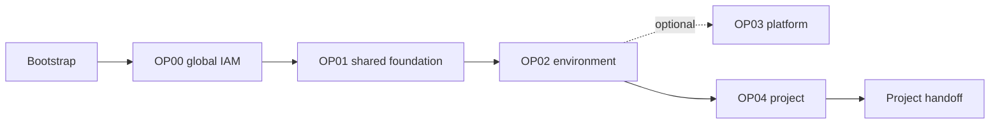

# Architecture and state

The Landing Zone separates tenancy, environment, platform, and project changes
so reviewers can understand the scope of each plan.

## Ownership

Cloud Operators own every phase through OP04. Project Teams receive no tenancy
administrative access and begin work only after OP04. The project handoff is the
only contract with the Multi-Cloud Control Plane; it carries identifiers and
network references, never credentials.

## State isolation

All phases may share one protected OCI Object Storage bucket, but each uses a
separate key:

| Phase | State key |
|---|---|
| Bootstrap | `bootstrap/terraform.tfstate` |
| OP00 | `op00_manage_global_landing_zone/terraform.tfstate` |
| OP01 | `op01_manage_landing_zone_environment/terraform.tfstate` |
| OP02 | `op02_manage_environment/{environment}/terraform.tfstate` |
| OP03 | `op03_manage_platform_gitops/terraform.tfstate` |
| OP04 | `op04_manage_project/{environment}/{project}/terraform.tfstate` |

The workflows obtain the bucket, namespace, and region from GitHub repository
variables. After Bootstrap, OCI providers and state access use the runner's
Instance Principal identity.

## Change path

Pull requests validate and plan; an approved merge to `main` applies. Workflows
clone the approved OCI orchestrator at its pinned commit and pass the JSON files
from the selected phase as Terraform variable files.

Because phases depend on earlier outputs, deploy them in order for a new
tenancy. Later maintenance remains isolated to the phase that owns the changed
resource.
