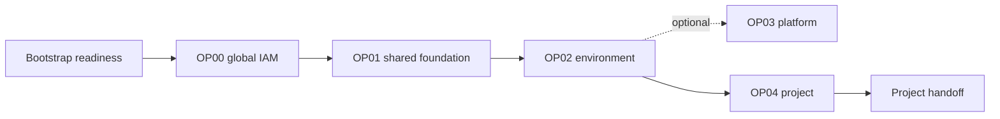

# Architecture and state

The Landing Zone separates tenancy, environment, platform, and project changes
so reviewers can understand the scope of each plan.

## Ownership

Cloud Operators own every phase through OP04. Project Teams receive no tenancy
administrative access and begin work only after OP04. The project handoff is the
only contract with the Multi-Cloud Control Plane; it carries identifiers and
network references, never credentials.

## State isolation

All phases may share one protected OCI Object Storage bucket, but each uses a
separate key:

The OP03 runner uses a different private, versioned bucket for project
workload state. Its IAM policy must not authorize the foundation-state bucket.

| Phase | State key |
|---|---|
| OP00 | `op00_manage_global_landing_zone/terraform.tfstate` |
| OP01 | `op01_manage_landing_zone_environment/terraform.tfstate` |
| OP02 | `op02_manage_environment/{environment}/terraform.tfstate` |
| OP03 | `op03_manage_platform_gitops/terraform.tfstate` |
| OP04 | `op04_manage_project/{environment}/{project}/terraform.tfstate` |

The workflows obtain the bucket, namespace, and region from GitHub repository
variables. OCI providers and state access use the private foundation runner's
Instance Principal identity. Bootstrap readiness is a read-only workflow and
has no Terraform state.

## Official blueprint boundary

OE `v3.1.0` owns the hierarchy, naming, and standard IAM definitions. The local
Jsonnet adapter projects its output into the OP00–OP04 state boundaries and
adds only the MCCP runner policies that OE does not provide. It emits no OSMS
service statement; OS Management Hub access uses separately scoped policies.

OE `v3.1.0` also emits a child-specific Security Zone for the shared network
compartment in addition to the parent CIS zone. OCI prohibits a platform
resource in the parent zone from using a subnet in that child zone. Until the
upstream generator places dependent resources under one common zone, the
protected adapter omits only the shared-network child target. Shared network
and platform resources therefore inherit the same CIS Level 1 zone from
`CMP-LANDINGZONE-KEY`; the environment-level zone remains unchanged.

The delegated project compartment is a different MCCP ownership boundary. OP04
creates it below the environment's `PROJECTS` compartment. Its generated,
reviewable `project-security-zone-exception.json` declaration identifies the
child and inherited environment zone for the protected post-apply workflow to
reconcile. It removes only that project child from inherited Security Zone
enforcement. The foundation, environment, shared network, and platform zones
remain enforced. OCI retains a standard Cloud Guard target for the removed
delegated project compartment, while the Project Team's governed pull-request
workflow can manage the approved project NSG lifecycle, including deletion.
This is an explicit MCCP adapter behavior; OE `v3.1.0` does not model the
project exception.

OE `v3.1.0` derives an example Bastion SSH source by adding host offset `123`
to the Hub management subnet. OCI Bastion assigns its private endpoint
dynamically, so that example is not an executable access contract. The
protected adapter removes the example when
`platform_bastion_private_endpoint_cidr` is `null` and otherwise replaces it
with the exact OCI-assigned `/32`. No broader management-subnet SSH source is
accepted.

The adapter derives every DRG route-distribution statement key from its owning
distribution. This preserves the Hub E routes while satisfying the official
networking module's globally unique flattened-statement key contract.

The OE model creates one project compartment under the environment's
`PROJECTS` compartment. Application, database, and infrastructure values in the
handoff are logical role aliases and contain the same project
compartment OCID. The application, database, and infrastructure *subnets*
remain distinct because they are part of the official project-network model.
The MCCP runner extension grants project NSG management in that exact project
compartment. It does not grant NSG management across the shared environment
network compartment; the project manifest combines the handed-off project
compartment OCID with the handed-off shared VCN OCID.

The adapter attaches the project-specific GitOps policy inside the exact
project compartment, alongside the human administrator policy created by OE.
The policy and project therefore share one OP04 lifecycle boundary. Retiring
one project cannot alter a sibling project's policy reference. The shared
network and security GitOps policies remain attached to the environment
compartment because their statements target the environment's shared
`NETWORK` and `SECURITY` child compartments. Each policy still grants access
only to its named target.

Creating or deleting a project NSG also changes its shared VCN. The network
GitOps policy therefore adds OCI's narrowly conditioned `manage vcns` grant
only for `CreateNetworkSecurityGroup` and `DeleteNetworkSecurityGroup` in the
environment network compartment. The existing `use virtual-network-family`
grant remains the read/use boundary for other VCN operations.

## Change path

Pull requests validate and plan; an approved merge to `main` applies. Workflows
clone the approved OCI orchestrator at its pinned commit and pass the JSON files
from the selected phase as Terraform variable files.

Because phases depend on earlier outputs, deploy them in order for a new
tenancy. Later maintenance remains isolated to the phase that owns the changed
resource. A downstream phase reads the exact Orchestrator-generated dependency
JSON content recorded in protected upstream Terraform state
(`compartments_output.json`, `network_output.json`, and similar) and passes the
resulting file paths through a temporary `.tfvars.json` file. The temporary
file only binds official Orchestrator dependency variables to JSON files; it
does not define resources or replace the Orchestrator.
