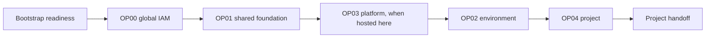

# Architecture and state

The Landing Zone separates tenancy, environment, platform, and project changes
so reviewers can understand the scope of each plan.

## Ownership

Cloud Operators own every phase through OP04. Project Teams receive no tenancy
administrative access and begin work only after OP04. The project handoff is the
only contract with the Multi-Cloud Control Plane; it carries identifiers and
network references, never credentials.

## Runner and identity isolation

This architecture uses two separate compute instances, not two runners on one
VM. Each instance has its own OCI Instance Principal and belongs to a different
dynamic group.

| Boundary | Foundation runner | Project runner |
|---|---|---|
| Creation | Manual, in the bootstrap procedure | OP03 infrastructure stage |
| OCI identity | Exact-instance foundation dynamic group | `dg-mccp-platform-runner`, restricted to the exact OP03 instance |
| GitHub use | Foundation repository, operated by Cloud Operators | Only repositories selected in the project runner group after handoff |
| State boundary | Private foundation-state bucket; OP00–OP04 isolated by state key | Separate private project-state bucket for project workload state |
| OCI authority | Approved Landing Zone operations through OP04 | Fixed environment-scoped Compute, ADB, and project-NSG actions only |

The Project Team never receives the foundation runner, its Instance Principal,
the foundation-state bucket, or a tenancy-administrative policy. Project code
can invoke only the APIs allowed to the Project runner's Instance Principal;
changing a project workflow cannot expand that environment-level OCI IAM
boundary. The project handoff contains the selected project compartment and
network references needed within that boundary, not access to foundation state
or Landing Zone control.

The MVP deliberately uses one Project runner identity for the selected
repositories. Its fixed policies cover the environment's `PROJECTS` subtree,
so GitHub repository selection does not create OCI isolation between projects
using that identity. This is sufficient to separate Project Teams from
foundation administration. A requirement for project-to-project OCI isolation
needs a separately designed runner identity and policy boundary per project or
trust domain; it is outside the current MVP scope.

## State isolation

All phases may share one protected OCI Object Storage bucket, but each uses a
separate key:

The OP03 runner uses a different private, versioned bucket for project
workload state. Its IAM policy must not authorize the foundation-state bucket.

| Phase | State key |
|---|---|
| OP00 | `op00_manage_global_landing_zone/terraform.tfstate` |
| OP01 | `op01_manage_landing_zone_environment/terraform.tfstate` |
| OP02 | `op02_manage_environment/{environment}/terraform.tfstate` |
| OP03 | `op03_manage_platform_gitops/terraform.tfstate` |
| OP04 | `op04_manage_project/{environment}/{project}/terraform.tfstate` |

The workflows obtain the bucket, namespace, and region from GitHub repository
variables. OCI providers and state access use the private foundation runner's
Instance Principal identity. Bootstrap readiness is a read-only workflow and
has no Terraform state.

## Official blueprint boundary

The reviewed OCI Landing Zone Operating Entities `master` revision owns the
hierarchy, naming, standard IAM definitions, and TBAC add-on semantics. The
local Jsonnet adapter parameterizes the official TBAC example for the project
catalogue, projects it into OP00–OP04 state boundaries, and adds only the MCCP
runner policies that OE does not provide. It emits no OSMS service statement;
OS Management Hub access uses separately scoped policies.

For this MVP, the protected adapter retains only OE's root CIS Level 1 Security
Zone target. It deliberately does not emit OE's shared-network or
environment-level targets. Those extra recipes prevent Network Security Group
deletion, which makes a project-managed NSG lifecycle and project retirement
impossible. The root recipe keeps the basic CIS Level 1 restrictions while
allowing Terraform to create, update, and delete project NSGs.

The delegated project compartment is a different MCCP ownership boundary. OP04
creates it below the environment's `PROJECTS` compartment. No project-specific
Security Zone or Cloud Guard operation is added in this MVP. A stronger
project-level Security Zone model is deferred until its full NSG lifecycle is
tested end to end.

The reviewed OE `master` revision derives an example Bastion SSH source by adding host offset `123`
to the Hub management subnet. OCI Bastion assigns its private endpoint
dynamically, so that example is not an executable access contract. The
protected adapter removes the example when
`platform_bastion_private_endpoint_cidr` is `null` and otherwise replaces it
with the exact OCI-assigned `/32`. No broader management-subnet SSH source is
accepted.

The adapter derives every DRG route-distribution statement key from its owning
distribution. This preserves the Hub E routes while satisfying the official
networking module's globally unique flattened-statement key contract.

The official TBAC model creates a project root below the environment's
`PROJECTS` compartment with Application, Database, and Infrastructure children.
Human groups and target compartments use the `tn-lzp-proj-role` defined tags;
the generic official TBAC policies compare principal-group and target-compartment
tags. The schema-3 handoff exposes four distinct OCIDs: the root plus the three
workload targets. Compute uses Application, ADB uses Database, and NSGs use
Infrastructure. The MCCP runner extension remains a narrow dynamic-group
exception and does not grant a human TBAC role.

OP02 creates one fixed set of three GitOps runner policies for each
environment: the `PROJECTS` subtree, shared `NETWORK`, and shared `SECURITY`.
They cover only the MVP workload contracts—Compute, ADB, and project NSGs—and
are not repeated for every project. The runner is a dynamic group rather than
a human TBAC role; human access remains governed by the official TBAC
policies. The environment-wide runner scope is intentional for this MVP.

Creating or deleting a project NSG also changes its shared VCN. The network
GitOps policy therefore adds OCI's narrowly conditioned `manage vcns` grant
only for `CreateNetworkSecurityGroup` and `DeleteNetworkSecurityGroup` in the
environment network compartment. The existing `use virtual-network-family`
grant remains the read/use boundary for other VCN operations.

## Change path

Pull requests validate and plan; an approved merge to `main` applies. Workflows
clone the approved OCI orchestrator at its pinned commit and pass the JSON files
from the selected phase as Terraform variable files.

Because phases depend on earlier outputs, deploy them in order for a new
tenancy. Later maintenance remains isolated to the phase that owns the changed
resource. A downstream phase reads the exact Orchestrator-generated dependency
JSON content recorded in protected upstream Terraform state
(`compartments_output.json`, `network_output.json`, and similar) and passes the
resulting file paths through a temporary `.tfvars.json` file. The temporary
file only binds official Orchestrator dependency variables to JSON files; it
does not define resources or replace the Orchestrator.
