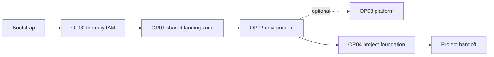

# How the foundation works

Your OCI foundation is established in ordered phases. Each phase has its own
Terraform state and pull-request workflow, which limits the scope of a change
and makes approvals easier to understand.

- **Bootstrap** creates the permanent runner network, compute, and trust. Its
  first run uses a temporary trusted execution host and a pre-created state
  bucket.
- **OP00** configures tenancy-wide groups and policies.
- **OP01** creates the shared landing-zone structure and network.
- **OP02** creates an environment such as production or development.
- **OP03** creates the control-plane platform foundation.
- **OP04** creates one project's compartments, groups, and policies.

After OP04, the workflow produces `project-foundation-handoff.json` for the
Control Plane and `enviroment_information.md` for your teams. The Landing Zone
does not create the project repository or deploy project workloads.

Cloud Operators control the foundation. Project Teams work only in their
handed-off project repositories, where the normal pull-request approval process
continues to apply.
