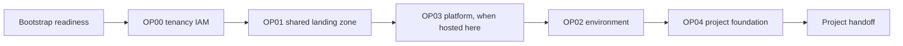

# How the foundation works

Your OCI foundation is established in ordered phases. Each phase has its own
Terraform state and pull-request workflow, which limits the scope of a change
and makes approvals easier to understand.

- **Bootstrap readiness** verifies the administrator-created private foundation
  runner, its Instance Principal identity, and the private state bucket. It
  creates no OCI resource and has no Terraform state.
- **OP00** configures tenancy-wide groups and policies.
- **OP01** creates the shared landing-zone structure and network.
- **OP03** creates the control-plane platform foundation. When it is hosted in
  this tenancy, complete its infrastructure and identity stages before OP02.
- **OP02** creates an environment such as production or development.
- **OP04** creates the official OCI TBAC project root, role groups, and child
  compartments.

Each environment has a `PROJECTS` container. The official TBAC hierarchy places
one project root below it with Application, Database, and Infrastructure child
compartments. The Control Plane schema-3 handoff contains distinct OCIDs for
each workload target.

After OP04, the workflow produces `project-foundation-handoff.json` for the
Control Plane and `environment_information.md` for your teams. The Landing Zone
does not create the project repository or deploy project workloads.

OP04 foundation identities are environment-specific: `dev-<project>`,
`test-<project>`, `uat-<project>`, and `prod-<project>`. Dev, test, and UAT
handoffs target the shared `nonprod-<project>` repository; production targets
`prod-<project>`. Each handoff is written to
`environments/<environment>/environment_information.md`.

Cloud Operators control the foundation. Project Teams work only in their
handed-off project repositories, where the normal pull-request approval process
continues to apply.
