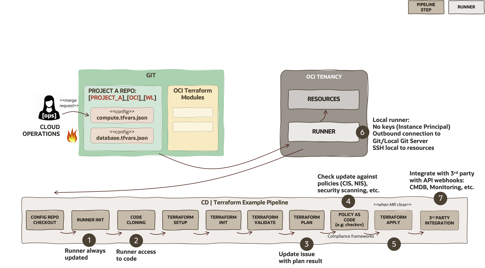

# CI/CD Security <!-- omit in toc --> 

Reviewed: 2026-09-04

# What is this asset?

This asset describes CI/CD security practices for GitOps multi-cloud automation pipelines.

# How to use this asset?

Use this guide to assess pipeline stages, runner controls, review evidence, and third-party integration practices before operating a workload lifecycle pipeline.

Continuing with the Operational Security considerations from Git Security, the next step in the runtime automation is to check the different CI/CD security best practices to adopt for Landing Zone and workloads lifecycle management in GitOps Multi-Cloud Operationg Model. These practices falls in the DevSecOps and implies to follow some best practices on the CI/CD platform side, that might be dependant on the vendors solution.

In the below diagram, we can see an example of how an automation pipelines is fired after a Cloud Operator commit the changes into the Git repository and the merge request is created. The example pipeline (for Terraform) has the following steps (or stages):

1) **Configuration repository checkout:** The runner gathers the configuration repository contents locally, so it can work with the Terraform variables.
   
2) **Runner initialisation (optional):** Depending on the kind of runner deployment (VM, container), it might be needed to check the status of required packages to run the pipeline. In containerised platforms, the runner image is maintained in a registry, that can be versioned and doesn't need to perform this step.
   
3) **Code cloning:** This is where the code meets the configurations. The code module(s) is referenced in the pipeline definition and usually uses an orchestrator (as the OCI Landing Zone Orchestrator module), that acts as a wrapper or orchestration layer for multiple depends modules (Landing Zone or Workloads modules). This avoids that operator can add new, uncontrolled code. 
   
4) **Terraform setup:** Terraform binary and environment variables are setup in this step. Even if you want to use latest version or a specific one.
   
5) **Terraform init:** Terraform modules are initialised, being downloaded from the Internet or other controlled private repositories by the IaC Developers. It also initialises the Terraform State file backend and providers.
   
6) **Terraform validate:** Performs a syntactical validation and internal consistency of the configuration variables regardless of their existing state.
   
7) **Terraform plan:** Reads the Terraform state file from the backend and the given configuration and calculate the dependency graph and needed changes to perform against the existing or non-existing configuration. Gives the summary of changes, modifications and possible resources to destroy. This step should include the output in the Git issue to document the planned changes to be reviewed by the reviewer.
   
8) **(Optional) Policy-as-code:** Policy-as-code can be used against many different security frameworks (CIS, NIST), perform static security checks or check against custom or existing policies libraries. Typical example is to run checkov tool to perform checks as: validate risks on Security List/Network Security Groups, check public buckets, IAM policies or against the mentioned security frameworks. This is a preemptive control.
   
9) **Terraform Apply:** After the merge request is approved and closed, the pipeline executes again but this time on the apply is performed and changes are implemented.
    
10) **3rd Party Integrations:** It is common to use web hooks based on APIs to integrate with other tools as CMDB updates, Monitoring integration, etc.

A more detailed description of these best practices:

1) **Runner always updated:** Forcing use of latest versions of dependant software may reduce the existence of security vulnerabilities and bugs.
   
2) **Runner access to code:** Avoid the access or modification by Cloud Operators to code. Runners are the only ones which can checkout Terraform modules repositories. Cloud Operations only has access to specs, not to read/write/modify existing or new code.
   
3) **Update the issue with plan result:** After running successfully/unsuccessful plan, the output is updated into the Git issue to the changes can be tracked and the reviewer can review carefully the modifications filed by the operator to approve/reject the change. Their comments are also added to the merge request review.
   
4) **Use of Policy-as-code:** use it as preemptive controls on configurations against security frameworks or company custom policies to avoid violations before are implemented.
   
5) **Terraform apply output attached to the Git issue:** Runtime errors can appeared, being the output documented on the Git issue. New issues, git revert or new merge request, even manual intervention can be needed and properly documented in the Git history for audit purposes.
   
6) **Use of local tenancy runners:** improve the performance and overall security, avoiding to use API signing keys and reducing the network ports to be opened against automation platforms central instances. It also allows to connect locally in the tenancy to end workloads for Procedural IaC (as SSH, SQLnet, etc.).
   
7) **3rd party integration for IT systems reconciliation:** Many platforms support REST APIs webhook integrations (as ServiceNow), where it unlocks the power to interact with these platforms with another IT systems and workflows. Typical examples are CMDBs, ITSM, Monitoring platforms, etc.

# License

Copyright (c) 2026 Oracle and/or its affiliates.

Licensed under the Universal Permissive License (UPL), Version 1.0.

See [LICENSE](https://github.com/oracle-devrel/technology-engineering/blob/main/LICENSE) for more details.
