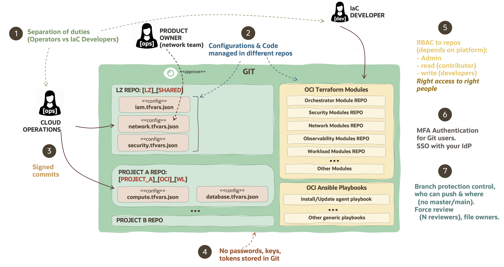

# Git Security 

Reviewed: 2026-09-04

## What is this asset?

This asset describes Git platform security practices for separating duties, protecting code and configuration, and maintaining an auditable GitOps operating model.

## How to use this asset?

Use the recommended practices in this guide when defining Git repository access, branch-protection, authentication, and review controls.

One of the considerations within Operational Security is to align the end-to-end for people, tools and processes involved in the design and implementation of the Landing Zone and workloads lifecycle management in GitOps Multi-Cloud Operating Model. These practices falls in the DevSecOps and implies to follow some best practices on the Git platform side, that might be dependant on the vendors to offer more or less capabilities over the Git open standard.

In the below diagram, we can see an overview of the different Git Security Best Practices we recommend:

A more detailed description of these best practices:

1) **Separation of duties (Cloud Operators vs IaC Developers):** This best practice stands for the correct separation of duties between operators and developers, where operators don't have access to change the code, deploy new code as the IaC Developers can't access to infrastructure configurations. Every role focuses in their duties, splitting responsibilities and avoiding that one single person or role can mixed both things, which would imply in code forks, creation of backdoors, or developers having access to production workloads.
   
2) **Configuration & Code managed in different repos:** mixing code and configuration must be avoided so the code can be tracked and controlled. Having multiple copies avoid to track software versions correctly, increasing the operational risk of bugs and security backdoors appearance. In the same way, IaC Developers don't have access to configurations so they may change or simple to know production information.

3) **Signed commits:** to control commit integrity, it is advised to used signed commits that can allow to sign the interaction with repos with verified authorship and enabling an immutable history (or controlled rewriting).
   
4) **No passwords, keys or tokens stored in Git:** always that is possible, key-less authentication methods should be used so keys can't be lost or not properly rotated, reducing the possibility to propagate the keys. Also applies to certificates or any authentication method that can be used to access any OCI resource.
   
5) **Role-Based Access Controls must be used for Git repositories:** Git security access is quite simple, basically is read, read/write or admin rights over repo. Depending on the platform additional roles can be configured giving access to project's variables, automation, and repo management capabilities. At its finest, independent, smaller repositories can be created to just a need-access approach is followed with the specific teams, avoiding to grant access to large amount of users.
   
6) **Git users forced to use MFA Authentication and SSO:** Multi-Factor authentication for secondary devices or SSO integration with federated Identity Providers are encouraged to allow the users management lifecycle process to block users that left the company. Strict control over tokens capabilities should be established also on only access need permissions to the repository features.
   
7) **Require branch protection and N reviewers:** These features must be enabled to avoid that a single individual can just commit or merge changes in the main branch (production), requiring that different reviewers must review and approve the changes before they're merged. This reduces individuals making unauthorised changes or malicious changes. The force to protect main/master branch also forces to track better the changes history on Git. This can also be enhanced with some proprietary options, as the use os CODEOWNERS (present in GitHub/GitLab), that forces to certain files to be reviewed by specific team(s) members, as it could be in those customers where a Product Owner might want to do the review for their domain area of expertise (typical examples are Security/Networking admins).

# License

Copyright (c) 2026 Oracle and/or its affiliates.

Licensed under the Universal Permissive License (UPL), Version 1.0.

See [LICENSE](https://github.com/oracle-devrel/technology-engineering/blob/main/LICENSE) for more details.
