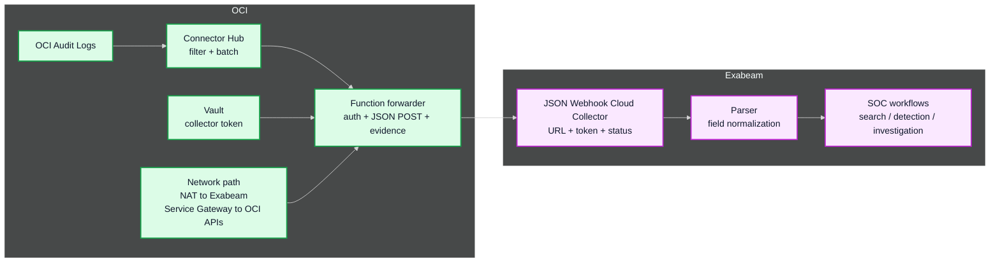
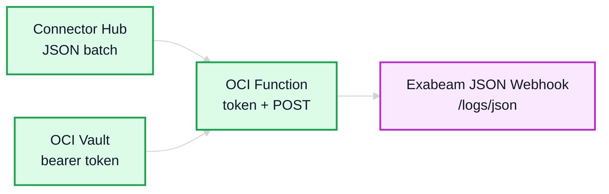

# **Integrations for OCI Audit Logs and Exabeam Webhook**

&nbsp;

This asset describes a reference integration for forwarding **Oracle Cloud Infrastructure (OCI) Audit Logs** to **Exabeam** through an OCI Function. It can be used to extend day-two operations by making OCI control-plane and identity activity available for Exabeam search, detection, investigation, and SOC workflows.

The integration connects **OCI Audit Logs**, **Connector Hub**, **OCI Functions**, **OCI Vault**, and the **Exabeam JSON Webhook Cloud Collector**.

&nbsp;

## 1. What Is This Integration

OCI Audit Logs provide control-plane and identity activity for OCI resources. Exabeam can use this activity to support investigation and detection scenarios, but there is no out-of-the-box OCI integration that sends OCI Audit Logs directly to the Exabeam JSON Webhook Cloud Collector.

This reference integration provides a deployable OCI Function sample that receives audit log batches from Connector Hub and forwards them to the Exabeam JSON webhook endpoint.

The integration is designed with the following principles:

1. **Operational**. It focuses on day-two log forwarding and SOC integration.
2. **Minimal**. The Function forwards the audit payload without parsing, enriching, or classifying events.
3. **Secure by default**. The Exabeam collector token should be stored in OCI Vault for deployed environments.
4. **Configurable**. The Exabeam collector URL and token source are provided through Function configuration.
5. **Reusable**. The sample can be adapted to the target tenancy, network, IAM, Vault, logging, and Exabeam collector requirements.

&nbsp;

## 2. Architecture

The diagram below presents the high-level flow from OCI Audit Logs to Exabeam.

```text
OCI Audit / OCI Logging -> Connector Hub -> OCI Function -> Exabeam JSON Webhook Cloud Collector
```



&nbsp;

## 3. How It Works

The Function acts as the delivery adapter between Connector Hub and Exabeam.

It performs the following activities:

1. Receives a JSON list from Connector Hub.
2. Reads the Exabeam bearer token from OCI Vault, or from `BEARER_TOKEN` for local invocation.
3. Sends the payload to the Exabeam JSON webhook endpoint with bearer authentication.
4. Logs delivery evidence without logging credentials.



&nbsp;

## 4. Design Considerations

The following considerations should be reviewed before using this integration in a target environment.

| AREA | RECOMMENDATION |
|---|---|
| Collector type | Use an Exabeam Webhook Cloud Collector configured for JSON. |
| Endpoint | Configure the Function with the collector-generated URL for the Exabeam region. |
| Token | Use the collector-generated token with bearer authentication. |
| Payload shape | Use a JSON single object or JSON array. Connector Hub sends audit log batches as a JSON list. |
| Delivery behavior | Connector Hub delivery is at least once. Duplicates are possible. |
| Batch sizing | Connector Hub sends a JSON list up to 6 MB per Function invocation. The Exabeam webhook limit is higher, but the OCI Function target limit is the effective sizing boundary. |
| Ordering | Do not require strict end-to-end ordering. |
| Validation | Validate HTTP success, Exabeam collector health, and parser/search results in Exabeam. |

&nbsp;

## 5. Security Considerations

The following controls are recommended for deployed environments.

| CONTROL | RECOMMENDATION |
|---|---|
| Secret storage | Store the Exabeam collector token in OCI Vault. |
| Function configuration | Do not store bearer tokens or other sensitive configuration in Git. |
| Function logs | Log delivery metadata only. Do not log bearer tokens, Vault secret OCIDs, or response bodies that may contain sensitive content. |
| Network path | If the Function runs in a private subnet, use NAT Gateway for outbound HTTPS to Exabeam and Service Gateway for OCI APIs such as Vault. |
| IAM | Allow Connector Hub to invoke the Function, and allow the Function resource principal to read only the required Vault secret. |
| Rotation | Define token rotation and Function token-cache behavior before production use. |

&nbsp;

## 6. How To Start

Use the following steps to adapt the sample to your environment.

| STEP | ACTIVITY | DESCRIPTION |
|:---:|---|---|
| 1 | **Create the collector** | Create an Exabeam Webhook Cloud Collector configured for JSON and capture the collector-generated endpoint. |
| 2 | **Store the token** | Store the collector bearer token in OCI Vault for deployed environments. |
| 3 | **Deploy the Function** | Use the deployable sample under [`function/`](function/). |
| 4 | **Configure the Function** | Configure `WEBHOOK_URL` and either `VAULT_SECRET_OCID` or `BEARER_TOKEN`. |
| 5 | **Connect Connector Hub** | Configure Connector Hub to send OCI Audit Log batches to the Function. |
| 6 | **Validate delivery** | Validate Function logs, HTTP success, Exabeam collector status, and parser/search output in Exabeam. |

&nbsp;

## 7. Function Sample

This directory includes the deployable Function sample that implements the forwarding path.

| FILE | DESCRIPTION |
|---|---|
| [`function/func.py`](function/func.py) | Function handler, payload reading, token resolution, and Function response. |
| [`function/webhook.py`](function/webhook.py) | Exabeam webhook delivery, retry, gzip, and sanitized logging behavior. |
| [`function/func.yaml`](function/func.yaml) | OCI Functions runtime metadata. |
| [`function/requirements.txt`](function/requirements.txt) | Python dependencies. |
| [`function/README.md`](function/README.md) | Deployment, configuration, test, and troubleshooting guide for the Function sample. |

&nbsp;

# License

Copyright (c) 2026 Oracle and/or its affiliates.

Licensed under the Universal Permissive License (UPL), Version 1.0.

See [LICENSE](https://github.com/oracle-devrel/technology-engineering/blob/main/LICENSE) for more details.
