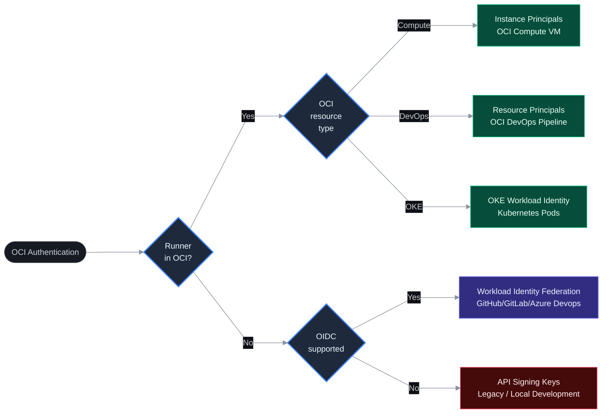

# Programmatic Access to OCI for CI/CD Pipelines

Last reviewed: 2026-05-14

---

## Overview

When a CI/CD pipeline calls OCI APIs it needs to authenticate. The safest way to do this is to avoid storing credentials at all. A key sitting in a secret store can leak through a build log, get committed to a repo by mistake, or expire without anyone noticing.

OCI makes credential-free authentication possible through native identity: the pipeline resource proves who it is using its own OCI identity, with no keys involved. When the runner runs outside OCI, a short-lived token exchange can replace the static key. Static API keys are the last option, used only when nothing else is available.

The sections below help you pick the right approach for your setup. Configuration steps are in the implementation guides linked at the bottom.

## Options

| Method | Where the runner runs | Secrets to manage | Rotation |
| --- | --- | --- | --- |
| **Instance Principals** | OCI Compute VM | None | Automatic |
| **Resource Principals** | OCI DevOps Pipeline or Functions | None | Automatic |
| **OKE Workload Identity** | OKE pod (Enhanced Cluster only) | None | Automatic |
| **Workload Identity Federation** | Any external runner with OIDC | OAuth client only | Automatic |
| **API Signing Keys** | Anywhere | Private key, rotated every 90 days | Manual |

## Best Practices

### Runner inside OCI

Pick the option that matches what runs the pipeline:

| Runner type | Method |
| --- | --- |
| Self-hosted agent on an OCI Compute VM | **Instance Principals** |
| OCI DevOps Build or Deploy Pipeline | **Resource Principals** — already configured inside the pipeline, nothing extra needed |
| Pod on an OKE Enhanced Cluster | **OKE Workload Identity** — scoped to the pod, not the node |

No keys. No rotation process. No secrets in your pipeline configuration.

### Runner outside OCI

If your platform supports OIDC (GitHub Actions, GitLab CI, and most modern CI tools do), use **Workload Identity Federation**. The only thing stored in your CI/CD system is an OAuth `client_id` and `client_secret` that can only be used to exchange tokens, it gives no access to OCI resources on its own.

### When nothing else works

If your tooling does not support OIDC and does not run inside OCI, use **API Signing Keys**. Follow the hardening steps in the implementation guide, they are not optional.

## Security Basics

These apply regardless of which method you use:

- **Scope policies to a compartment.** Never use `manage all-resources in tenancy` for a CI/CD identity.  
- **One identity per pipeline.** Do not share keys or dynamic group rules across unrelated teams or projects.
- **Check the audit logs.** OCI logs every API call with the full principal identity. Filter by principal OCID to confirm only expected actions are happening.
- **No credentials in code.** Keys must not appear in source files, Dockerfiles, or build specs, ever.

## License

Copyright (c) 2026 Oracle and/or its affiliates.  
Licensed under the Universal Permissive License (UPL), Version 1.0.  
See [LICENSE](LICENSE) for more details.  
