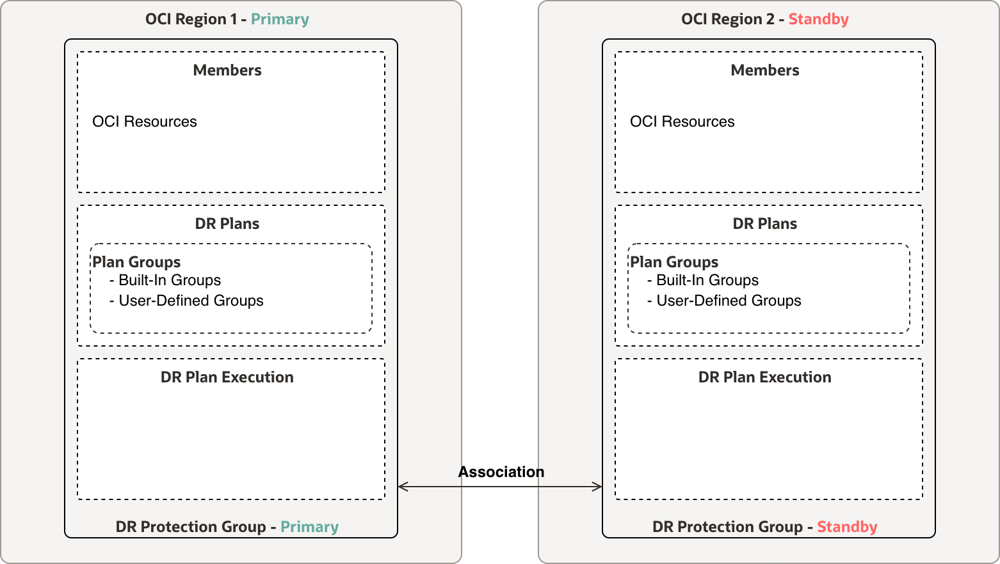
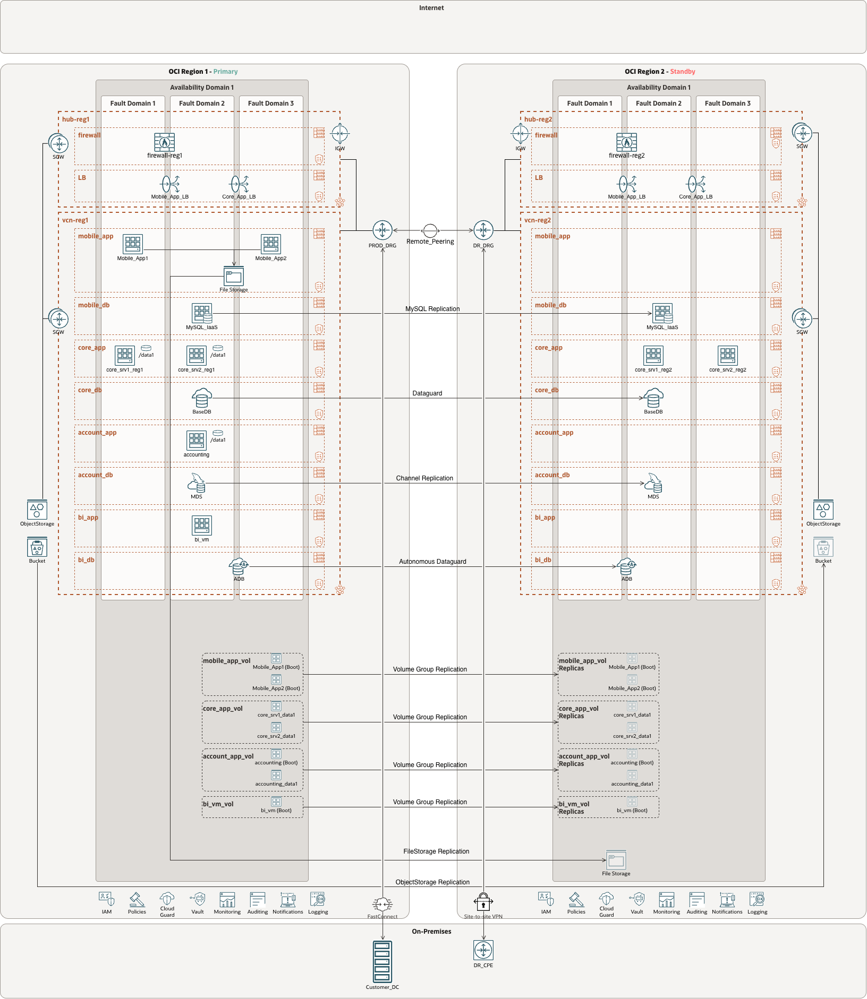
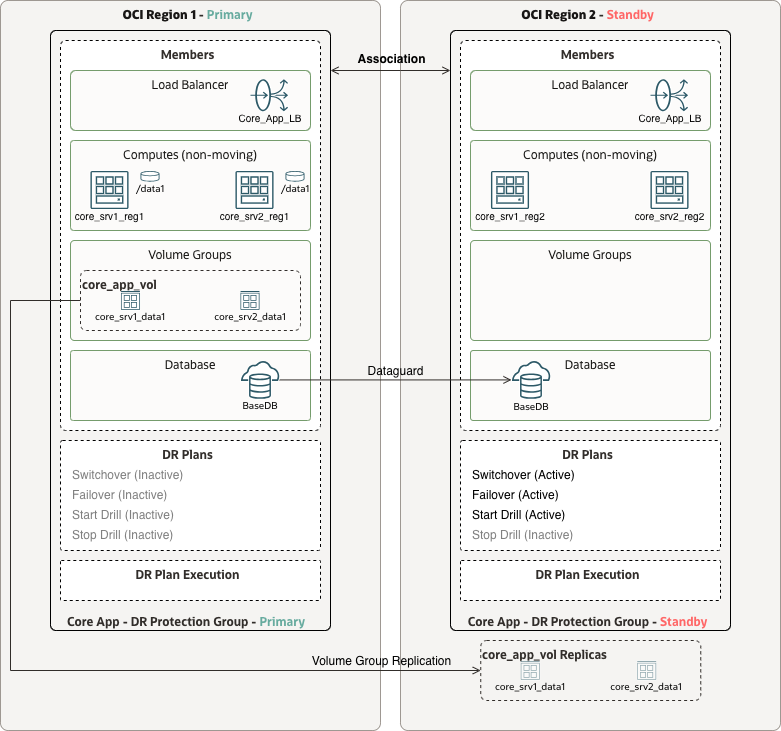
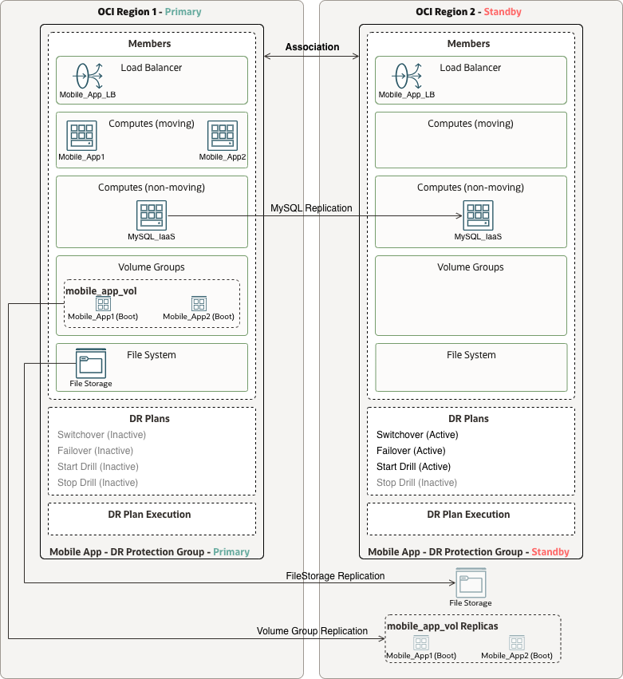
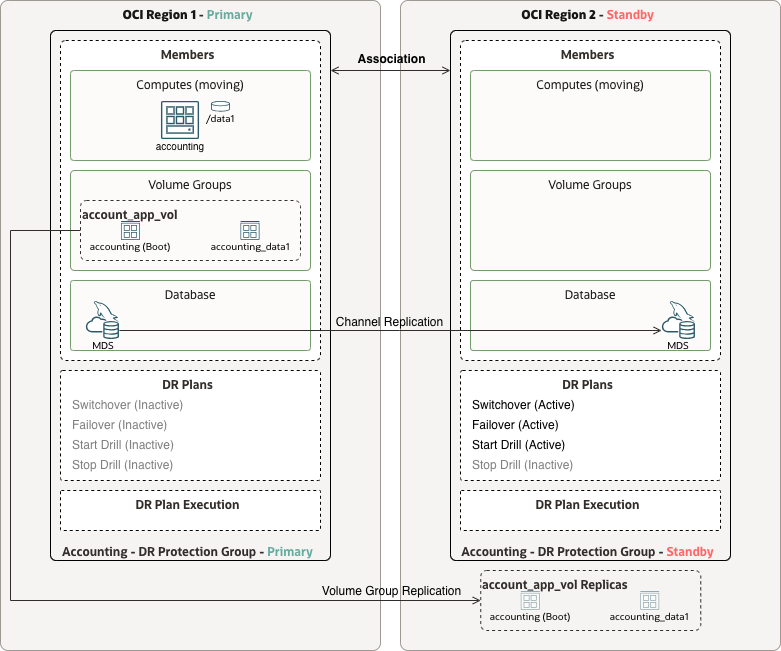
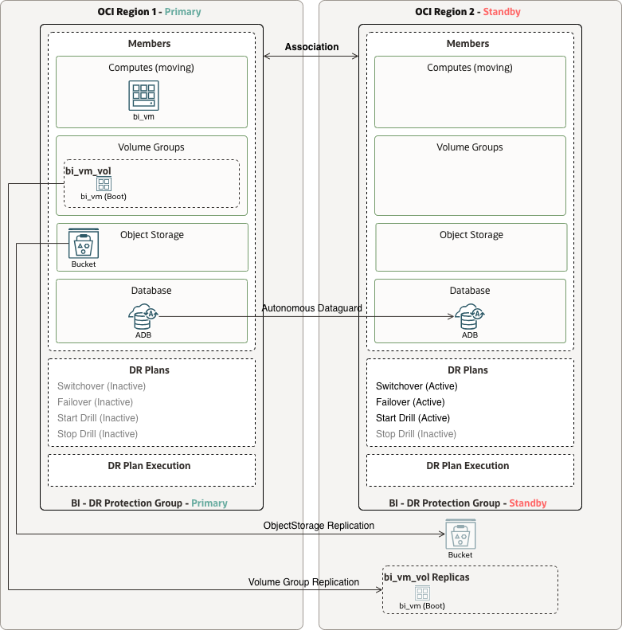
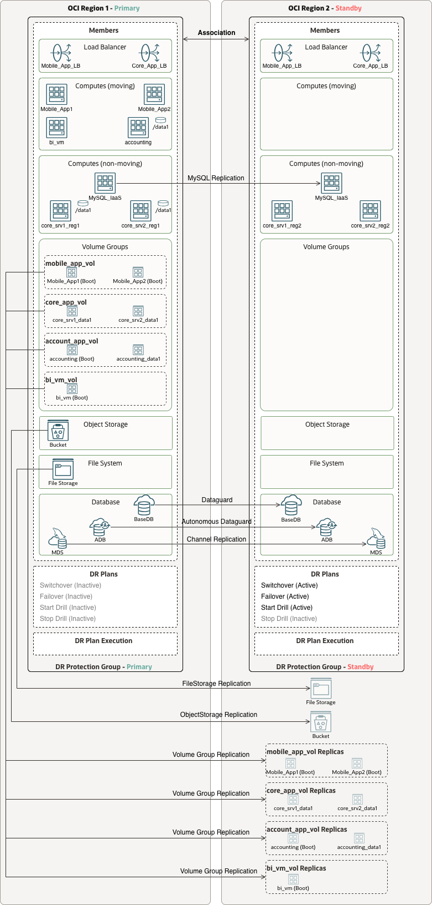

# Designing OCI Full Stack Disaster Recovery

OCI Full Stack Disaster Recovery (FSDR) orchestrates recovery for complete application stacks. It groups dependent OCI resources into DR Protection Groups, manages recovery plans, runs prechecks, and coordinates switchover and failover operations.

Design and configure the underlying replication first. FSDR coordinates database, storage, compute, and application recovery; each service provides its own data protection mechanism.

## Disclaimer

The information, architectures, and examples in this guide are provided for general reference and may not fully suit your specific use case. You assume full responsibility for designing, implementing, testing, and maintaining your disaster recovery solution, including validating that it meets your application requirements and recovery objectives.

## Prerequisites

Prepare the recovery environment before creating FSDR plans:

- **Networking:** configure VCNs, load balancers, routing, and DRG remote peering where private cross-region connectivity is required.
- **Replication:** configure and validate database, volume group, File Storage, Object Storage, and application replication as needed.
- **Compute:** prepare VMs in both regions for non-moving instances. For moving instances, ensure the recovery region has the network and capacity to create the VMs.
- **Application dependencies:** prepare required software, configuration, storage mounts, and service startup procedures.
- **IAM:** configure the [FSDR policies](https://docs.oracle.com/en-us/iaas/disaster-recovery/doc/policies.html) required to manage resources and execute custom steps.

## DR Protection Groups and Plans

A DR Protection Group (DRPG) contains resources that must recover together. Each DRPG is associated with one exclusive peer in a primary/standby relationship. Multiple pairs can protect independent applications across different regional combinations.

| Element | Purpose |
| --- | --- |
| Members | OCI resources belonging to the application stack. |
| DR Plans | Recovery workflows created and executed at the standby DRPG. |
| Plan Groups and Steps | Groups execute sequentially; steps within a group run in parallel. |
| Plan Executions | Track recovery progress and results. |
| Prechecks | Validate plans and resource configuration before recovery. |

DRPG members can include compute instances, volume groups, file systems, Object Storage buckets, databases, OKE clusters, and load balancers. Verify [current member support and prerequisites](https://docs.oracle.com/en-us/iaas/disaster-recovery/doc/how-disaster-recovery-works.html) for the selected services. For the Autonomous Database pattern below, prepare a remote Autonomous Data Guard standby and confirm the applicable deployment requirements.

## Design Guidance

Use a separate DRPG pair for each application with independent ownership, lifecycle, dependencies, or recovery objectives. Combine applications only when they are tightly coupled, have compatible requirements, and must fail over together.

- **RPO** depends on the replication mechanism and its observed lag.
- **RTO** depends on the complete workflow: role transitions, storage activation, compute startup, application recovery, traffic redirection, and validation.

Validate both objectives through recovery exercises. Add user-defined steps for application startup, connection changes, user-managed database recovery, and functional checks. Test custom steps independently before adding them to a plan.

## Recommended DRPG Template

### Pair Configuration

| Property | Primary region | Standby region |
| --- | --- | --- |
| Name | `<app>-drpg-<primary-region>` | `<app>-drpg-<standby-region>` |
| Compartment | `<compartment-name>` | `<compartment-name>` |
| Log bucket | `<primary-log-bucket>` | `<standby-log-bucket>` |
| Initial role | `PRIMARY` | `STANDBY` |
| Peer | Standby DRPG | Primary DRPG |

### Typical Members

| Category | Primary DRPG | Standby DRPG |
| --- | --- | --- |
| Networking | Load Balancer | Standby Load Balancer |
| Networking | Network Load Balancer | Standby Network Load Balancer |
| Compute | Moving compute instances | — |
| Compute | Non-moving compute instances | Pre-created non-moving compute instances |
| Storage | Volume groups with cross-region replication enabled | — |
| Storage | File systems with cross-region replication enabled | — |
| Storage | Object Storage buckets with cross-region replication enabled | — |
| Database | Primary Autonomous Database with remote standby enabled | Standby Autonomous Database |
| Database | Primary Oracle DB System with Data Guard configured | Standby Oracle DB System |
| Database | Primary MySQL HeatWave DB System with channel replication enabled | Replica MySQL HeatWave DB System |
| Containers | Primary OKE cluster(s) | Standby OKE cluster(s) |

This template lists the members for the illustrated cross-region patterns. A dash indicates that no separate standby member is listed in the template; it does not mean that a replication target or recovery resource is unnecessary. Membership depends on the resource type and recovery pattern.

Create switchover and failover plans at the standby DRPG. Add start/stop drill plans where supported and include the custom steps needed for complete application recovery.

## Examples of DR Protection Group Structure

### Physical Architecture

The reference environment contains Core App, Mobile App, Accounting, and BI across two OCI regions. It includes regional load balancers, replicated storage, database peers, and cross-region networking. Application dependencies determine the DRPG boundaries.

### Separate DRPG Pairs for Each Application

Separate pairs allow each application to have its own recovery plans, ownership, objectives, and drill schedule.

This is generally the preferred design for independent applications because it provides better isolation, smaller DR plans, clearer ownership, and more flexible DR testing. It also allows each application to have its own recovery schedule, RTO/RPO objectives, validation steps, and operational runbook.

#### Core App

Core App uses non-moving VMs in both regions, dedicated application-data volumes protected by Volume Group Replication, and Oracle Database with Data Guard. FSDR coordinates the database role transition and attaches recovered data volumes to the standby VMs. Load balancer members can also participate through backend draining and undraining.

#### Mobile App

Mobile App uses moving application VMs, regional load balancers, replicated File Storage, and user-managed MySQL on IaaS. Protect the application VM boot volumes through Volume Group Replication. Add custom MySQL steps to promote the standby database, reconfigure replication, update connections where needed, and validate availability.

#### Accounting

Accounting uses a moving VM with replicated boot and data volumes and OCI MySQL HeatWave with channel replication. FSDR coordinates VM recovery and the database transition through native MySQL DB System member support. Replication must be configured before recovery.

#### BI

BI uses a moving VM, replicated boot volume, Object Storage replication, and Autonomous Database with Autonomous Data Guard. Validate database connectivity, reports, data sources, and access to replicated objects after recovery.

### One DRPG Pair for All Applications

A combined pair provides one recovery workflow for the environment. Use it when all applications share a recovery window and must transition together. Every application in the group participates in the operation, increasing the scope of testing and maintenance.

Avoid this model when applications can be recovered independently. It can increase DR plan complexity, lengthen execution time, and make testing or maintenance more difficult.

## Design and Validation Checklist

- [ ] Define the primary and standby topology.
- [ ] Create and associate DR Protection Groups in both regions.
- [ ] Add all required members.
- [ ] Verify that service-specific replication is configured and healthy.
- [ ] Create DR plans in the standby DR Protection Group.
- [ ] Test custom recovery steps independently before adding them to a plan.
- [ ] Automate end-to-end recovery, including application recovery and validation.
- [ ] Run prechecks regularly. See [Automate Disaster Recovery Plan Validation in OCI Using a Custom Precheck Tool](https://dev.to/amoubarak/automate-disaster-recovery-plan-validation-in-oci-using-a-custom-precheck-tool-1omo).
- [ ] Document dependencies between DR Protection Group members.
- [ ] Configure monitoring and alerts for replication lag.
- [ ] Plan and execute an initial switchover.
- [ ] Create the required DR plans in the former primary region, which becomes the new standby.
- [ ] Schedule regular DR drills; quarterly drills are recommended in the source guidance.
- [ ] Review each drill and document lessons learned.
- [ ] Document RTO and RPO requirements for each application.
- [ ] Review and update DR plans after each infrastructure change.
- [ ] Train the operations team on DR execution procedures.
- [ ] Establish a communication plan for DR events.

# License

Copyright (c) 2026 Oracle and/or its affiliates.

Licensed under the Universal Permissive License (UPL), Version 1.0.

See [LICENSE](https://github.com/oracle-devrel/technology-engineering/blob/main/LICENSE) for more details.