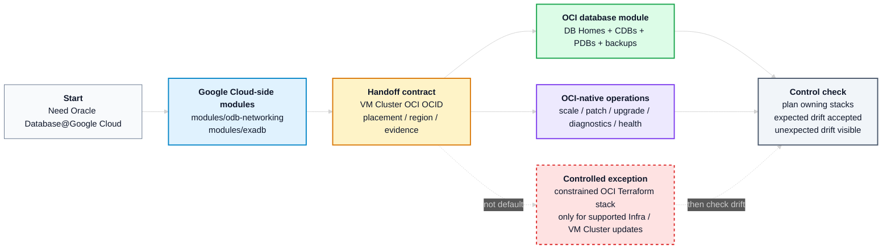

# Operational Best Practices for Oracle Database@Google Cloud

Last reviewed: 2026-05-20

This document does not define the overall operating model. The operating model is GitOps: Git remains the source of truth, changes are reviewed through pull requests, pipelines execute approved changes, and the desired state is applied, validated, or reconciled through the appropriate automation layer.

This document defines the Oracle Database@Google Cloud operational best practices that fit into that GitOps model. It explains control-plane ownership, Terraform state boundaries, Day 1 and Day 2 tool selection, handoff contracts, and drift handling for OD@GCP.

For the implementation runbook, dependency handoff examples, and module wiring patterns, see [OD@GCP Module Handoff Reference](./odgcp-module-handoff-reference.md).

## Table Of Contents

- [Operational Best Practices for Oracle Database@Google Cloud](#operational-best-practices-for-oracle-databasegoogle-cloud)
  - [Table Of Contents](#table-of-contents)
  - [1. Overview](#1-overview)
  - [2. Recommended Workflow](#2-recommended-workflow)
  - [3. Control-Plane Ownership and State Boundaries](#3-control-plane-ownership-and-state-boundaries)
  - [4. Provider Evidence Behind the Ownership Split](#4-provider-evidence-behind-the-ownership-split)
    - [4.1 Evidence Baseline](#41-evidence-baseline)
    - [4.2 Google Provider Position](#42-google-provider-position)
    - [4.3 OCI Provider Position](#43-oci-provider-position)
  - [5. Day 2 Operations, State, And Drift](#5-day-2-operations-state-and-drift)
  - [6. OCI Terraform Exception Path](#6-oci-terraform-exception-path)
  - [7. Module Alignment And Handoff Reference](#7-module-alignment-and-handoff-reference)
- [License](#license)

## 1. Overview

OD@GCP uses two control planes with a clear operational split:

1. Use the Google Cloud-side Terraform module for Day 1 creation and stable ownership of OD@GCP networking, Cloud Exadata Infrastructure, and Cloud VM Cluster.
2. Use OCI-native tools by default for Day 2 operations: scale, patching, upgrades, diagnostics, health checks, and support-guided work.
3. Use the OCI Exadata Database module for the OCI database layer — DB Homes, CDBs, PDBs, and backup configuration — only when that layer must be declarative.
4. Use OCI Terraform for Infrastructure or VM Cluster updates only as a controlled exception, not as a second uncontrolled owner.

The provider evidence behind these rules is in [Section 4](#4-provider-evidence-behind-the-ownership-split).

Scope: Oracle Database@Google Cloud Exadata Infrastructure and VM Clusters created from Google Cloud and operated through OCI.

## 2. Recommended Workflow

The normal execution sequence is:

1. Create OD@GCP networking with the Google Cloud-side networking module.
2. Create Cloud Exadata Infrastructure and Cloud VM Cluster with the Google Cloud-side Exadata module.
3. Handoff the VM Cluster OCI OCID to OCI-native tools and, if needed, to the OCI Exadata Database module.
4. Use OCI-native tooling for Day 2 operations.
5. Run the owning module plans after operational changes so expected drift is accepted and unexpected drift remains visible.

For the concrete dependency maps, wrapper pattern, direct OCID pattern, and post-handoff checks, see [OD@GCP Module Handoff Reference](./odgcp-module-handoff-reference.md).

## 3. Control-Plane Ownership and State Boundaries

Terraform must be split according to lifecycle, ownership, permissions, change windows, and blast radius. This is not a single-stack Terraform lifecycle.

| Area                                | Recommended practice                                                                                                                                                                                                                     |
| ----------------------------------- | ---------------------------------------------------------------------------------------------------------------------------------------------------------------------------------------------------------------------------------------- |
| Infrastructure and VM Cluster Day 1 | Use the Google Cloud-side Terraform module to create ODB Network, ODB Subnets, Cloud Exadata Infrastructure, and Cloud VM Cluster.                                                                                                       |
| Infrastructure and VM Cluster Day 2 | Use OCI-native tools by default for supported scale, patching, upgrade, diagnostics, health checks, and support-guided operations.                                                                                                       |
| Infrastructure and VM Cluster drift | Use narrow `lifecycle.ignore_changes` entries in the Google Cloud-side module for expected OCI-side operational changes. These ignores prevent unwanted replacement attempts; they do not make Google Terraform the Day 2 update engine. |
| DB layer Day 1                      | Use the OCI Exadata Database module, or another approved OCI Terraform module, only when the database layer must be declarative.                                                                                                         |
| DB layer drift                      | Use narrow module-owned `ignore_changes` entries for expected OCI-native, Ansible, patching, password, backup, or node-local changes.                                                                                                    |
| Node-local DBA operations           | Use `dbaascli` only for supported tasks inside the Exadata VM or DB node. It does not own the VM Cluster, Google Cloud-side resources, or Terraform state.                                                                               |
| CLI / API operations                | Use for bootstrap, discovery, evidence capture, and supported operational changes. Any mutation that affects Terraform-managed resources must be reconciled through the owning state, drift contract, or documented exception path.      |

In short: Terraform owns the declarative layers where it fits best; OCI-native tooling owns the operational lifecycle.

## 4. Provider Evidence Behind the Ownership Split

This section explains why the ownership split is recommended. The Google provider is well suited for Day 1 creation and long-lived ownership of the Google Cloud-side OD@GCP resources, but it should not be positioned as the Day 2 operations engine for Exadata Infrastructure or Cloud VM Cluster changes. The provider tables below show why.

### 4.1 Evidence Baseline

| Evidence item               |                Version / baseline | Notes                                                                                                                                              |
| --------------------------- | --------------------------------: | -------------------------------------------------------------------------------------------------------------------------------------------------- |
| HashiCorp Google provider   |                          `7.33.0` | Provider schema reviewed for OD@GCP resources. Revalidate if using a newer provider.                                                               |
| Oracle OCI provider         |                          `8.15.0` | Provider schema reviewed for Exadata Infrastructure, Cloud VM Cluster, DB Home, Database, and PDB resources. Revalidate if using a newer provider. |

### 4.2 Google Provider Position

The Google provider is the Day 1 creation and ownership provider for the Google Cloud-side OD@GCP resources. After deployment, use it mainly for state ownership, outputs, lifecycle/deletion controls, and drift visibility.

Do not use it for in-place Day 2 operations such as Exadata Infrastructure capacity changes or Cloud VM Cluster CPU/ECPU/OCPU scaling.

Terraform-managed lifecycle fields (`deletion_protection`, `deletion_policy`, and `timeouts`) can change without replacing the OD@GCP resource because they do not update the OD@GCP service configuration. API-managed fields must be treated as creation-time fields from the Google provider. For `labels`, do not assume update support even if the provider schema looks mutable; existing OD@GCP resources can reject label changes as not updatable.

| Resource | Recommended role | API-managed fields to treat as creation-time |
|---|---|---|
| `google_oracle_database_odb_network` | Create and own ODB Network identity on an existing VPC. | `labels`, `network`, `location`, `odb_network_id`, `gcp_oracle_zone`, `project`. |
| `google_oracle_database_odb_subnet` | Create and own client and backup ODB Subnets. | `labels`, `cidr_range`, `purpose`, `odbnetwork`, `location`, `odb_subnet_id`, `project`. |
| `google_oracle_database_cloud_exadata_infrastructure` | Create Cloud Exadata Infrastructure and publish OCI/cloud identifiers. | `labels`, `display_name`, `gcp_oracle_zone`, `properties`, capacity, maintenance window, customer contacts. |
| `google_oracle_database_cloud_vm_cluster` | Create Cloud VM Cluster and publish the VM Cluster OCID. | `labels`, `display_name`, network/subnet references, `properties`, CPU/ECPU/OCPU, storage, memory, Grid Infrastructure version, node count, DB servers, SSH keys. |

Validate any update assumption with `terraform plan` against the pinned provider version and, where needed, with the documented service behavior before use.

`ignore_changes` in the Google Cloud-side module is a drift contract for OCI-side operations. It prevents Terraform from trying to revert or replace resources for changes that the Google provider should not own. It does not make those fields safe to update through the Google provider.

### 4.3 OCI Provider Position

The OCI provider is the normal Terraform provider for the OCI database layer. It is also the exception provider for selected Infrastructure or VM Cluster Day 2 updates when the customer’s OD@GCP service model, Oracle documentation, and provider schema support the intended field.

| Resource | Recommended role | Update position |
|---|---|---|
| `oci_database_cloud_exadata_infrastructure` | Exception path only when Terraform must update selected Infrastructure fields for a resource originally created from the Google Cloud side. | Use only for approved and supported fields, such as capacity, maintenance-related settings, display name, tags, or compartment-related changes where valid for the service model. |
| `oci_database_cloud_vm_cluster` | Exception path only when Terraform must update selected VM Cluster fields. | Use only for approved and supported fields, such as CPU/ECPU/OCPU, storage, memory, NSGs, license model, SSH keys, diagnostics, tags, or display name where valid for the service model. |
| `oci_database_db_home` | Normal OCI-side DB Home and initial database resource. | Suitable for declarative DB Home and initial CDB/database creation when the database layer must be managed through Terraform. |
| `oci_database_database` | Normal OCI-side CDB/database resource when separated from DB Home lifecycle. | Suitable for selected declarative database settings, including database-level backup configuration where required and supported. |
| `oci_database_pluggable_database` | Normal OCI-side PDB resource. | Suitable for declarative PDB creation and selected supported PDB lifecycle attributes. |

The OCI provider has the resource support for selected Terraform-driven changes that the Google provider should not own. However, this must not create a second long-lived owner for Google-created Infrastructure or VM Cluster resources.

For OD@GCP, use the OCI provider in two different ways:

1. **Normal path** — manage the OCI database layer: DB Homes, CDBs/databases, PDBs, and database-level backup configuration where required.
2. **Controlled exception path** — manage selected Infrastructure or VM Cluster updates only when the operation is explicitly approved, supported, evidenced, and protected by the matching Google Cloud-side drift contract. See [Section 6](#6-oci-terraform-exception-path) for the preconditions and execution guardrails.

## 5. Day 2 Operations, State, And Drift

Terraform is not the patching or upgrade engine for the operational layer. Use it for declarative database-layer resources, and for the controlled Infrastructure or VM Cluster exception path only.

| Tooling | Use for | Do not use it for |
|---|---|---|
| OCI API / SDK / supported CLI commands | Supported control-plane operations, patch/update prechecks, patch/update actions, work requests, history, health checks, and evidence capture. | Becoming a second long-lived Terraform owner. |
| Exadata Fleet Update | Fleet-style Grid Infrastructure, Database Home, and database patch orchestration where the service, region, and target type support it. | Small node-local tasks or unsupported targets. |
| OCI Ansible Collection / pipelines | Repeatable automation around supported OCI APIs: discovery, prechecks, update orchestration, tagging, evidence, and standard operations. | Bypassing Oracle-supported workflows or hiding manual changes from state review. |
| `dbaascli` | Supported node-local DBA tasks inside the VM or DB node: diagnostics, PDB administration, password work, cloud tooling tasks, and database / DB Home / Grid Infrastructure patch or upgrade commands when Oracle documentation says to use it. | Owning the VM Cluster, Google Cloud-side resources, or Terraform state. |
| Support-guided tools | Interim patches, one-off fixes, or procedures required by Oracle documentation, My Oracle Support, or Oracle Support. | Standard automation unless the exception is recorded and reconciled. |

Drift is expected when OCI-native operations, provider automation, patching, out-of-place workflows, generated values, passwords, backup settings, or support-guided workflows change fields outside the Terraform stack that created the resource.

Both reference modules use narrow `ignore_changes` contracts to keep ownership explicit. These ignores are not a mechanism to hide unknown drift, and broad ignores should never replace understanding which attributes actually move. If OCI Terraform manages a field that the Google Cloud-side stack can also see, the matching Google-side drift contract must be in place before the change.

The following operational guardrails keep the GitOps model consistent while allowing controlled OCI-native Day 2 operations:

- Split Terraform states only when there is a clear lifecycle, ownership, permission, change-window, or blast-radius reason.
- For break-glass or OCI-native changes, capture the ticket, operator, work request where applicable, command output, plan output, and post-change validation.
- Do not modify service-managed resources or provider-generated dependencies unless Oracle documentation or Oracle Support explicitly directs it.
- Do not store secrets, private keys, sensitive tfvars, credentials, or Terraform state files in Git.
- After OCI-side operations that may affect fields visible to the Google Cloud-side stack, run the owning Google Cloud-side Terraform plan so expected drift is accepted and unexpected drift, especially network, placement, or identity drift, remains visible.

## 6. OCI Terraform Exception Path

This is not the default Day 2 operations path. Use it only for approved Infrastructure or VM Cluster changes when all of the following are true:

1. The customer requires or has approved Terraform-driven Day 2 updates.
2. The OD@GCP resource is exposed through the OCI control plane.
3. The OCI provider supports the target field as updatable.
4. Oracle documentation, the official provider schema, or Oracle Support confirms that the operation is valid for the customer’s OD@GCP service model.
5. The matching Google Cloud-side `ignore_changes` contract is already in place.
6. The change is evidenced with a ticket, work request where applicable, plan output, command output where applicable, and final state.

Execution guardrails:

1. The Google Cloud-side module creates and remains the normal owner of the Google Cloud-side resources.
2. A separate, constrained OCI Exadata module stack handles only the approved Infrastructure or VM Cluster change.
3. After the change, capture the post-change evidence: ticket, work request where applicable, plan output, and final state.
4. The exception state must be temporary, or ownership must be formally transferred.

Do not import Infrastructure or VM Cluster resources into the normal OCI database-layer stack. Do not leave OCI Terraform and the Google Cloud-side stack as two concurrent long-lived owners of the same resource.

## 7. Module Alignment And Handoff Reference

The two reference module families share a single contract: the Google Cloud-side stack creates and publishes identifiers; the OCI-side stack consumes them.

| Area | Reference module | Role |
|---|---|---|
| Google Cloud networking | `modules/odb-networking` | Owns ODB Network and ODB Subnets. |
| Google Cloud Exadata | `modules/exadb` | Owns Cloud Exadata Infrastructure and Cloud VM Cluster identity. |
| OCI database layer | `exadata-database` | Owns DB Homes, CDBs, PDBs, and backups when that layer must be declarative. |
| Handoff example | `oci-dbhome-handoff` | Resolves `vm_cluster_key` from the Google Cloud-side VM Cluster output and passes the OCI VM Cluster OCID to the OCI Exadata Database module. |

Use [OD@GCP Module Handoff Reference](./odgcp-module-handoff-reference.md) for the practical wiring details: dependency maps, direct OCID handoff, wrapper-based handoff, post-handoff checks, and common mistakes.

# License

Copyright (c) 2026 Oracle and/or its affiliates.

Licensed under the Universal Permissive License (UPL), Version 1.0.

See [LICENSE](https://github.com/oracle-devrel/technology-engineering/blob/main/LICENSE) for more details.
