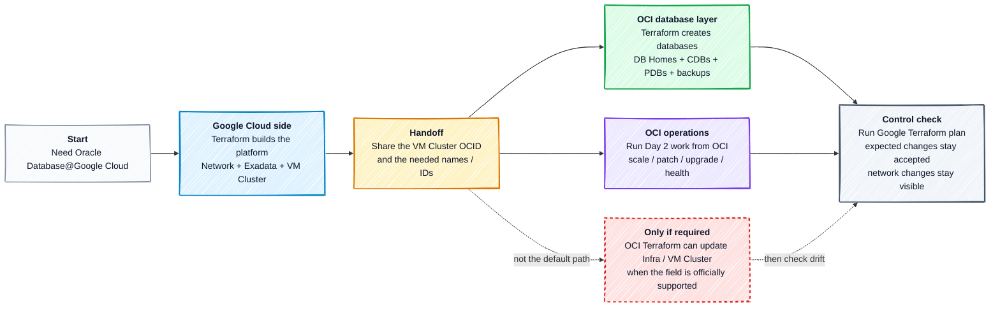
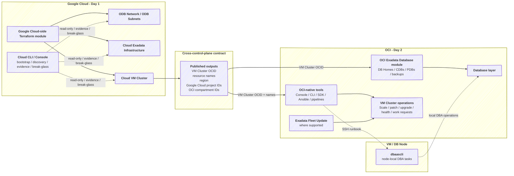

# OD@GCP Operations Best Practices

Last reviewed: 2026-05-14

## Table Of Contents

- [OD@GCP Operations Best Practices](#odgcp-operations-best-practices)
  - [Table Of Contents](#table-of-contents)
  - [1. Overview](#1-overview)
  - [2. Recommended Workflow](#2-recommended-workflow)
  - [3. Proposed Approach](#3-proposed-approach)
  - [5. Proposed Operations Flow](#5-proposed-operations-flow)
  - [6. Day 1 Google Cloud Ownership](#6-day-1-google-cloud-ownership)
  - [7. Control Plane Handoff](#7-control-plane-handoff)
  - [8. Provider Evidence](#8-provider-evidence)
    - [8.1 Google Provider](#81-google-provider)
    - [8.2 OCI Provider](#82-oci-provider)
  - [9. Day 2 Operations, State, And Drift](#9-day-2-operations-state-and-drift)
  - [10. Tooling And Guardrails](#10-tooling-and-guardrails)
  - [11. OCI Terraform Exception Path](#11-oci-terraform-exception-path)
  - [12. Module Alignment](#12-module-alignment)
- [License](#license)

## 1. Overview

This proposal focuses on Oracle Database@Google Cloud (OD@GCP) operational best practices: who owns each control plane, how Terraform state should behave, and how to handle Day 2 drift. Overall recommendation is:

1. Use the Google Terraform provider for Day 1 creation and stable Google Cloud-side ownership.
2. Use OCI-native tools as the default Day 2 operations for infrastructure and VM Cluster.
3. Use the OCI Terraform provider for DB Homes, Container Databases (CDBs), Pluggable Databases (PDBs), and backup configuration when the database layer must be declarative.
4. Use OCI Terraform for infrastructure or VM Cluster updates only as a controlled exception.
5. Use provider details only to explain the recommendation and the required drift contracts.

We cover Oracle Database@Google Cloud Exadata Infrastructure and VM Clusters created from Google Cloud and then operated through OCI. The focus is ownership, Terraform state behavior, and Day 2 drift policy. This is not a detailed runbook.

## 2. Recommended Workflow

This diagram is for non-technical readers. It shows who does what in the recommended operations workflow. The detailed provider rules start after it.

## 3. Proposed Approach

We propose a clear split between the two control planes. Google Cloud creates the OD@GCP deployment, ExaDB-D infrastructure and VM Clusters. OCI becomes the operations plane after the VM Cluster exists. When Terraform is used, the Google provider owns Day 1 Google Cloud-side creation and state. The OCI provider owns the database layer and is used as a controlled exception for selected in-place Infrastructure or VM Cluster updates.

| Task | Recommended practice |
|---|---|
| Infrastructure and VM Cluster Day 1 | Use the approved [Google Cloud Terraform module](https://github.com/oci-landing-zones/terraform-oci-multicloud-google). It creates the ODB Network, ODB Subnets, Exadata Infrastructure, and VM Cluster. |
| Infrastructure and VM Cluster Day 2 | Use OCI-native tools by default. If Terraform must drive selected capacity, maintenance, or metadata updates, use the OCI provider exception path only for fields marked as updatable. |
| Infrastructure and VM Cluster drift | The Google Cloud-side module owns the drift policy. It should use narrow `lifecycle.ignore_changes` entries for fields operated outside that stack. In the Google provider, these fields are ignored because most operational fields are replacement-only, not because Google Terraform can update them in place. Terraform state should be refreshed after any change in the alternate path. |
| DB layer Day 1 | Use the [OCI Landing Zones Exadata Database module](https://github.com/oci-landing-zones/terraform-oci-modules-exadata/tree/main/exadata-database), or another approved OCI Terraform module, for DB Homes, CDBs, PDBs, and backups after the VM Cluster exists. |
| DB layer drift | The OCI database module owns narrow `lifecycle.ignore_changes` entries for expected OCI-native, Ansible, patching, or non-available operations in OCI APIs, as password, backup, and node-local changes. |
| VM Cluster Day 2 operations | OCI-native tools handle scale, patching, upgrade, diagnostics, and support-guided operations. |
| Database Administration local operations | `dbaascli` is only for supported DBA tasks inside the VM or DB node. It does not own the VM Cluster or Google Cloud-side resources. |
| Terraform ownership | Separate Terraform stacks (configuration + state file), aligned to your Operational Security. |

The proposal is not a single-stack Terraform lifecycle. Terraform owns the declarative layers where it fits best: Google Cloud-side creation, stable identity, Google Cloud network attachments, and optionally the OCI database layer. OCI-native tools own operational work: scale, patching, upgrades, health checks, work requests, and support-guided tasks.

## 5. Proposed Operations Flow

The workflow starts when the VM Cluster is created and ends with OCI as the operations plane.

1. The [Google Terraform module](https://github.com/oci-landing-zones/terraform-oci-multicloud-google) creates the ODB Network, ODB Subnets, Cloud Exadata Infrastructure, and Cloud VM Cluster.
2. That stack publishes the handoff contract: VM Cluster OCID, names, regions, Google Cloud project IDs, OCI compartment IDs, and cloud resource IDs.
3. OCI-native tools operate the VM Cluster lifecycle: scale, patch, upgrade, health check, diagnostics, work requests, and support-guided tasks.
4. The [OCI Exadata Database module](https://github.com/oci-landing-zones/terraform-oci-modules-exadata/tree/main/exadata-database) uses the VM Cluster OCID to deploy DB Homes, CDBs, PDBs, and backups when the database layer must be declarative.
5. Terraform is useful only when each module is clear about what it owns and what drift it expects through narrow `lifecycle.ignore_changes`.

For Google Cloud, Terraform with the Google provider creates and owns ODB Network, ODB Subnets, Cloud Exadata Infrastructure, and Cloud VM Cluster for Day 1. Terraform with the OCI provider consumes the VM Cluster OCID and owns the database layer. Day 2 automation, including OCI Ansible collection playbooks, can operate only fields covered by the module drift contract.

Terraform-driven in-place Exadata Infrastructure capacity changes and VM Cluster CPU/ECPU/OCPU scaling up or down are not part of the normal Google provider path. The current Google provider has update functions for Oracle Database@Google Cloud resources, but the operational fields that matter for Infrastructure and VM Cluster Day 2 are replacement-only. The mutable fields are limited to labels, Terraform labels, and virtual fields such as `deletion_protection`. Use OCI Terraform as a controlled exception for Terraform-driven Infrastructure or VM Cluster Day 2 updates only when the service and OCI provider support the target field.

## 6. Day 1 Google Cloud Ownership

| Target | Day 1 resources | Terraform interface | Network boundary |
|---|---|---|---|
| Google Cloud | Existing VPC, ODB Network, client ODB Subnet, backup ODB Subnet, Cloud Exadata Infrastructure, VM Cluster | `hashicorp/google` Oracle Database resources or `terraform-oci-multicloud-google` | VPC is normally owned by the platform landing zone or Shared VPC stack. The Oracle module references it. |

Cloud CLI or console can be used for bootstrap, discovery, evidence, and break-glass. Any mutation must be reconciled through the owning Terraform state and drift contract.

## 7. Control Plane Handoff

The Google Cloud-side stack should hand off only the identifiers needed by downstream tools. The VM Cluster OCID is the key output: OCI-side tools use it to operate the VM Cluster, and the OCI database module uses it to deploy DB Homes, CDBs, PDBs, and backups. OCI Terraform import/update paths for Infrastructure or VM Cluster are outside the default flow and belong only to the exception path.

## 8. Provider Evidence

This section explains why we recommend this split. It is not a second workflow. It is based on the latest providers available on 2026-05-14: HashiCorp Google provider `7.31.0` and Oracle OCI provider `8.13.0`.

### 8.1 Google Provider

The Google provider is the Day 1 creation provider for Oracle Database@Google Cloud. It is not the in-place Day 2 operations provider for Exadata Infrastructure capacity changes or VM Cluster CPU/ECPU/OCPU scaling up or down.

| Resource | Recommended role | Update position |
|---|---|---|
| `google_oracle_database_odb_network` | Create and own ODB Network identity on an existing VPC. | Only labels, Terraform labels, and virtual fields are mutable. `network`, `location`, `odb_network_id`, `gcp_oracle_zone`, and `project` are replacement-only. |
| `google_oracle_database_odb_subnet` | Create and own client/backup ODB Subnets. | Only labels, Terraform labels, and virtual fields are mutable. `cidr_range`, `purpose`, `odbnetwork`, `location`, `odb_subnet_id`, and `project` are replacement-only. |
| `google_oracle_database_cloud_exadata_infrastructure` | Create Cloud Exadata Infrastructure and publish OCI/cloud identifiers. | Only labels, Terraform labels, and virtual fields are mutable. `display_name`, `gcp_oracle_zone`, `properties`, `compute_count`, `storage_count`, `total_storage_size_gb`, `maintenance_window`, and `customer_contacts` are replacement-only. |
| `google_oracle_database_cloud_vm_cluster` | Create Cloud VM Cluster and publish VM Cluster OCID. | Only labels, Terraform labels, and virtual fields are mutable. `properties`, `cpu_core_count`, `ocpu_count`, `data_storage_size_tb`, `db_node_storage_size_gb`, `memory_size_gb`, `node_count`, `db_server_ocids`, network/subnet references, `display_name`, `gi_version`, `ssh_public_keys`, and most operational fields are replacement-only. |

What this means: the Google module can create the GCP-side resources, but network drift should stay visible because ODB Network and ODB Subnet changes can affect connectivity. `ignore_changes` in the Google module is a drift contract for OCI-side operations; it does not make those fields safe to update through the Google provider. The current GCP module already ignores Exadata Infrastructure capacity and selected VM Cluster operational fields. If OCI Terraform will also manage Infrastructure `maintenance_window` or `customer_contacts`, add matching Google-side drift handling before use. Do not use the Google provider for in-place VM Cluster ECPU/OCPU scaling.

### 8.2 OCI Provider

The OCI provider is the normal provider for the database layer. It is also the exception provider for selected Infrastructure or VM Cluster Day 2 updates.

| Resource | Recommended role | Updatable examples to account for |
|---|---|---|
| `oci_database_cloud_exadata_infrastructure` | Exception path only when Terraform must update infrastructure created from the Google Cloud side. | `compute_count`, `storage_count`, `maintenance_window`, `customer_contacts`, `display_name`, `defined_tags`, `freeform_tags`, and `compartment_id`. |
| `oci_database_cloud_vm_cluster` | Exception path only when Terraform must update selected VM Cluster fields. | `cpu_core_count`, `ocpu_count`, `data_storage_size_in_tbs`, `db_node_storage_size_in_gbs`, `memory_size_in_gbs`, `nsg_ids`, `backup_network_nsg_ids`, `license_model`, `ssh_public_keys`, `data_collection_options`, `cloud_automation_update_details`, `defined_tags`, `freeform_tags`, and `display_name`. For X11M+, `cpu_core_count` is total ECPU capacity. |
| `oci_database_db_home` | Normal OCI-side DB Home and initial database resource. | The nested `database` block is updatable, but field support varies. Nested database `db_backup_config`, `defined_tags`, and `freeform_tags` are updatable. DB Home `defined_tags` is updatable. DB Home `display_name` is not marked updatable. |
| `oci_database_database` | Normal OCI-side CDB resource when separated from DB Home lifecycle. | `db_backup_config`, `defined_tags`, `freeform_tags`, patch options, and `set_key_version_trigger` are updatable. Many creation fields are not updatable. |
| `oci_database_pluggable_database` | Normal OCI-side PDB resource. | `defined_tags`, `freeform_tags`, `convert_to_regular_trigger`, `refresh_trigger`, and `rotate_key_trigger` are updatable. Creation inputs, admin password, and open mode are not normal Terraform update fields. |

What this means: OCI Terraform is the right Terraform provider for explicit Terraform-driven ECPU/OCPU scale and selected Exadata Infrastructure updates. It must not remain a second long-lived owner of Infrastructure or VM Cluster resources already owned by the Google Cloud-side stack. The OCI database module should manage DB Homes, CDBs, PDBs, and backups. Only provider-supported mutable fields should be treated as Terraform Day 2 updates. Non-updatable fields are creation-time inputs, or they are intentionally ignored when operated by OCI-native tools, Ansible, patching, generated values, passwords, or node-local workflows.

## 9. Day 2 Operations, State, And Drift

Day 2 has two layers:

- **Database layer:** use `oci-landing-zones/terraform-oci-modules-exadata` or an approved OCI Terraform module for DB Homes, CDBs, PDBs, and backups. It consumes the VM Cluster OCID. It must not become a second long-lived VM Cluster owner.
- **Infrastructure / VM Cluster operations:** use OCI-native tools by default: Console, CLI, SDK, Ansible, Exadata Fleet Update where supported, controlled pipelines, and `dbaascli` only for supported node-local DBA tasks.

Drift is expected when OCI-native operations, provider automation, patching, out-of-place workflows, generated values, passwords, backup settings, or support-guided workflows change fields outside the Terraform stack that created the resource. Expected drift belongs in narrow, module-owned `ignore_changes`. Broad ignores should not hide unknown drift. Run Google Cloud-side plans after OCI-side operations, keep network drift visible, and document exact attribute mappings in module and runbook contracts.

## 10. Tooling And Guardrails

| Area | Recommendation |
|---|---|
| Day 1 network, Cloud Exadata Infrastructure, VM Cluster creation | Oracle-provided or approved Google Cloud-side Terraform module. |
| DB Homes, CDBs, PDBs, backups | OCI Landing Zones Exadata Database module or approved OCI Terraform module. |
| Infrastructure / VM Cluster Day 2 | OCI-native tools by default. Use OCI Terraform only for explicit, supported, declarative exceptions. |
| ECPU/OCPU scale | OCI-native tools by default. Use the OCI Terraform exception path if Terraform-driven scale is required. Do not use the Google provider for in-place scale. |
| Infrastructure scale / maintenance | OCI-native tools by default. Use the OCI Terraform exception path if Terraform-driven updates are required. Do not use the Google provider for in-place infrastructure updates. |
| Patching / upgrades | OCI-native workflow and Exadata Fleet Update where appropriate. |
| Drift checks | Run Google Cloud-side Terraform plan after OCI-side changes. Keep `ignore_changes` narrow. |
| State layout | Split states for lifecycle, ownership, permission, change-window, or blast-radius reasons. Do not split only for style. |
| Break-glass / evidence | Use cloud CLI or console for bootstrap, discovery, evidence, and break-glass. Reconcile mutations. Capture ticket, operator, work request, command output, plan output, and post-check. |
| Service-managed resources | Do not rename, move, delete, or modify service-managed OCI resources unless Oracle documentation or Support directs it. |
| Secrets and state | Do not store real `terraform.tfvars`, credentials, private keys, or state files in Git. |

## 11. OCI Terraform Exception Path

This is not the recommended default operations path. Use it only when the customer requires Terraform-driven Day 2 updates and Oracle Database@Google Cloud plus the OCI provider support the intended field. Do not copy mechanics from other Oracle Database deployment models blindly into OD@GCP; validate the Google Cloud service behavior and provider schema first.

Minimum path:

1. Record the decision and intended field.
2. Export the Infrastructure or VM Cluster OCID from the Google Cloud-side stack.
3. Import only the needed OCI resource into constrained state: `oci_database_cloud_exadata_infrastructure` or `oci_database_cloud_vm_cluster`.
4. Add `prevent_destroy`, review imported arguments, and start from a clean OCI Terraform plan.
5. Apply only the selected update and capture work request / final-state evidence.
6. Run the Google Cloud-side Terraform plan and confirm expected drift is ignored while unexpected drift remains visible.
7. Choose the end state before apply: temporary import then `removed { destroy = false }` / explicit `terraform state rm`, or permanent ownership transfer.

Do not leave OCI Terraform and the Google Cloud-side Terraform stack as two active long-lived owners of the same Infrastructure or VM Cluster resource.

## 12. Module Alignment

| Side | Alignment |
|---|---|
| OCI | Use `oci-landing-zones/terraform-oci-modules-exadata` for the database layer. It creates and owns DB Homes, CDBs, PDBs, and backups using the VM Cluster OCID exported by the Google Cloud stack. It should use narrow `ignore_changes` for supported Day 2 operations. Do not let it manage already Google-owned Infrastructure or VM Cluster resources unless ownership is explicitly transferred. |
| Google Cloud | Use `oci-landing-zones/terraform-oci-multicloud-google` for GCP Day 1. It creates and owns ODB Networks, ODB Subnets, Cloud Exadata Infrastructures, and Cloud VM Clusters. It references an externally owned VPC, exports dependency JSON and VM Cluster OCID, and includes narrow drift handling for OCI-side operations. Do not use it for in-place ECPU/OCPU or Infrastructure capacity/maintenance/customer-contact updates. Those fields are replacement-only in the Google provider. |

# License

Copyright (c) 2026 Oracle and/or its affiliates.

Licensed under the Universal Permissive License (UPL), Version 1.0.

See [LICENSE](https://github.com/oracle-devrel/technology-engineering/blob/main/LICENSE) for more details.
