# OD@GCP Module Handoff Reference

Last reviewed: 2026-05-20

This runbook is the implementation companion to [Operational Best Practices for Oracle Database@Google Cloud](./odgcp-operations-best-practices.md). It shows one practical way to wire the OD@GCP Google Cloud-side modules to the OCI Exadata Database module.

The best-practices document remains the source of truth for control-plane ownership, drift contracts, Day 2 tool selection, and exception rules. This runbook focuses only on the normal implementation path and post-handoff checks.

For the recommended GitOps repository, state, and operations model, see [GitOps Repository, State, and Operations Design for Oracle Database@Google Cloud](./odgcp-gitops-repository-state-and-operations-design.md).

## Table Of Contents

- [OD@GCP Module Handoff Reference](#odgcp-module-handoff-reference)
  - [Table Of Contents](#table-of-contents)
  - [1. Scope](#1-scope)
  - [2. Reference Examples](#2-reference-examples)
  - [3. Prerequisites](#3-prerequisites)
  - [4. Target Layout](#4-target-layout)
    - [Implementation Flow](#implementation-flow)
  - [5. Step 1 - Google Cloud Networking Stack](#5-step-1---google-cloud-networking-stack)
  - [6. Step 2 - Google Cloud Exadata Stack](#6-step-2---google-cloud-exadata-stack)
  - [7. Step 3 - OCI Database Layer](#7-step-3---oci-database-layer)
    - [7.1 Path A - Direct OCID Recommended for Orchestrated Flows](#71-path-a---direct-ocid-recommended-for-orchestrated-flows)
    - [7.2 Path B - Handoff Wrapper Optional Adapter](#72-path-b---handoff-wrapper-optional-adapter)
  - [8. Step 4 - Post-Handoff Checks](#8-step-4---post-handoff-checks)
  - [9. Common Mistakes](#9-common-mistakes)
- [License](#license)

## 1. Scope

This runbook covers the normal handoff path across four steps:

1. **Google Cloud networking** — create ODB Network and ODB Subnets with `modules/odb-networking`.
2. **Google Cloud Exadata** — create Cloud Exadata Infrastructure and Cloud VM Cluster with `modules/exadb`.
3. **OCI database layer** — connect the OCI database stack to the VM Cluster OCID and create DB Homes, CDBs/databases, PDBs, and database-level backup configuration where required.
4. **Post-handoff checks** — verify ownership and drift contracts after OCI-side operations that may affect Terraform-managed or handoff-relevant fields.

This runbook does not cover patching, upgrades, support procedures, or the OCI Terraform exception path for Infrastructure / VM Cluster updates. Those topics are covered in [Operational Best Practices for Oracle Database@Google Cloud](./odgcp-operations-best-practices.md).

This runbook also does not define the full GitOps repository and state model. That design is covered in [GitOps Repository, State, and Operations Design for Oracle Database@Google Cloud](./odgcp-gitops-repository-state-and-operations-design.md).

## 2. Reference Examples

| Reference | What it shows |
|---|---|
| [`modules/odb-networking/examples/basic`](https://github.com/oci-landing-zones/terraform-oci-multicloud-google/tree/release-0.2.0/modules/odb-networking/examples/basic) | A standalone networking stack that creates ODB Network and ODB Subnets. |
| [`modules/exadb/examples/cluster`](https://github.com/oci-landing-zones/terraform-oci-multicloud-google/tree/release-0.2.0/modules/exadb/examples/cluster) | A VM Cluster consumer stack that receives dependency maps from upstream stacks. |
| [`modules/exadb/examples/vision`](https://github.com/oci-landing-zones/terraform-oci-multicloud-google/tree/release-0.2.0/modules/exadb/examples/vision) | A single-root local validation example. Useful for labs, not the preferred production split. |
| [`modules/exadb/examples/oci-dbhome-handoff`](https://github.com/oci-landing-zones/terraform-oci-multicloud-google/tree/release-0.2.0/modules/exadb/examples/oci-dbhome-handoff) | A wrapper pattern that resolves `vm_cluster_key` from the Google Cloud-side VM Cluster output and passes the OCI Cloud VM Cluster OCID to the OCI Exadata Database module. |
| [`terraform-oci-modules-exadata/exadata-database`](https://github.com/oci-landing-zones/terraform-oci-modules-exadata/tree/main/exadata-database) | The OCI module used for DB Homes, CDBs/databases, PDBs, database-level backup configuration where required, and controlled exceptions. |

Executable module references in the examples below use pinned tags. For production, replace those tags with the release tag or commit SHA validated by the customer.

## 3. Prerequisites

- Google Cloud project enabled for Oracle Database@Google Cloud.
- Existing Google Cloud foundation / Landing Zone inputs, including approved project, VPC or Shared VPC, IAM model, service account, security guardrails, and allowed region.
- Entitlement and capacity in the target Google Cloud region / Google Cloud Oracle Database zone.
- Google provider authentication and permissions for OD@GCP networking, Exadata Infrastructure, and VM Cluster resources.
- OCI tenancy, compartment, OCI region, and credentials for the database layer.
- Terraform or OpenTofu available in the pipeline or operator environment.
- No secrets, credentials, private keys, sensitive tfvars, or Terraform state files committed to Git.

## 4. Target Layout

For the normal path, use separate Terraform states. The rationale — ownership boundaries, blast radius, change windows, and lifecycle — is defined in [Operational Best Practices for Oracle Database@Google Cloud](./odgcp-operations-best-practices.md).

### Implementation Flow

```mermaid
%%{init: {"look": "classic", "theme": "dark"}}%%
flowchart LR
  START["<b>Start</b><br/>Need Oracle Database@Google Cloud"]
  NET["<b>01 - gcp-networking state</b><br/>module: modules/odb-networking<br/><br/>Creates:<br/>ODB Network<br/>Client ODB Subnet<br/>Backup ODB Subnet"]
  NETOUT["<b>Networking dependency maps</b><br/>gcp_odb_networks_dependency<br/>gcp_odb_subnets_dependency<br/><br/>Passed by orchestration layer"]
  EXA["<b>02 - gcp-exadb state</b><br/>module: modules/exadb<br/><br/>Creates:<br/>Cloud Exadata Infrastructure<br/>Cloud VM Cluster"]
  EXAOUT["<b>VM Cluster handoff contract</b><br/>gcp_cloud_vm_clusters_dependency<br/><br/>id = Google Cloud resource name<br/>ocid = OCI Cloud VM Cluster OCID<br/>oci_region = OCI region<br/>state = AVAILABLE"]
  CHOICE{"<b>OCI DB layer input</b>"}
  DIRECT["<b>Path A - Direct OCID</b><br/>recommended for orchestrated flows<br/><br/>Input:<br/>vm_cluster_id = OCI OCID"]
  WRAP["<b>Path B - Handoff wrapper</b><br/>optional adapter<br/><br/>Input:<br/>vm_cluster_key<br/><br/>Resolves OCI OCID"]
  OCI["<b>03 - oci-db-layer state</b><br/>module: exadata-database<br/><br/>Creates:<br/>DB Homes<br/>CDBs / Databases<br/>PDBs<br/>Database-level backup config"]
  CHECK["<b>04 - Post-handoff checks</b><br/>plan owning stacks<br/>expected drift accepted<br/>unexpected drift visible"]

  START --> NET --> NETOUT --> EXA --> EXAOUT --> CHOICE
  CHOICE --> DIRECT --> OCI
  CHOICE --> WRAP --> OCI
  OCI --> CHECK

  classDef start fill:#f8fafc,stroke:#64748b,color:#0f172a,stroke-width:1px;
  classDef google fill:#e0f2fe,stroke:#0284c7,color:#0f172a,stroke-width:2px;
  classDef contract fill:#fef3c7,stroke:#d97706,color:#0f172a,stroke-width:2px;
  classDef decision fill:#fef9c3,stroke:#ca8a04,color:#0f172a,stroke-width:2px;
  classDef oci fill:#dcfce7,stroke:#16a34a,color:#0f172a,stroke-width:2px;
  classDef check fill:#f1f5f9,stroke:#475569,color:#0f172a,stroke-width:2px;

  class START start;
  class NET,EXA google;
  class NETOUT,EXAOUT contract;
  class CHOICE decision;
  class DIRECT,WRAP,OCI oci;
  class CHECK check;
```



For production, pass dependency maps through the selected orchestration layer, such as Terragrunt dependencies, `terraform_remote_state`, HCP Terraform / Terraform Enterprise workspace outputs, or CI/CD pipeline variables/artifacts.

File-based JSON handoff with `output_path` and `*_dependency_file_path` is useful for local validation, examples, and demos, but it should not be the default production integration contract.

| Stack | Module | Long-lived owner |
|---|---|---|
| `01-gcp-networking` | `modules/odb-networking` | ODB Network and ODB Subnets. |
| `02-gcp-exadb` | `modules/exadb` | Cloud Exadata Infrastructure and Cloud VM Cluster identity. |
| `03-oci-db-layer` | `exadata-database` | OCI database layer: DB Homes, CDBs/databases, PDBs, and database-level backup configuration where required. |

Add a fourth, temporary stack only for the controlled OCI Terraform exception path described in the best-practices document. The exception stack must not become a second long-lived owner unless ownership is formally transferred.

## 5. Step 1 - Google Cloud Networking Stack

The networking stack owns the OD@GCP network layer. Its job ends at publishing dependency maps that downstream stacks consume.

```hcl
module "odb_networking" {
  source = "git::https://github.com/oci-landing-zones/terraform-oci-multicloud-google.git//modules/odb-networking?ref=release-0.2.0"

  default_project_id      = var.gcp_project_id
  default_location        = var.gcp_region
  default_gcp_oracle_zone = var.gcp_oracle_zone

  gcp_odb_networks_configuration = {
    primary = {
      odb_network_id = "odbnet-${var.env}"
      network        = var.shared_vpc_self_link
    }
  }

  gcp_odb_subnets_configuration = {
    client = {
      odb_subnet_id   = "odbsub-client-${var.env}"
      cidr_range      = var.client_cidr
      purpose         = "CLIENT_SUBNET"
      odb_network_key = "primary"
    }
    backup = {
      odb_subnet_id   = "odbsub-backup-${var.env}"
      cidr_range      = var.backup_cidr
      purpose         = "BACKUP_SUBNET"
      odb_network_key = "primary"
    }
  }
}
```

The networking stack publishes the following dependency maps for downstream stacks:

```hcl
gcp_odb_networks_dependency = {
  primary = { id = "<odb-network-resource-name>" }
}

gcp_odb_subnets_dependency = {
  client = {
    id      = "<client-odb-subnet-resource-name>"
    purpose = "CLIENT_SUBNET"
  }
  backup = {
    id      = "<backup-odb-subnet-resource-name>"
    purpose = "BACKUP_SUBNET"
  }
}
```

For local validation or demos, `output_path` and example-level `*_dependency_file_path` inputs can be used if the selected example supports file-based handoff.

## 6. Step 2 - Google Cloud Exadata Stack

The Exadata stack consumes the networking maps and creates Cloud Exadata Infrastructure plus Cloud VM Cluster. Its key output is the OCI Cloud VM Cluster OCID.

```hcl
module "exadb" {
  source = "git::https://github.com/oci-landing-zones/terraform-oci-multicloud-google.git//modules/exadb?ref=release-0.2.0"

  default_project_id      = var.gcp_project_id
  default_location        = var.gcp_region
  default_gcp_oracle_zone = var.gcp_oracle_zone

  gcp_odb_networks_dependency = var.gcp_odb_networks_dependency
  gcp_odb_subnets_dependency  = var.gcp_odb_subnets_dependency

  ssh_public_keys_file_path = var.ssh_public_keys_file_path

  gcp_cloud_exadata_infrastructures_configuration = {
    primary = {
      cloud_exadata_infrastructure_id = "exa-${var.env}"
      display_name                    = "exa-${var.env}"
      properties = {
        shape         = "Exadata.X11M"
        compute_count = 2
        storage_count = 3
      }
    }
  }

  gcp_cloud_vm_clusters_configuration = {
    primary = {
      cloud_vm_cluster_id        = "vmc-${var.env}"
      display_name               = "vmc-${var.env}"
      exadata_infrastructure_key = "primary"
      odb_network_key            = "primary"
      odb_subnet_key             = "client"
      backup_odb_subnet_key      = "backup"
      properties = {
        license_type            = "BRING_YOUR_OWN_LICENSE"
        gi_version              = var.gi_version
        cpu_core_count          = var.cpu_core_count
        node_count              = 2
        memory_size_gb          = var.memory_size_gb
        db_node_storage_size_gb = var.db_node_storage_size_gb
        data_storage_size_tb    = var.data_storage_size_tb
        disk_redundancy         = "HIGH"
        hostname_prefix         = "exa"
        cluster_name            = "vmc${var.env}"
        time_zone               = { id = "UTC" }
      }
    }
  }
}
```

Publish a small, sanitized handoff contract. The `ocid` field is the key value consumed by the OCI database layer and OCI-native tools. The `oci_region` field should be used by the OCI provider configuration. The `state` field is used by the optional handoff wrapper for pre-flight validation.

```hcl
gcp_cloud_vm_clusters_dependency = {
  primary = {
    id         = "projects/<project>/locations/<gcp-region>/cloudVmClusters/<name>"
    ocid       = "ocid1.cloudvmcluster.oc1.<unique-id>"
    oci_region = "<oci-region>"
    state      = "AVAILABLE"
  }
}
```

Useful evidence fields to capture alongside the OCID: VM Cluster state, OCI compartment ID, OCI region, Google Cloud location, Google Cloud Oracle Database zone, SCAN DNS, listener ports, initial capacity, Grid Infrastructure version, and system version.

Do not copy full real outputs into Git or tickets unless they are sanitized.

For local validation or demos, `output_path` and example-level `*_dependency_file_path` inputs can be used if the selected example supports file-based handoff.

## 7. Step 3 - OCI Database Layer

Both paths below deploy the same OCI database layer. In orchestrated production flows, prefer the direct OCID path. Use the handoff wrapper only when the OCI stack should resolve the VM Cluster by logical key, or when no orchestration layer is resolving the OCID before calling the OCI database module.

### 7.1 Path A - Direct OCID Recommended for Orchestrated Flows

Use this path when Terragrunt, `terraform_remote_state`, HCP Terraform / Terraform Enterprise workspace outputs, CI/CD variables/artifacts, or another orchestration layer already resolves and passes the OCI Cloud VM Cluster OCID directly. In this case, the handoff wrapper is not required.

```hcl
module "oci_db_layer" {
  source = "git::https://github.com/oci-landing-zones/terraform-oci-modules-exadata.git//exadata-database?ref=v1.1.0"

  default_compartment_id = var.oci_compartment_id

  cloud_db_homes_configuration = {
    dbhome1 = {
      vm_cluster_id = var.vm_cluster_ocid
      display_name  = "dbh-cdb1-${var.env}"
      db_version    = var.db_version
      source        = "VM_CLUSTER_NEW"
    }
  }

  databases_configuration           = var.databases_configuration
  pluggable_databases_configuration = var.pluggable_databases_configuration
}
```

Do not pass the Google Cloud resource name as `vm_cluster_id`. The OCI module requires the OCI Cloud VM Cluster OCID.

Set the OCI provider region from the validated handoff contract, for example `oci_region`, not from the Google Cloud region.

### 7.2 Path B - Handoff Wrapper Optional Adapter

Use this path when the OCI stack should reference the Google Cloud-side VM Cluster by logical key, or when no orchestration layer resolves the OCI Cloud VM Cluster OCID before calling the OCI database module. The wrapper resolves the key from the dependency map and validates the handoff contract before forwarding the OCI Cloud VM Cluster OCID to `exadata-database`.

```hcl
module "oci_dbhome_handoff" {
  source = "git::https://github.com/oci-landing-zones/terraform-oci-multicloud-google.git//modules/exadb/examples/oci-dbhome-handoff?ref=release-0.2.0"

  tenancy_ocid           = var.tenancy_ocid
  region                 = var.oci_region
  default_compartment_id = var.oci_compartment_id

  gcp_cloud_vm_clusters_dependency = var.gcp_cloud_vm_clusters_dependency

  cloud_db_homes_configuration = {
    dbhome1 = {
      vm_cluster_key = "primary"
      display_name   = "dbh-cdb1-${var.env}"
      db_version     = var.db_version
      source         = "VM_CLUSTER_NEW"
    }
  }

  databases_configuration           = var.databases_configuration
  pluggable_databases_configuration = var.pluggable_databases_configuration
}
```

For local/demo file handoff, use `gcp_cloud_vm_clusters_dependency_file_path` instead of `gcp_cloud_vm_clusters_dependency`. Do not set both.

If the wrapper pattern is used in production, treat it as approved module code: pin the source to a validated tag or commit SHA, or promote the wrapper into the customer’s approved module repository.

The wrapper validates that:

- only one handoff input style is used;
- each DB Home sets exactly one of `vm_cluster_key` or `vm_cluster_id`;
- direct `vm_cluster_id` values are OCI Cloud VM Cluster OCIDs;
- `vm_cluster_key` exists in the Google Cloud-side VM Cluster dependency map;
- the referenced VM Cluster has an OCI Cloud VM Cluster OCID;
- the referenced VM Cluster is `AVAILABLE` when state is present.

## 8. Step 4 - Post-Handoff Checks

After the database layer is created, and after any OCI-side operation that may affect Terraform-managed or handoff-relevant fields, verify that the ownership contract remains clean:

1. The Google Cloud networking stack still owns only ODB Network and ODB Subnets.
2. The Google Cloud Exadata stack still owns Cloud Exadata Infrastructure and Cloud VM Cluster identity.
3. The OCI database stack owns only DB Homes, CDBs/databases, PDBs, and database-level backup configuration where required.
4. Expected drift from OCI-side operations is covered by the narrow module `ignore_changes` contract.
5. Unexpected network, placement, or identity drift remains visible in the owning module plans.
6. Evidence is captured: ticket, operator, work request where applicable, relevant output, plan output, and final state.

## 9. Common Mistakes

| Mistake | Why it is a problem |
|---|---|
| Passing the Google Cloud resource name as `vm_cluster_id`. | The OCI module requires the OCI Cloud VM Cluster OCID. |
| Assuming the Google Cloud region is the OCI provider region. | Use the OCI region from the validated handoff contract. The Google Cloud region and OCI region are not the same configuration value. |
| Treating JSON file handoff as the default production pattern. | JSON handoff is useful for local validation, examples, and demos. Production should use the selected orchestration layer. |
| Importing Infrastructure or VM Cluster into the normal OCI database-layer stack. | It creates a second long-lived owner for resources that the Google Cloud-side stack owns. |
| Using broad `ignore_changes` blocks. | Broad ignores can hide unknown drift. Keep `ignore_changes` narrow and module-owned. |
| Copying full real outputs into Git or tickets. | Outputs can include sensitive identifiers or operational details. Sanitize first. |
| Copying reusable module code into the live configuration repository. | It weakens separation of duties and creates uncontrolled forks. Reference versioned modules instead. |
| Using `ref=main` in executable examples. | The documentation becomes non-reproducible because the default branch can change. Use a pinned tag or commit SHA. |

# License

Copyright (c) 2026 Oracle and/or its affiliates.

Licensed under the Universal Permissive License (UPL), Version 1.0.

See [LICENSE](https://github.com/oracle-devrel/technology-engineering/blob/main/LICENSE) for more details.