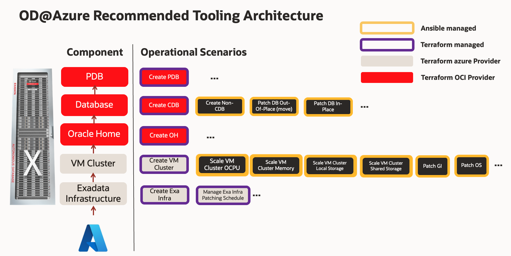
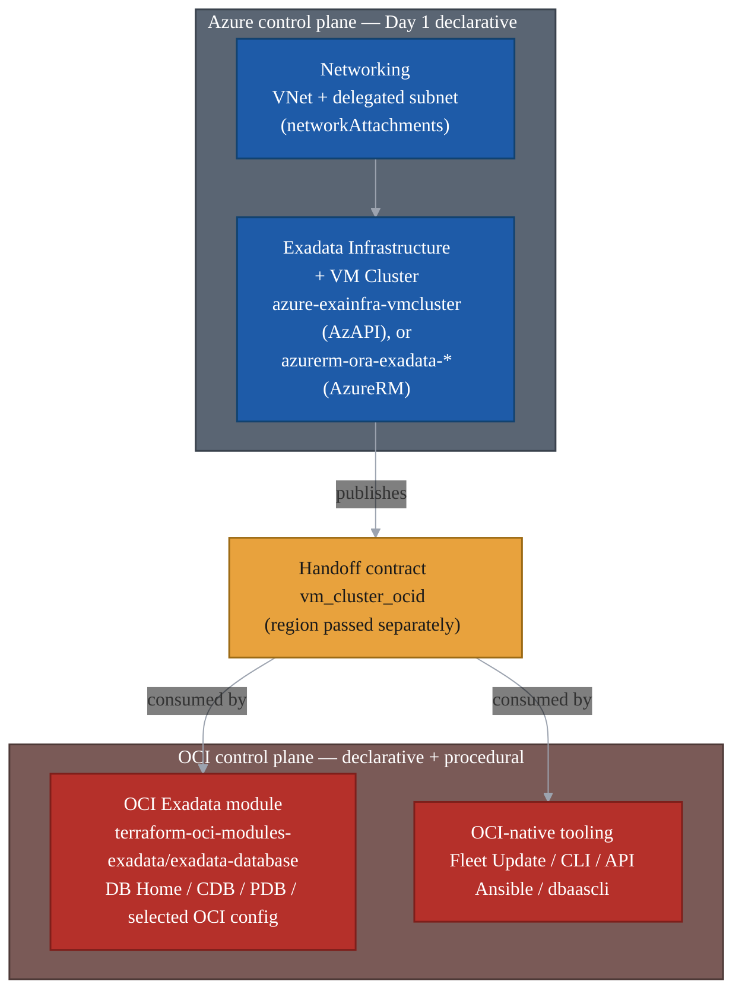

# Operational Best Practices for Oracle Database@Azure Exadata Database Service

&nbsp;

Last reviewed: 2026-06-16

This asset describes how to operate the Exadata Database Service scope of Oracle Database@Azure (OD@Azure) in the **GitOps multi-cloud operating model**: Git is the source of truth, changes are reviewed through pull requests, and pipelines apply the approved desired state. The focus is control-plane ownership, Terraform state boundaries, Day 1 and Day 2 tool selection, handoff contracts, and drift handling.

For the implementation runbook, dependency handoff examples, and module wiring patterns, see [OD@Azure Module Handoff Reference](./handoff-reference.md).

&nbsp;

## Table of Contents

- [Operational Best Practices for Oracle Database@Azure Exadata Database Service](#operational-best-practices-for-oracle-databaseazure-exadata-database-service)
  - [Table of Contents](#table-of-contents)
  - [1. Overview](#1-overview)
  - [2. Operational Pattern](#2-operational-pattern)
  - [3. Design and Ownership Considerations](#3-design-and-ownership-considerations)
  - [4. How to Start](#4-how-to-start)
  - [5. Module Alignment and Handoff Reference](#5-module-alignment-and-handoff-reference)
  - [6. Day 2 Operations, State, and Drift](#6-day-2-operations-state-and-drift)
- [License](#license)

&nbsp;

## 1. Overview

Scope: Exadata Database Service on Oracle Database@Azure: Exadata Infrastructure and VM Clusters created and surfaced through Azure, with limited Azure-side management, selected OCI-side Day 2 operations, and the Exadata database layer operated through OCI.

This guide is about ownership and guardrails. Implementation wiring is included only where it affects the operating model; detailed handoff examples live in [OD@Azure Module Handoff Reference](./handoff-reference.md).

The core split is simple: Azure owns the creation path, Azure resource identity, networking, monitoring, and the Azure management surface; OCI owns the Exadata database layer and selected OCI-side operations. The Azure stack publishes the OCI VM Cluster OCID, and OCI-side automation consumes it.

That split follows the service model. Azure lets you provision and manage Oracle Database@Azure Exadata Infrastructure and VM Cluster resources from Azure, but the Azure blade exposes a limited management surface and provides direct OCI access for OCI-side resource management. Oracle-managed infrastructure patching and updates are performed through a connection to OCI, and CDB/PDB management tasks are completed in OCI when required. The documented Terraform path follows the same boundary: create Exadata Infrastructure and VM Cluster from Azure, then create DB Homes, CDBs/databases, and PDBs through the OCI provider.

&nbsp;

## 2. Operational Pattern

The diagram below is a representative tooling map for common operations. It is not an exhaustive catalog, a provider capability matrix, or a full Terraform state model.

Use the map as a decision guide:

- Azure-owned creation stays in [`terraform-oci-multicloud-azure`](https://github.com/oci-landing-zones/terraform-oci-multicloud-azure).
- OCI-side database desired state stays in [`terraform-oci-modules-exadata/exadata-database`](https://github.com/oci-landing-zones/terraform-oci-modules-exadata/tree/v1.1.0/exadata-database).
- Procedural work and intentionally ignored fields stay in Day 2 tooling: [ODyS](../../scaling/exacc-exacs-dynamic-scaling/README.md) for Dynamic Scaling, OCI-native tooling, Ansible, Fleet Update, `dbaascli`, REST/API automation, or support-guided procedures.

The practical rule is `lifecycle.ignore_changes`. If the OCI Exadata module models a field and does not ignore it, that field can be managed from a dedicated OCI desired-state stack. If the module ignores it, or the workflow has ordered operational steps, keep it outside Terraform.

Common operating cases:

- **Patching:** DB Home `db_version` and `database_software_image_id` are creation-time inputs and ignored after creation; database `db_home_id` and `db_version` are ignored too. Treat database patching as out-of-place: create a patched DB Home, then move the database to it.
- **Scaling:** VM Cluster OCPU changes are best kept in Day 2 tooling, not Terraform.
- **ODyS for FinOps:** When the operating model uses [ODyS](../../scaling/exacc-exacs-dynamic-scaling/README.md), treat it as the Dynamic Scaling app: it scales OCPU up or down to match workload demand and captures operational evidence. Keep Terraform responsible for the baseline topology; if a state still owns OCPU or sizing fields, its next plan will try to restore the configured capacity unless those fields are not managed by that state or are covered by narrow `ignore_changes`.
- **Recovery:** Backup configuration can be modeled by Terraform, but operational restore or recovery remains a Day 2 workflow.

| Area | Recommended approach |
|---|---|
| **Azure-owned operations** | Use Azure Terraform only for networking, OD@Azure Exadata Infrastructure, VM Cluster creation or supported Azure-side resource updates, and handoff outputs. |
| **OCI database desired state** | Use [`terraform-oci-modules-exadata/exadata-database`](https://github.com/oci-landing-zones/terraform-oci-modules-exadata/tree/v1.1.0/exadata-database) for DB Homes, CDBs/databases, PDBs, backup configuration, and creation-time DB software image selection. |
| **OCI Infrastructure or VM Cluster fields** | Use the OCI Exadata module only by explicit exception, with a dedicated OCI state and matching Azure-side `ignore_changes`. |
| **Day 2 workflows** | Use the Azure blade/API for Azure-supported resource actions. Use ODyS for Dynamic Scaling. Use OCI-native tools, Ansible, Fleet Update, `dbaascli`, REST/API automation, or support-guided procedures for patching, refreshable clones, restore/recovery, DR, health checks, passwords, OCI NSG rules, Recovery Service, and ignored fields. |
| **Drift control** | Use `ignore_changes` to absorb expected drift, not to turn the Azure stack into the OCI operations engine. |

The handoff flow is:

&nbsp;

## 3. Design and Ownership Considerations

Split Terraform stacks by lifecycle, ownership, permissions, change window, and blast radius.

| Area | Recommended practice |
|---|---|
| Networking Day 1 | Create the VNet and subnet delegated to `Oracle.Database/networkAttachments` from the Azure-side stack. |
| Infrastructure and VM Cluster Day 1 | Create Cloud Exadata Infrastructure and Cloud VM Cluster from Azure, then publish the OCI VM Cluster OCID. |
| OCI desired state | Use the OCI Exadata module only for fields it owns and does not ignore. Resources created from Azure need a single-writer OCI state and matching Azure drift coverage. |
| Day 2 operations | Keep procedural work, ignored fields, ODyS / Dynamic Scaling, restore/recovery, and support-guided procedures outside Terraform. |

&nbsp;

## 4. How to Start

Start with this sequence.

| STEP | AREA | DESCRIPTION |
|:---:|---|---|
| **1** | **Azure Networking** | Create the VNet and delegated subnet. |
| **2** | **Azure Exadata** | Create Cloud Exadata Infrastructure and Cloud VM Cluster with [`terraform-oci-multicloud-azure`](https://github.com/oci-landing-zones/terraform-oci-multicloud-azure). |
| **3** | **Handoff Contract** | Publish `vm_cluster_ocid`; pass the OCI provider region separately. |
| **4** | **OCI Exadata Module** | Create DB Homes, CDBs/databases, PDBs, backup configuration, and creation-time DB software image selection. |
| **5** | **Day 2 Operations** | Run patching, ODyS / Dynamic Scaling, refreshable clone maintenance, restore/recovery, DR, health checks, password work, and ignored-field changes outside Terraform. |
| **6** | **Control Check** | Run plans from the owning stacks so expected drift is accounted for through the relevant `ignore_changes` contract and unexpected drift remains visible. |

Use the module alignment below to decide which stack owns each field.

&nbsp;

## 5. Module Alignment and Handoff Reference

All reference module families share one contract: Azure creates the VM Cluster and publishes its OCI OCID; OCI consumes that OCID. Use Azure modules only for the Azure-owned path. Use the OCI Exadata module for OCI desired state.

**Azure-side Day 1, option A — AzAPI combined module.** A single module creates both Cloud Exadata Infrastructure and Cloud VM Cluster and exports `vm_cluster_ocid`. Use this when you want the published reference and a single Azure-side creation stack. The `release-0.1.0` module uses the AzAPI provider against the `Oracle.Database/...@2023-09-01-preview` API version; newer module revisions use later API versions and add broader `ignore_changes` coverage. Pin the selected source revision and confirm its lifecycle contract before adopting.

| Area | Reference module | Role |
|---|---|---|
| Azure networking | Azure Verified Module [`Azure/avm-res-network-virtualnetwork/azurerm`](https://registry.terraform.io/modules/Azure/avm-res-network-virtualnetwork/azurerm/latest), or [`modules/azure-vnet-subnet`](https://github.com/oci-landing-zones/terraform-oci-multicloud-azure/tree/release-0.1.0/modules/azure-vnet-subnet) | Owns the VNet and the subnet delegated to `Oracle.Database/networkAttachments`. |
| Azure Exadata + VM Cluster | [`modules/azure-exainfra-vmcluster`](https://github.com/oci-landing-zones/terraform-oci-multicloud-azure/tree/release-0.1.0/modules/azure-exainfra-vmcluster) | Owns Cloud Exadata Infrastructure and Cloud VM Cluster identity; exports `vm_cluster_ocid`. |

**Azure-side Day 1, option B — AzureRM split modules.** Separate modules for Exadata Infrastructure and VM Cluster, built on native `azurerm_oracle_*` resources. These modules carry broader `ignore_changes` contracts and additional OCI-identity outputs (`oci_region`, `oci_compartment_ocid`, `oci_vcn_ocid`, `oci_nsg_ocid`). Use them when you need AzureRM-native resources or richer Azure-side drift absorption, not to execute OCI operations.

| Area | Reference module | Role |
|---|---|---|
| Azure Exadata Infrastructure | [`modules/azurerm-ora-exadata-infra`](https://github.com/oci-landing-zones/terraform-oci-multicloud-azure/tree/main/modules/azurerm-ora-exadata-infra) | Owns `azurerm_oracle_exadata_infrastructure`; ignores `compute_count`, `storage_count`, `customer_contacts`, `maintenance_window`. |
| Azure VM Cluster | [`modules/azurerm-ora-exadata-vmc`](https://github.com/oci-landing-zones/terraform-oci-multicloud-azure/tree/main/modules/azurerm-ora-exadata-vmc) | Owns `azurerm_oracle_cloud_vm_cluster`; exports `vm_cluster_ocid` and OCI identity URLs; ignores identity and OCI-updatable fields. |

**OCI-side operating module.** Use [`terraform-oci-modules-exadata/exadata-database`](https://github.com/oci-landing-zones/terraform-oci-modules-exadata/tree/v1.1.0/exadata-database) for OCI-side desired state. In `v1.1.0`, its lifecycle contract is the operational guide:

| OCI resource in `exadata-database` | Terraform maintains | `ignore_changes` means use non-Terraform tooling for |
|---|---|---|
| `oci_database_cloud_exadata_infrastructure` | Configured Infrastructure fields when this resource is intentionally owned by the OCI Exadata state. | No module-level ignore is declared in `v1.1.0`; any field placed under this resource is treated as desired state by that OCI stack. |
| `oci_database_cloud_vm_cluster` | VM Cluster fields that are deliberately owned by the OCI state, such as data collection options and, only by explicit exception, OCPU, memory, local storage, or shared storage. | `gi_version`, `system_version`, and `defined_tags`. GI and system patch/upgrade flows therefore remain OCI-native / Fleet Update / `dbaascli` operations. OCPU and sizing fields are not ignored by the module, so ODyS-driven or other out-of-band scaling will appear as drift and Terraform will try to revert it unless the owning state deliberately does not manage those fields or ignores them. |
| `oci_database_db_home` | DB Home creation, display name, initial version, and optional software-image selection. | `db_version` and `database_software_image_id` after creation. DB Home patching and software-image movement are not Terraform update operations. |
| `oci_database_database` | CDB creation and modeled database configuration, including backup configuration when supplied. | `db_home_id`, `db_version`, and `database.0.admin_password`. Database patching, DB Home movement, and password work are outside Terraform. |
| `oci_database_pluggable_database` | PDB creation and modeled PDB configuration. | `container_database_id`, `container_database_admin_password`, and `pdb_admin_password`. Refreshable clone operations and password work stay outside Terraform unless explicitly modeled as a creation-time flow. |

Use the [OD@Azure Module Handoff Reference](./handoff-reference.md) for the practical wiring details: dependency maps, direct OCID handoff, wrapper-based handoff, post-handoff checks, and common mistakes.

&nbsp;

## 6. Day 2 Operations, State, and Drift

Terraform is the right tool only for fields owned by the relevant Terraform state. Procedural work has prechecks, ordered steps, work requests, and rollback; run it through the appropriate Day 2 tooling.

| Tooling | Use for | Do not use it for |
|---|---|---|
| ODyS | Dynamic Scaling for VM Cluster OCPU capacity: FinOps windows and scale-up / scale-down evidence. | Creating the baseline service topology or competing with a Terraform state that still owns the same OCPU or sizing fields. |
| OCI API / SDK / supported CLI commands | Control-plane operations, prechecks, patch/update actions, work requests, history, health checks, and evidence capture. | Becoming a second long-lived Terraform owner. |
| Exadata Fleet Update | Fleet-style **patching and upgrade** orchestration for Grid Infrastructure, Database Homes, and existing databases. It patches out-of-place by adding a new patched Oracle Home. | Creating the service topology or modeling DB Homes / CDBs / PDBs as desired-state resources. |
| OCI Ansible Collection / pipelines | Repeatable automation around supported OCI APIs: discovery, prechecks, updates, evidence, and standard operations. | Bypassing Oracle-supported workflows or hiding manual changes from state review. |
| `dbaascli` | Supported node-local DBA tasks inside the VM or DB node: diagnostics, PDB administration, password work, cloud tooling tasks, and database / DB Home / Grid Infrastructure patch or upgrade commands when Oracle documentation says to use it. | Owning the VM Cluster, Azure-side resources, or Terraform state. |
| Support-guided tools | Interim patches, one-off fixes, or procedures required by Oracle documentation, My Oracle Support, or Oracle Support. | Standard automation unless the exception is recorded and reconciled. |

Drift is expected. ODyS, OCI-native operations, patching, generated values, passwords, restore/recovery state, and support-guided workflows can all change fields outside Terraform. Use narrow `ignore_changes` entries to absorb expected drift; do not use broad ignores to hide unknown changes.

The single-writer split is summarized below.

| Resource | Create / publish with | Maintain with | `ignore_changes` directs to non-Terraform tooling for |
|---|---|---|---|
| Azure VNet and delegated subnet | Azure-side stack | Azure-side stack for VNet address space, subnet delegation to `Oracle.Database/networkAttachments`, and Azure network policy supported for the selected networking mode. | No OCI Terraform owner. VNet, subnet, delegation, CIDR, NSG, UDR, and peering drift should remain visible to the Azure owner. |
| Cloud Exadata Infrastructure | Azure-side stack | Azure blade/API for supported Azure-side resource actions. OCI Exadata module only for OCI-side fields explicitly assigned to that state, with matching Azure-side ignore coverage. | Fields ignored by the Azure stack are allowed to drift from Azure's point of view; fields not ignored must not be changed outside the Azure owner. |
| Cloud VM Cluster | Azure-side stack | Azure blade/API for supported Azure-side resource actions. OCI Exadata module for non-ignored OCI-side fields such as data collection configuration, with matching Azure-side ignore coverage. Keep VM Cluster scaling in ODyS or another approved Day 2 path when Dynamic Scaling is the operating pattern. | `gi_version` and `system_version` in the OCI Exadata module, so GI / system patching remains OCI-native. The module also does not ignore OCPU or storage sizing fields, so ODyS changes become drift and Terraform will try to revert them unless the owning state deliberately allows the scaling field to move. |
| DB Home | OCI Exadata module | OCI Exadata module for creation-time desired state. | `db_version` and `database_software_image_id` after creation, so DB Home patching and software-image movement remain OCI-native. |
| CDB / database | OCI Exadata module | OCI Exadata module for creation and modeled backup configuration. | `db_home_id`, `db_version`, and admin password, so patching, DB Home movement, and password work remain OCI-native. |
| PDB | OCI Exadata module | OCI Exadata module for PDB creation and modeled creation-time options. | Container/password fields; refreshable clone operations and password work remain OCI-native unless explicitly modeled as a creation-time flow. |

Out-of-band changes come from ODyS, OCI-native tooling (Fleet Update, CLI / API, Ansible, `dbaascli`), or support-guided procedures. The exact Azure-side ignore coverage differs between module families and revisions; confirm what the selected Azure module ignores before relying on OCI-side changes.

The following **operational guardrails** apply:

- Split Terraform states only when there is a clear lifecycle, ownership, permission, change-window, or blast-radius reason.
- Never create two declarative writers for the same field. Keep the Azure stack responsible for creation and identity publication, and keep the OCI Exadata stack responsible only for the OCI-side fields it explicitly owns.
- For break-glass or OCI-native changes, capture the ticket, operator, work request where applicable, command output, plan output, and post-change validation.
- Do not modify service-managed resources or provider-generated dependencies unless Oracle documentation or Oracle Support explicitly directs it.
- Do not store secrets, private keys, sensitive tfvars, credentials, or Terraform state files in Git.
- After OCI-side operations that may affect fields visible to the Azure stack, run the owning Azure-side Terraform plan so expected drift is accounted for through the module's `ignore_changes` contract and unexpected drift, especially network, placement, or identity drift, remains visible.

&nbsp;

# License

Copyright (c) 2026 Oracle and/or its affiliates.

Licensed under the Universal Permissive License (UPL), Version 1.0.

See [LICENSE](https://github.com/oracle-devrel/technology-engineering/blob/main/LICENSE) for more details.
