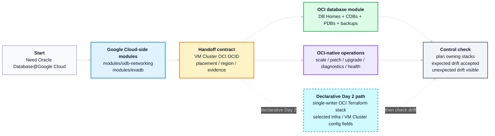

# Operational Best Practices for Oracle Database@Google Cloud

Last reviewed: 2026-06-02

This document sits inside a GitOps operating model. Git is the source of truth, changes are reviewed through pull requests, and pipelines apply the approved desired state. Within that model, it defines the OD@GCP operational practices: control-plane ownership, Terraform state boundaries, Day 1 and Day 2 tool selection, handoff contracts, and drift handling.

For the implementation runbook, dependency handoff examples, and module wiring patterns, see [OD@GCP Module Handoff Reference](./handoff-reference.md).

## Table Of Contents

- [Operational Best Practices for Oracle Database@Google Cloud](#operational-best-practices-for-oracle-databasegoogle-cloud)
  - [Table Of Contents](#table-of-contents)
  - [1. Overview](#1-overview)
  - [2. Recommended Workflow](#2-recommended-workflow)
  - [3. Control-Plane Ownership and State Boundaries](#3-control-plane-ownership-and-state-boundaries)
  - [4. Provider Evidence Behind the Ownership Split](#4-provider-evidence-behind-the-ownership-split)
    - [4.1 Evidence Baseline](#41-evidence-baseline)
    - [4.2 Google Provider Position](#42-google-provider-position)
    - [4.3 OCI Provider Position](#43-oci-provider-position)
  - [5. Day 2 Operations, State, And Drift](#5-day-2-operations-state-and-drift)
  - [6. OCI Terraform Path for Infrastructure and VM Cluster Updates](#6-oci-terraform-path-for-infrastructure-and-vm-cluster-updates)
  - [7. Module Alignment And Handoff Reference](#7-module-alignment-and-handoff-reference)
- [License](#license)

## 1. Overview

OD@GCP uses two control planes with a clear operational split:

1. Use the Google Cloud-side Terraform module for Day 1 creation and stable ownership of OD@GCP networking, Cloud Exadata Infrastructure, and Cloud VM Cluster.
2. Use OCI-native tools as the default Day 2 engine for scale, patching, upgrades, diagnostics, health checks, and support-guided work, because they are the path that scales across a fleet.
3. Use the OCI Exadata Database module for the OCI database layer (DB Homes, CDBs, PDBs, and backup configuration) only when that layer must be declarative.
4. Use OCI Terraform for Infrastructure or VM Cluster updates only when a team manages specific configuration fields declaratively in Git. This is a supported but optional path, governed by the single-writer invariant in [Section 6](#6-oci-terraform-path-for-infrastructure-and-vm-cluster-updates).

The provider evidence behind these rules is in [Section 4](#4-provider-evidence-behind-the-ownership-split).

Scope: Oracle Database@Google Cloud Exadata Infrastructure and VM Clusters created from Google Cloud and operated through OCI.

## 2. Recommended Workflow

Execution sequence:

1. Create OD@GCP networking with the Google Cloud-side networking module.
2. Create Cloud Exadata Infrastructure and Cloud VM Cluster with the Google Cloud-side Exadata module.
3. Handoff the VM Cluster OCI OCID to OCI-native tools and, if needed, to the OCI Exadata Database module.
4. Use OCI-native tooling for Day 2 operations.
5. Run the owning module plans after operational changes to surface drift.

For the concrete dependency maps, wrapper pattern, direct OCID pattern, and post-handoff checks, see [OD@GCP Module Handoff Reference](./handoff-reference.md).

## 3. Control-Plane Ownership and State Boundaries

Terraform must be split according to lifecycle, ownership, permissions, change windows, and blast radius.

| Area                                | Recommended practice                                                                                                                                                                                                                     |
| ----------------------------------- | ---------------------------------------------------------------------------------------------------------------------------------------------------------------------------------------------------------------------------------------- |
| Infrastructure and VM Cluster Day 1 | Use the Google Cloud-side Terraform module to create ODB Network, ODB Subnets, Cloud Exadata Infrastructure, and Cloud VM Cluster.                                                                                                       |
| Infrastructure and VM Cluster drift | Use narrow `lifecycle.ignore_changes` entries in the Google Cloud-side module for expected OCI-side operational changes. These ignores prevent unwanted replacement attempts; they do not make Google Terraform the Day 2 update engine. |
| DB layer Day 1                      | Use the OCI Exadata Database module, or another approved OCI Terraform module, only when the database layer must be declarative.                                                                                                         |
| DB layer drift                      | Use narrow module-owned `ignore_changes` entries for expected OCI-native, Ansible, patching, password, backup, or node-local changes.                                                                                                    |

## 4. Provider Evidence Behind the Ownership Split

This section explains why the ownership split is recommended. The Google provider is well suited for Day 1 creation and long-lived ownership of the Google Cloud-side OD@GCP resources, but it should not be the Day 2 operations engine for Exadata Infrastructure or Cloud VM Cluster changes, because those are procedural operations rather than declarative state changes.

### 4.1 Evidence Baseline

| Evidence item               |                Version / baseline | Notes                                                                                                                                              |
| --------------------------- | --------------------------------: | -------------------------------------------------------------------------------------------------------------------------------------------------- |
| HashiCorp Google provider   |                          `7.33.0` | Provider schema reviewed for OD@GCP resources. Revalidate if using a newer provider.                                                               |
| Oracle OCI provider         |                          `8.15.0` | Provider schema reviewed for Exadata Infrastructure, Cloud VM Cluster, DB Home, Database, and PDB resources. Revalidate if using a newer provider. |

### 4.2 Google Provider Position

The Google provider is the Day 1 creation and ownership provider for the Google Cloud-side OD@GCP resources. After deployment, use it for state ownership, outputs, lifecycle/deletion controls, drift visibility, and plan checks.

Do not use it for OD@GCP Day 2 operations: those changes belong to OCI-native tooling or to the OCI Terraform declarative Day 2 path where supported.

Terraform-managed lifecycle fields (`deletion_protection` and `timeouts`) can change without replacing the OD@GCP resource, because they do not update the OD@GCP service configuration. API-managed fields must be treated as creation-time fields from the Google provider. For `labels`, do not assume update support even if the provider schema looks mutable; existing OD@GCP resources can reject label changes as not updatable.

| Resource | Recommended role | API-managed fields to treat as creation-time |
|---|---|---|
| `google_oracle_database_odb_network` | Create and own ODB Network identity on an existing VPC. | `labels`, `network`, `location`, `odb_network_id`, `gcp_oracle_zone`, `project`. |
| `google_oracle_database_odb_subnet` | Create and own client and backup ODB Subnets. | `labels`, `cidr_range`, `purpose`, `odbnetwork`, `location`, `odb_subnet_id`, `project`. |
| `google_oracle_database_cloud_exadata_infrastructure` | Create Cloud Exadata Infrastructure and publish OCI/cloud identifiers. | `labels`, `display_name`, `gcp_oracle_zone`, `properties`, capacity, maintenance window, customer contacts. |
| `google_oracle_database_cloud_vm_cluster` | Create Cloud VM Cluster and publish the VM Cluster OCID. | `labels`, `display_name`, network/subnet references, `properties`, CPU (`cpu_core_count`) / OCPU (`ocpu_count`), storage, memory, Grid Infrastructure version, node count, DB servers, SSH keys. |

Validate any update assumption with `terraform plan` against the pinned provider version and, where needed, with the documented service behavior before use.

`ignore_changes` in the Google Cloud-side module is a drift contract for OCI-side operations: it stops Terraform from reverting or replacing resources for changes the Google provider should not own. It does not make those fields safe to update through the Google provider.

### 4.3 OCI Provider Position

The OCI provider is the normal Terraform provider for the OCI database layer. It is also the supported provider for selected Infrastructure or VM Cluster updates when the customer's OD@GCP service model, Oracle documentation, and provider schema support the intended field.

| Resource | Recommended role | Update position |
|---|---|---|
| `oci_database_db_home` | Normal OCI-side DB Home and initial database resource. | Use for declarative DB Home and initial CDB/database creation when the database layer must be managed through Terraform. |
| `oci_database_database` | Normal OCI-side CDB/database resource when separated from DB Home lifecycle. | Use for selected declarative database settings, including database-level backup configuration where required and supported. |
| `oci_database_pluggable_database` | Normal OCI-side PDB resource. | Use for declarative PDB creation and selected supported PDB lifecycle attributes. |
| `oci_database_cloud_exadata_infrastructure` | Declarative Day 2 path (single writer). | Manage approved, updatable Infrastructure fields, such as capacity, maintenance-related settings, display name, tags, and compartment, when valid for the OD@GCP service model. |
| `oci_database_cloud_vm_cluster` | Declarative Day 2 path (single writer). | Manage approved, updatable VM Cluster fields, such as CPU/OCPU, storage, memory, NSGs, license model, SSH keys, diagnostics, tags, and display name, when valid for the OD@GCP service model. |

Ownership is split by field, not duplicated: the Google Cloud-side stack stays the owner of identity and creation-time fields, while the declarative Day 2 stack owns only the agreed mutable fields. [Section 6](#6-oci-terraform-path-for-infrastructure-and-vm-cluster-updates) covers when to use the declarative Day 2 path, the trade-off, the conditions, and the single-writer contract that governs it.

## 5. Day 2 Operations, State, And Drift

Terraform is declarative, so it is the right tool for the declarative layer but not for procedural operations like patching and upgrades, which have prechecks, ordered steps, and rollback. Those run through OCI-native tooling such as Exadata Fleet Update, the OCI CLI/API, and `dbaascli`, which also scales better across a fleet than per-cluster Terraform. Use Terraform only for declarative database-layer resources and for the declarative Infrastructure or VM Cluster Day 2 path, and there only for the specific configuration fields a team has chosen to manage in Git.

| Tooling | Use for | Do not use it for |
|---|---|---|
| OCI API / SDK / supported CLI commands | Supported control-plane operations, patch/update prechecks, patch/update actions, work requests, history, health checks, and evidence capture. | Becoming a second long-lived Terraform owner. |
| Exadata Fleet Update | Fleet-style Grid Infrastructure, Database Home, and database patch orchestration where the service, region, and target type support it. | Small node-local tasks or unsupported targets. |
| OCI Ansible Collection / pipelines | Repeatable automation around supported OCI APIs: discovery, prechecks, update orchestration, tagging, evidence, and standard operations. | Bypassing Oracle-supported workflows or hiding manual changes from state review. |
| `dbaascli` | Supported node-local DBA tasks inside the VM or DB node: diagnostics, PDB administration, password work, cloud tooling tasks, and database / DB Home / Grid Infrastructure patch or upgrade commands when Oracle documentation says to use it. | Owning the VM Cluster, Google Cloud-side resources, or Terraform state. |
| Support-guided tools | Interim patches, one-off fixes, or procedures required by Oracle documentation, My Oracle Support, or Oracle Support. | Standard automation unless the exception is recorded and reconciled. |

Drift is expected. OCI-native operations, provider automation, patching, out-of-place workflows, generated values, passwords, backup settings, and support-guided workflows all change fields outside the Terraform stack that created the resource. Both reference modules use narrow `ignore_changes` contracts to keep ownership explicit, but that coverage is per-resource and per-field, not uniform. A resource that declares no `ignore_changes` treats any out-of-band change as drift and tries to revert it, so confirm what each resource actually ignores before relying on it. If OCI Terraform manages a field that the Google Cloud-side stack can also see, the matching Google-side drift contract must be in place before the change.

Operational guardrails:

- Split Terraform states only when there is a clear lifecycle, ownership, permission, change-window, or blast-radius reason.
- Never create a second declarative owner of the same resource. If a team uses the optional declarative Day 2 path, apply the single-writer controls in [Section 6](#6-oci-terraform-path-for-infrastructure-and-vm-cluster-updates).
- For break-glass or OCI-native changes, capture the ticket, operator, work request where applicable, command output, plan output, and post-change validation.
- Do not modify service-managed resources or provider-generated dependencies unless Oracle documentation or Oracle Support explicitly directs it.
- Do not store secrets, private keys, sensitive tfvars, credentials, or Terraform state files in Git.
- After OCI-side operations that may affect fields visible to the Google Cloud-side stack, run the owning Google Cloud-side Terraform plan so expected drift is accepted and unexpected drift, especially network, placement, or identity drift, remains visible.

## 6. OCI Terraform Path for Infrastructure and VM Cluster Updates

This is a supported declarative path for selected Day 2 Infrastructure and VM Cluster *configuration* changes. It is the exception, not the default Day 2 engine: the procedural work (patching, upgrades, scaling, node-local tasks) stays on OCI-native tooling (see [Section 5](#5-day-2-operations-state-and-drift)). Choose it deliberately, for low-cardinality, slow-changing fields such as OCPU, tags, NSGs, or license model that a team wants auditable in Git. The trade-off is explicit: Git auditability is paid for with dual-state maintenance.

The governing invariant is **one declarative writer per resource**. The Google and OCI providers expose the same VM Cluster as two Terraform resources, so only one stack may write a given field. This path does not hand the resource over to OCI: the Google Cloud-side stack stays the owner, while a separate, constrained OCI stack takes over only the agreed mutable fields, for example OCPU. Both stacks stay live, each writing a different set of fields on the same object.

Use this path only when all of these conditions hold:

| Condition | Requirement |
|---|---|
| Governance | The team operates these changes declaratively (GitOps), per the customer's governance. |
| Exposure | The OD@GCP resource is exposed through the OCI control plane, and the OCI provider supports the target field as updatable. |
| Validity | Oracle documentation, the provider schema, or Oracle Support confirms the operation is valid for the customer's OD@GCP service model. |
| Drift contract | The matching Google Cloud-side `ignore_changes` contract is already in place. |

To avoid a destroy-and-recreate, the field is moved, not the resource: the OCI stack imports the VM Cluster and manages the agreed fields, and the Google Cloud-side stack adds an `ignore_changes` entry for those fields so it stops reverting them. Oracle documents this import-and-`ignore_changes` workflow. In Oracle's example both sides are OCI, so the `ignore_changes` sits in the OCI configuration; in OD@GCP the resource is created from the Google side, so it goes on the Google Cloud-side stack instead. See [Modify an Exadata VM Cluster (Terraform)](https://docs.oracle.com/en-us/iaas/Content/database-at-gcp/gcpmd-modify-exadata-vm-cluster.html#terraform).

The OCI side can be managed with direct OCI resources or through a module such as `exadata-database` (Section 7). Direct resources keep the field split explicit and owned in your own stack, which fits the few fields this path targets. A module wraps those resources and suits teams already running this at fleet scale, managing the `ignore_changes` contract on their behalf. Either way, the single-writer boundary is what matters.

A few controls keep the single-writer boundary honest:

| Control | Purpose |
|---|---|
| Pin the providers | New fields appear only on a deliberate upgrade, not by surprise. |
| Review fields at each upgrade | Assign every new field on the shared resources to a single stack, because an unclassified field is an unowned field. |
| Gate on a clean `terraform plan` | An unowned field shows up the moment it drifts. |
| Evidence every change | Record the ticket, the work request where applicable, the plan output, and the final state. |

## 7. Module Alignment And Handoff Reference

The two reference module families share a single contract: the Google Cloud-side stack creates and publishes identifiers; the OCI-side stack consumes them.

| Area | Reference module | Role |
|---|---|---|
| Google Cloud networking | `modules/odb-networking` | Owns ODB Network and ODB Subnets. |
| Google Cloud Exadata | `modules/exadb` | Owns Cloud Exadata Infrastructure and Cloud VM Cluster identity. |
| OCI database layer | `exadata-database` | Owns DB Homes, CDBs, PDBs, and backups when that layer must be declarative. |
| Handoff example | `oci-dbhome-handoff` | Resolves `vm_cluster_id`, either a direct OCI Cloud VM Cluster OCID or a lookup key from `gcp_cloud_vm_clusters_dependency`, and passes the resolved OCI OCID to the OCI Exadata Database module. |

Use [OD@GCP Module Handoff Reference](./handoff-reference.md) for the practical wiring details: dependency maps, direct OCID handoff, wrapper-based handoff, post-handoff checks, and common mistakes.

# License

Copyright (c) 2026 Oracle and/or its affiliates.

Licensed under the Universal Permissive License (UPL), Version 1.0.

See [LICENSE](https://github.com/oracle-devrel/technology-engineering/blob/main/LICENSE) for more details.