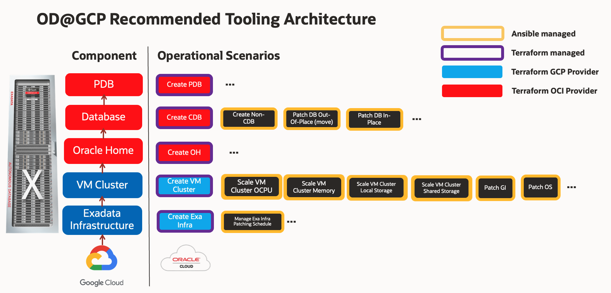
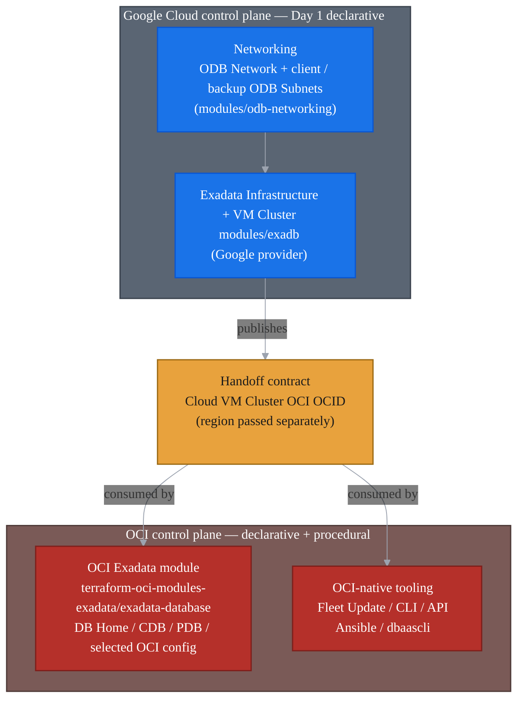

# Operational Best Practices for Oracle Database@Google Cloud Exadata Database Service

&nbsp;

Last reviewed: 2026-06-17

This asset describes how to operate the Exadata Database Service scope of Oracle Database@Google Cloud (OD@GCP) in the **GitOps multi-cloud operating model**: Git is the source of truth, changes are reviewed through pull requests, and pipelines apply the approved desired state. The focus is control-plane ownership, Terraform state boundaries, Day 1 and Day 2 tool selection, handoff contracts, and drift handling.

For the implementation runbook, dependency handoff examples, and module wiring patterns, see [OD@GCP Module Handoff Reference](./handoff-reference.md).

&nbsp;

## Table of Contents

- [Operational Best Practices for Oracle Database@Google Cloud Exadata Database Service](#operational-best-practices-for-oracle-databasegoogle-cloud-exadata-database-service)
  - [Table of Contents](#table-of-contents)
  - [1. Overview](#1-overview)
  - [2. Operational Pattern](#2-operational-pattern)
  - [3. Design and Ownership Considerations](#3-design-and-ownership-considerations)
  - [4. How to Start](#4-how-to-start)
  - [5. Module Alignment and Handoff Reference](#5-module-alignment-and-handoff-reference)
  - [6. Day 2 Operations, State, and Drift](#6-day-2-operations-state-and-drift)
- [License](#license)

&nbsp;

## 1. Overview

Scope: Exadata Database Service on Oracle Database@Google Cloud: Exadata Infrastructure and VM Clusters created from Google Cloud, with supported Day 2 modifications for those resources and the Exadata database layer operated through OCI.

This guide is about ownership and guardrails. Implementation wiring is included only where it affects the operating model; detailed handoff examples live in [OD@GCP Module Handoff Reference](./handoff-reference.md).

The core split is simple: Google Cloud owns the creation path and publishes identity; OCI owns Day 2 modifications for Exadata Infrastructure and VM Clusters that Google Cloud redirects to OCI, plus database operations. The Google Cloud stack publishes the OCI VM Cluster OCID, and OCI-side automation consumes it.

That split follows the service model. Google Cloud lets you create and manage Exadata Infrastructure instances and Exadata VM Clusters using the Google Cloud console, Google Cloud CLI, or the Oracle Database@Google Cloud API, but supported modifications for those Exadata resources redirect to OCI. Exadata databases are created in OCI. The documented Terraform path follows the same boundary: create ODB Network, ODB Subnets, Exadata Infrastructure, and VM Cluster from Google Cloud, then perform OCI-side Day 2 modifications and create the database layer through the OCI provider.

&nbsp;

## 2. Operational Pattern

The diagram below is a representative tooling map for common operations. It is not an exhaustive catalog, a provider capability matrix, or a full Terraform state model.

Use the map as a decision guide:

- Google Cloud-owned creation stays in [`terraform-oci-multicloud-google`](https://github.com/oci-landing-zones/terraform-oci-multicloud-google), specifically [`modules/odb-networking`](https://github.com/oci-landing-zones/terraform-oci-multicloud-google/tree/release-0.2.0/modules/odb-networking) and [`modules/exadb`](https://github.com/oci-landing-zones/terraform-oci-multicloud-google/tree/release-0.2.0/modules/exadb).
- OCI-side database desired state stays in [`terraform-oci-modules-exadata/exadata-database`](https://github.com/oci-landing-zones/terraform-oci-modules-exadata/tree/v1.1.0/exadata-database).
- Procedural work and intentionally ignored fields stay in Day 2 tooling: [ODyS](../../scaling/exacc-exacs-dynamic-scaling/README.md) for Dynamic Scaling, OCI-native tooling, Ansible, Fleet Update, `dbaascli`, REST/API automation, or support-guided procedures.

The practical rule is `lifecycle.ignore_changes`. If the OCI Exadata module models a field and does not ignore it, that field can be managed from a dedicated OCI desired-state stack. If the module ignores it, or the workflow has ordered operational steps, keep it outside Terraform. If the Google Cloud module ignores a field, expected OCI-side drift is absorbed by the Google Cloud owner; that still does not make the Google Cloud stack the OCI operations engine.

Common operating cases:

- **Patching:** DB Home `db_version` and `database_software_image_id` are creation-time inputs and ignored after creation; database `db_home_id` and `db_version` are ignored too. Treat database patching as out-of-place: create a patched DB Home, then move the database to it.
- **Scaling:** The Google Cloud Exadata module ignores Infrastructure sizing fields and VM Cluster sizing or operational fields such as OCPU, memory, local storage, shared storage, DB server OCIDs, Grid Infrastructure version, and local backup flags.
- **ODyS for FinOps:** When the operating model uses [ODyS](../../scaling/exacc-exacs-dynamic-scaling/README.md), treat it as the Dynamic Scaling app: it scales OCPU up or down to match workload demand and captures operational evidence. The Google Cloud-side module can absorb expected drift for ignored sizing fields; any other Terraform state that owns OCPU or sizing fields will try to restore the configured capacity unless those fields are not managed by that state or are covered by narrow `ignore_changes`.
- **Recovery:** Backup configuration can be modeled by Terraform, but operational restore or recovery remains a Day 2 workflow.

| Area | Recommended approach |
|---|---|
| **Google Cloud-owned operations** | Use Google Cloud Terraform only for ODB Network, ODB Subnets, OD@GCP Exadata Infrastructure, VM Cluster creation, and handoff outputs. |
| **OCI database desired state** | Use [`terraform-oci-modules-exadata/exadata-database`](https://github.com/oci-landing-zones/terraform-oci-modules-exadata/tree/v1.1.0/exadata-database) for DB Homes, CDBs/databases, PDBs, backup configuration, and creation-time DB software image selection. |
| **OCI Infrastructure or VM Cluster fields** | Use the OCI Exadata module only by explicit exception, with a dedicated OCI state and matching Google Cloud-side `ignore_changes`. |
| **Day 2 workflows** | Use ODyS for Dynamic Scaling. Use OCI-native tools, Ansible, Fleet Update, `dbaascli`, REST/API automation, or support-guided procedures for patching, refreshable clones, restore/recovery, DR, health checks, passwords, and ignored fields. |
| **Drift control** | Use `ignore_changes` to absorb expected drift, not to turn the Google Cloud stack into the OCI operations engine. |

The handoff flow is:

&nbsp;

## 3. Design and Ownership Considerations

Split Terraform stacks by lifecycle, ownership, permissions, change window, and blast radius.

| Area | Recommended practice |
|---|---|
| Networking Day 1 | Create ODB Network and ODB Subnets from the Google Cloud-side stack. |
| Infrastructure and VM Cluster Day 1 | Create Cloud Exadata Infrastructure and Cloud VM Cluster from Google Cloud, then publish the OCI VM Cluster OCID. |
| Handoff contract | Publish a small sanitized map containing the VM Cluster Google Cloud resource name, OCI OCID, state, and placement evidence. Pass the OCI provider region separately. |
| OCI desired state | Use the OCI Exadata module only for fields it owns and does not ignore. Resources created from Google Cloud need a single-writer OCI state and matching Google Cloud drift coverage. |
| Day 2 operations | Keep procedural work, ignored fields, ODyS / Dynamic Scaling, restore/recovery, and support-guided procedures outside Terraform. |

&nbsp;

## 4. How to Start

Start with this sequence.

| STEP | AREA | DESCRIPTION |
|:---:|---|---|
| **1** | **Google Cloud Networking** | Create ODB Network and ODB Subnets with [`modules/odb-networking`](https://github.com/oci-landing-zones/terraform-oci-multicloud-google/tree/release-0.2.0/modules/odb-networking). |
| **2** | **Google Cloud Exadata** | Create Cloud Exadata Infrastructure and Cloud VM Cluster with [`modules/exadb`](https://github.com/oci-landing-zones/terraform-oci-multicloud-google/tree/release-0.2.0/modules/exadb). |
| **3** | **Handoff Contract** | Publish the VM Cluster OCI OCID through `gcp_cloud_vm_clusters`; downstream stacks can pass a sanitized `gcp_cloud_vm_clusters_dependency`. Pass the OCI provider region separately. |
| **4** | **OCI Exadata Module** | Create DB Homes, CDBs/databases, PDBs, backup configuration, and creation-time DB software image selection. |
| **5** | **Day 2 Operations** | Run patching, ODyS / Dynamic Scaling, refreshable clone maintenance, restore/recovery, DR, health checks, password work, and ignored-field changes outside Terraform. |
| **6** | **Control Check** | Run plans from the owning stacks so expected drift is accounted for through the relevant `ignore_changes` contract and unexpected drift remains visible. |

Use the module alignment below to decide which stack owns each field.

&nbsp;

## 5. Module Alignment and Handoff Reference

All reference module families share one contract: Google Cloud creates the VM Cluster and publishes its OCI OCID; OCI consumes that OCID. Use Google Cloud modules only for the Google Cloud-owned path. Use the OCI Exadata module for OCI desired state.

**Google Cloud-side Day 1, networking module.** Use [`modules/odb-networking`](https://github.com/oci-landing-zones/terraform-oci-multicloud-google/tree/release-0.2.0/modules/odb-networking) to create the ODB Network and ODB Subnets that the VM Cluster consumes. The module exports `gcp_odb_networks` and `gcp_odb_subnets`; downstream stacks normally pass those maps as `gcp_odb_networks_dependency` and `gcp_odb_subnets_dependency`.

| Area | Reference module | Role |
|---|---|---|
| Google Cloud networking | [`modules/odb-networking`](https://github.com/oci-landing-zones/terraform-oci-multicloud-google/tree/release-0.2.0/modules/odb-networking) | Owns ODB Network and ODB Subnets. The reference module ignores labels, but network identity, location, CIDR, purpose, and ODB Network attachment remain Google Cloud-owned desired state. |

**Google Cloud-side Day 1, Exadata module.** Use [`modules/exadb`](https://github.com/oci-landing-zones/terraform-oci-multicloud-google/tree/release-0.2.0/modules/exadb) to create Cloud Exadata Infrastructure and Cloud VM Cluster. The module exports `gcp_cloud_exadata_infrastructures` and `gcp_cloud_vm_clusters`; the VM Cluster output includes the OCI OCID and state used by the handoff.

| Area | Reference module | Role |
|---|---|---|
| Google Cloud Exadata Infrastructure | [`modules/exadb`](https://github.com/oci-landing-zones/terraform-oci-multicloud-google/tree/release-0.2.0/modules/exadb) | Owns `google_oracle_database_cloud_exadata_infrastructure`; exports Infrastructure identity, OCI OCID, state, location, zone, and capacity evidence. In `release-0.2.0`, it ignores `properties[0].compute_count`, `properties[0].storage_count`, and `properties[0].total_storage_size_gb`. |
| Google Cloud VM Cluster | [`modules/exadb`](https://github.com/oci-landing-zones/terraform-oci-multicloud-google/tree/release-0.2.0/modules/exadb) | Owns `google_oracle_database_cloud_vm_cluster`; exports the VM Cluster OCI OCID and state. In `release-0.2.0`, it ignores labels plus sizing or OCI-operational fields such as `cpu_core_count`, `ocpu_count`, `memory_size_gb`, `db_node_storage_size_gb`, `data_storage_size_tb`, `db_server_ocids`, `disk_redundancy`, `gi_version`, `local_backup_enabled`, `node_count`, and `sparse_diskgroup_enabled`. |
| Handoff wrapper | [`modules/exadb/examples/oci-dbhome-handoff`](https://github.com/oci-landing-zones/terraform-oci-multicloud-google/tree/release-0.2.0/modules/exadb/examples/oci-dbhome-handoff) | Optional adapter that resolves `vm_cluster_id` from either a direct OCI Cloud VM Cluster OCID or a key from `gcp_cloud_vm_clusters_dependency`, validates that the dependency is `AVAILABLE`, and passes the resolved OCI OCID to the OCI Exadata module. |

The OCI provider region is not the Google Cloud region. Resolve it in the orchestration layer or derive it from the Cloud VM Cluster OCID and validate it before configuring the OCI provider. Do not add `oci_region` to `gcp_cloud_vm_clusters_dependency`; the wrapper contract accepts `id`, `name`, `ocid`, and `state`.

**OCI-side operating module.** Use [`terraform-oci-modules-exadata/exadata-database`](https://github.com/oci-landing-zones/terraform-oci-modules-exadata/tree/v1.1.0/exadata-database) for OCI-side desired state. In `v1.1.0`, its lifecycle contract is the operational guide:

| OCI resource in `exadata-database` | Terraform maintains | `ignore_changes` means use non-Terraform tooling for |
|---|---|---|
| `oci_database_cloud_exadata_infrastructure` | Configured Infrastructure fields when this resource is intentionally owned by the OCI Exadata state. | No module-level ignore is declared in `v1.1.0`; any field placed under this resource is treated as desired state by that OCI stack. |
| `oci_database_cloud_vm_cluster` | VM Cluster fields that are deliberately owned by the OCI state, such as data collection options and, only by explicit exception, OCPU, memory, local storage, or shared storage. | `gi_version`, `system_version`, and `defined_tags`. GI and system patch/upgrade flows therefore remain OCI-native / Fleet Update / `dbaascli` operations. OCPU and sizing fields are not ignored by the module, so ODyS-driven or other out-of-band scaling will appear as drift and Terraform will try to revert it unless the owning state deliberately does not manage those fields or ignores them. |
| `oci_database_db_home` | DB Home creation, display name, initial version, and optional software-image selection. | `db_version` and `database_software_image_id` after creation. DB Home patching and software-image movement are not Terraform update operations. |
| `oci_database_database` | CDB creation and modeled database configuration, including backup configuration when supplied. | `db_home_id`, `db_version`, and `database.0.admin_password`. Database patching, DB Home movement, and password work are outside Terraform. |
| `oci_database_pluggable_database` | PDB creation and modeled PDB configuration. | `container_database_id`, `container_database_admin_password`, and `pdb_admin_password`. Refreshable clone operations and password work stay outside Terraform unless explicitly modeled as a creation-time flow. |

Use the [OD@GCP Module Handoff Reference](./handoff-reference.md) for the practical wiring details: dependency maps, direct OCID handoff, wrapper-based handoff, post-handoff checks, and common mistakes.

&nbsp;

## 6. Day 2 Operations, State, and Drift

Terraform is the right tool only for fields owned by the relevant Terraform state. Procedural work has prechecks, ordered steps, work requests, and rollback; run it through the appropriate Day 2 tooling.

| Tooling | Use for | Do not use it for |
|---|---|---|
| ODyS | Dynamic Scaling for VM Cluster OCPU capacity: FinOps windows and scale-up / scale-down evidence. | Creating the baseline service topology or competing with a Terraform state that still owns the same OCPU or sizing fields. |
| OCI API / SDK / supported CLI commands | Control-plane operations, prechecks, patch/update actions, work requests, history, health checks, and evidence capture. | Becoming a second long-lived Terraform owner. |
| Exadata Fleet Update | Fleet-style **patching and upgrade** orchestration for Grid Infrastructure, Database Homes, and existing databases. It patches out-of-place by adding a new patched Oracle Home. | Creating the service topology or modeling DB Homes / CDBs / PDBs as desired-state resources. |
| OCI Ansible Collection / pipelines | Repeatable automation around supported OCI APIs: discovery, prechecks, updates, evidence, and standard operations. | Bypassing Oracle-supported workflows or hiding manual changes from state review. |
| `dbaascli` | Supported node-local DBA tasks inside the VM or DB node: diagnostics, PDB administration, password work, cloud tooling tasks, and database / DB Home / Grid Infrastructure patch or upgrade commands when Oracle documentation says to use it. | Owning the VM Cluster, Google Cloud-side resources, or Terraform state. |
| Support-guided tools | Interim patches, one-off fixes, or procedures required by Oracle documentation, My Oracle Support, or Oracle Support. | Standard automation unless the exception is recorded and reconciled. |

Drift is expected. ODyS, OCI-native operations, patching, generated values, passwords, restore/recovery state, and support-guided workflows can all change fields outside Terraform. Use narrow `ignore_changes` entries to absorb expected drift; do not use broad ignores to hide unknown changes.

The single-writer split is summarized below.

| Resource | Create / publish with | Maintain with | `ignore_changes` directs to non-Terraform tooling for |
|---|---|---|---|
| ODB Network and ODB Subnets | Google Cloud-side stack | Google Cloud-side stack for network identity, placement, CIDR, purpose, and attachment. | Labels only in the reference networking module. Network, subnet, CIDR, purpose, and placement drift should remain visible to the owning Google Cloud stack. |
| Cloud Exadata Infrastructure | Google Cloud-side stack | OCI Exadata module only for OCI-side fields explicitly assigned to that state, with matching Google Cloud-side ignore coverage. | Infrastructure sizing fields ignored by the Google Cloud module, including compute count, storage count, and total storage size. Fields not ignored must not be changed outside the Google Cloud owner unless a separate single-writer design exists. |
| Cloud VM Cluster | Google Cloud-side stack | OCI Exadata module for non-ignored OCI-side fields such as data collection configuration, with matching Google Cloud-side ignore coverage. Keep VM Cluster scaling in ODyS or another approved Day 2 path when Dynamic Scaling is the operating pattern. | Google Cloud module ignores OCPU, CPU core, memory, local storage, shared storage, DB server OCIDs, node count, disk redundancy, local backup, sparse disk group, and GI version fields. Those ignored fields can absorb expected ODyS drift on the Google Cloud side; any separate OCI state that owns OCPU or sizing fields will still try to revert them unless explicitly designed not to. |
| DB Home | OCI Exadata module | OCI Exadata module for creation-time desired state. | `db_version` and `database_software_image_id` after creation, so DB Home patching and software-image movement remain OCI-native. |
| CDB / database | OCI Exadata module | OCI Exadata module for creation and modeled backup configuration. | `db_home_id`, `db_version`, and admin password, so patching, DB Home movement, and password work remain OCI-native. |
| PDB | OCI Exadata module | OCI Exadata module for PDB creation and modeled creation-time options. | Container/password fields; refreshable clone operations and password work remain OCI-native unless explicitly modeled as a creation-time flow. |

Out-of-band changes come from ODyS, OCI-native tooling (Fleet Update, CLI / API, Ansible, `dbaascli`), or support-guided procedures. The exact Google Cloud-side ignore coverage differs between module families and revisions; confirm what the selected Google Cloud module ignores before relying on OCI-side changes.

The following **operational guardrails** apply:

- Split Terraform states only when there is a clear lifecycle, ownership, permission, change-window, or blast-radius reason.
- Never create two declarative writers for the same field. Keep the Google Cloud stack responsible for creation and identity publication, and keep the OCI Exadata stack responsible only for the OCI-side fields it explicitly owns.
- For break-glass or OCI-native changes, capture the ticket, operator, work request where applicable, command output, plan output, and post-change validation.
- Do not modify service-managed resources or provider-generated dependencies unless Oracle documentation or Oracle Support explicitly directs it.
- Do not store secrets, private keys, sensitive tfvars, credentials, or Terraform state files in Git.
- After OCI-side operations that may affect fields visible to the Google Cloud-side stack, run the owning Google Cloud-side Terraform plan so expected drift is accounted for through the module's `ignore_changes` contract and unexpected drift, especially network, placement, or identity drift, remains visible.

&nbsp;

# License

Copyright (c) 2026 Oracle and/or its affiliates.

Licensed under the Universal Permissive License (UPL), Version 1.0.

See [LICENSE](https://github.com/oracle-devrel/technology-engineering/blob/main/LICENSE) for more details.
