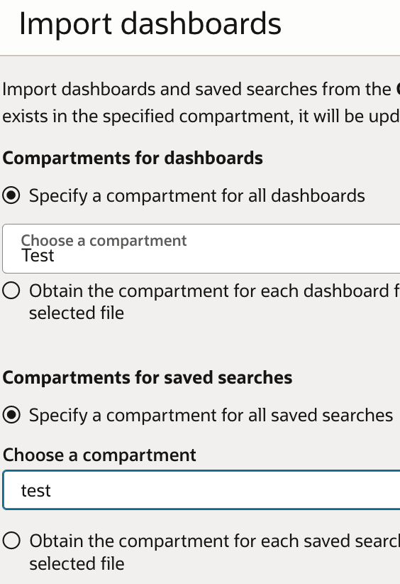

# CIS Compliance Dashboard

## Overview
This document outlines the steps to set up and use the CIS Compliance Dashboard.

## Pre-requisite:
OCI Log Analytics should be enabled in the desired region .Please refer the [doc](https://docs.oracle.com/en-us/iaas/log-analytics/doc/enable-access-logging-analytics-and-its-resources.html) for details.

## Step 1: Create Log Group in Log Analytics
1. Create a [log group](https://docs.oracle.com/en-us/iaas/Content/Logging/Task/create-logging-log-group.htm) in Log Analytics in the desired compartment. This log group will be used to store the CIS compliance data.Restrict the access of this log group to only necessary users.

## Step 2: Import Logsources and Dashboard using Terraform
1. Use the terraform code [here](./files/terraform/) to import logsources. Use the dashboard json to import via console .While importing select Specify a compartment for all dashboards and for saved searches as well. 


## Step 3: Create Policies for Log Upload and Run CIS Script
1. Create the necessary [IAM policies](https://docs.oracle.com/en-us/iaas/log-analytics/doc/upload-logs-demand.html) to allow log upload:
   ```
   allow group <group_name> to use loganalytics-ondemand-upload in tenancy
   allow group <group_name> to use loganalytics-log-group in compartment <log_group_compartment>
   allow group <group_name> to read loganalytics-source in tenancy
   allow group <group_name> to {LOG_ANALYTICS_ENTITY_UPLOAD_LOGS} in compartment <entity_compartment>
   ```
   Replace `<group_name>`, `<log_group_compartment>`, and `<entity_compartment>` with your actual group name and compartment OCIDs.
2. Follow the guidelines in the [CIS landingzone GitHub repository](https://github.com/oci-landing-zones/oci-cis-landingzone-quickstart) for the required IAM policies and the way to run the CIS script.

**NOTE:** The CIS script version tested for this solution is v3.1.1. If future versions add new columns the log parser needs to be updated accordingly. 
Example to run CIS script in Cloud Shell with redact option```python3 cis_reports.py -dt --region eu-frankfurt-1 --report-directory CISRESULTS --redact-output```

  

## Step 4: Upload CSV to Log Analytics
1. Once the CIS script has run successfully, use the [cisla_upload.py](./files/python/cisla_upload.py) python script to upload the CSV data to Log Analytics.
2. Examples to run `cisla_upload.py`:
   1. Using Cloud Shell
   ```
   python3 cisla_upload.py -d <directory where the cis report exists> -lg <Log Analytics log group OCID> -dt
   ```
   2.Using Instance Principal:
   ```
   python3 cisla_upload.py -d <directory where the cis report exists> -lg <Log Analytics log group OCID> -ip
   ```

   Replace `<directory where the cis report exists>` with the path to the directory containing the CIS report, `<Log Analytics log group OCID>` with the OCID of the Log Analytics log group created in Step 1.

**NOTE:** Not all csv's generated as part of CIS scripts are uploaded for analysis. The list of csv that are uploaded for analysis are:  
    'cis_summary_report.csv',  
    'cis_Identity_and_Access_Management_1-1.csv',  
    'cis_Identity_and_Access_Management_1-3.csv',  
    'cis_Identity_and_Access_Management_1-7.csv',  
    'cis_Identity_and_Access_Management_1-8.csv',  
    'cis_Identity_and_Access_Management_1-9.csv',  
    'cis_Identity_and_Access_Management_1-10.csv',  
    'cis_Identity_and_Access_Management_1-11.csv',  
    'cis_Identity_and_Access_Management_1-12.csv',  
    'cis_Identity_and_Access_Management_1-13.csv',  
    'cis_Identity_and_Access_Management_1-15.csv',  
    'cis_Identity_and_Access_Management_1-16.csv',  
    'cis_Identity_and_Access_Management_1-17.csv', 
    'cis_Storage_Block_Volumes_5-2-1.csv',  
    'cis_Storage_Block_Volumes_5-2-2.csv',  
    'cis_Storage_File_Storage_Service_5-3-1.csv',  
    'cis_Networking_2-1.csv',  
    'cis_Networking_2-2.csv',  
    'cis_Networking_2-5.csv',  
    'cis_Networking_2-3.csv',  
    'cis_Networking_2-8.csv',  
    'cis_Compute_3-1.csv',  
    'cis_Compute_3-2.csv',  
    'cis_Compute_3-3.csv', 
    'cis_Logging_and_Monitoring_4-2.csv',  
    'cis_Logging_and_Monitoring_4-13.csv',  
    'cis_Logging_and_Monitoring_4-16.csv',  
    'cis_Logging_and_Monitoring_4-17.csv',  
    'cis_Storage_Object_Storage_5-1-1.csv',  
    'cis_Storage_Object_Storage_5-1-2.csv',  
    'cis_Storage_Object_Storage_5-1-3.csv'.  
   

## Step 5: Analyze Data using the CIS Compliance Dashboard
1. Use the imported CIS Compliance dashboard to analyze the CIS data uploaded to Log Analytics.

## Purge Logs: 
If you want to remove the logs sent to Log Analytics you can follow the steps documented [here](https://docs.oracle.com/en-us/iaas/log-analytics/doc/manage-storage.html)
