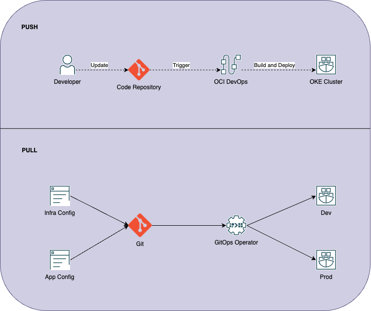
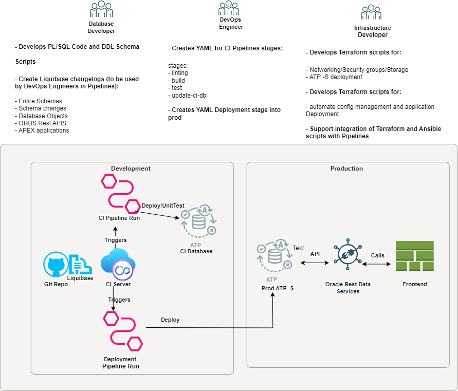
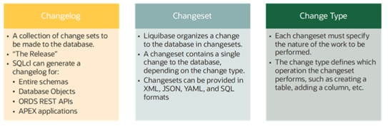
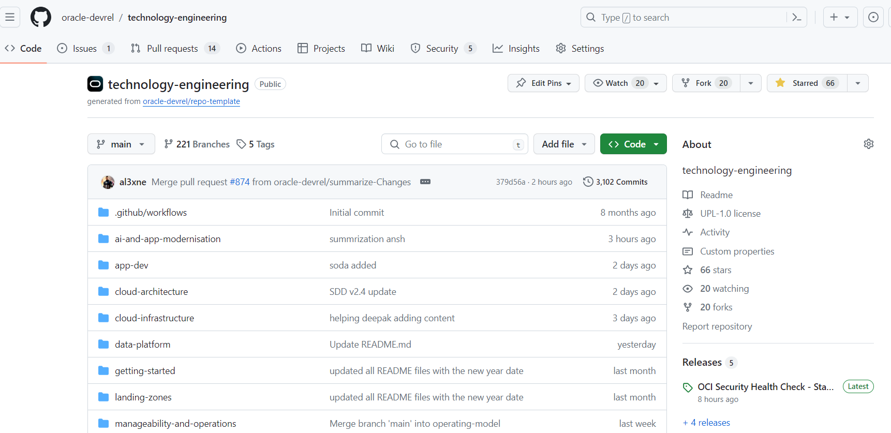
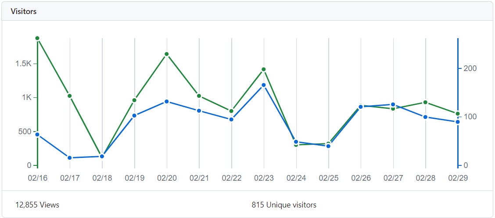

# Authors

| Name                       | eMail | Role                                      | Company |
|:---------------------------|:------|:------------------------------------------|:--------|
| Andrew Bond                |       | CTO and Specialist Leader                 | Oracle  |
| Marta Tolosa               |       | Application Development Specialist Leader | Oracle  |
| Carlos J. Olivares Sánchez |       | Data Development Specialist Leader        | Oracle  |
| Jose Palmeiro              |       | Landing Zone Specialist Leader            | Oracle  |

# History

| Version | Authors                    | Date                  | Comments                                                           |
|:--------|:---------------------------|:----------------------|:-------------------------------------------------------------------|
| 1.1     | Carlos J. Olivares Sánchez | 27th of February 2024 | Added 'DevOps for Oracle Database' draft 1.                        |
| 1.2     | Marta Tolosa               | 29th of February 2024 | added Jose                                                         |
| 1.3     | Alexander Hodicke          | 1st of March 2024     | Added 'Oracle EMEA PreSales Content Sharing Strategy based on Git' |
| 1.4     | Carlos J. Olivares Sánchez | 3rd of March 2024     | Added 'DevOps for Oracle Database' version 2.                      |
| 1.5     | Marta Tolosa               | 6th of March 2024     | updated initial section                                            |
| 1.6     | Marta Tolosa               | 7th of March 2024     | considered review input                                            |
| 1.7     | Alexander Hodicke          | 8th of March 2024     | considered review input                                            |
| 1.8     | Carlos J. Olivares Sánchez | 8th of March 2024     | considered review input                                            |

# DevOps

DevOps is the process of delivering software in a fast and reliable manner. Certain tools names are heard together with the term DevOps, however, DevOps is not a tool, it is the approach to streamline software development and deployment proceses that an organization needs to adapt to reach a higher degree of automation for both infrastructure and development workflows when growing from a simple application to a production-ready software product. DevOps, GitOps, and Infrastructure-as-Code (IaC) have existed for a while, the names have been coined recently but the practices have been followed for many years in different ways.

Git is a distributed version control system (VCS). Most VCS store information as a list of delta changes, but every time you commit with Git, it takes a picture of what all your files look like at that moment and stores a reference to that snapshot, Git thinks about its data like a stream of snapshots. A branch in Git is a movable pointer to one of these commits, you can switch back and forth between branches and merge them together. The parent is recorded at commiting, so finding the base for merging is easy which encourages developers to create and use branches often. If the same part of the same file is changed in two different branches, Git is not able to merge them and you need to resolve the conflict. Most development teams have only stable or production code in the main branch and the current changes are done in another one. Best practices for branching include pushing regularly, opening pull requests for feedback, and deploying as soon as possible into the main branch. Any code in the main branch should be deployable.

## GitOps

GitOps takes DevOps practices and applies them to infrastructure automation. IaC can be stored in Git repositories because IaC is stored as code and any code should be stored on a version control system. This means that multiple operations teams can work in parallel in creating and changing configurations for Terraform, Ansible, or Kubernetes. These teams can be divided into several subteams, such as core security, network admins, etc. By applying DevOps practices to IaC we can set up a pipeline where the code is automatically applied to an infrastructure. In the cloud, code is not applied to infrastructure but infrastructure is provisioned by code.

The benefits are:

-   Version Control,
-   Security through merge requests so only approved people are allowed to make changes,
-   Traceability thanks to versioning,
-   And to trigger deployment events on valid commit.

There are two kinds of deployment strategies: push and pull.

-   When a change is done in the code, with the push strategy, the repository pipeline reacts and pushes the updated changes to the infrastructure. This deployment strategy can be reached for example with OCI DevOps Service and the Oracle Container Engine for Kubernetes (OKE). The build pipeline is triggered by a git push command and it pushes the image to the OCI Registry. Then the deployment pipeline is triggered and it applies the corresponding manifest (with the latest image) to an OKE cluster. You can additionally decide on a blue/green strategy, canaries or a Helm chart.

-   In a pull deployment, we instruct our infrastructure to be on a constant lookout for any changes to a repository, pull the latest updates, and apply the changes internally. The mechanism is implemented with an agent added into the infrastructure that connects to the Git repository and it continuously pulls for changes when it detects one. It applies the changes and always ensures that the state in the repository is the same as in the infrastructure. That makes Git the single source of truth and every change can be traced thanks to versioning. If the software agents detect a drift in the system state versus the desired state, reconciliation happens.

There are two paradigms related to application management, imperative and declarative. Kubernetes objects can be created, updated, and deleted by storing multiple object configuration files in a directory. Using using kubectl apply creates and updates those objects as needed. One of the tools that implements the pull deployment is ArgoCD. The trigger for pulling configurations from the state store can be paused, enabled or forced manually. Another declarative tool with which you can reach the same pull deployment mechanism is FluxCD to use GitOps for applications and infrastructure, or Rancher Fleet. OKE uses unmodified open source Kubernetes that complies with the Cloud Native Computing Foundation (CNCF) and Open Container Initiative (OCI) standards. Container Engine for Kubernetes is fully conformant with open source upstream Kubernetes. This enables the option to leverage ecosystem solutions and easily integrate with tools, such as ArgoCD, Gitlab, Jenkins, and others.

It is best practice to have separate Git repositories for application source code and its configuration. Application-as-configuration changes typically do not require changes to the application source code. Having different repositories allows you to change the application configuration without triggering a Continuous Integration (CI) build. The pull model can also be integrated with a CI tool that pushes the image to the registry after building and successfully testing it. Additionally, with OCI being very open and fully compliant with the open container initiative, any open-source tool that can be used for CI such as Jenkins, GitHub, GitLab, and external repositories can be mirrored from BitBucket.

To implement GitOps and to leverage its benefits, organizations need the right governance and mindset, regardless of how many tools and technologies are available in OCI. Development and Operations teams need to embrace automation, collaboration, shared responsibility, transparency and fast feedback despite each team having different needs and goals.

Some DevOps examples of deploying infrastructure and applications to OCI:

-   [CI/CD for Node.JS on OCI](https://github.com/oracle-devrel/technology-engineering/tree/main/app-dev/devops/devops-nodejs-vm)
-   [Provision an instance in OCI and install Jenkins through an Ansible playbook](https://github.com/oracle-devrel/technology-engineering/tree/main/app-dev/devops/ansible-jenkins)
-   [GitHub Action for Oracle Sqlcl](https://github.com/cpruvost/setup-sqlcl)
-   [Jenkins meets OKE](https://github.com/alcampag/jenkins-oke)
-   [Terraform Automation, update image on Container Instance](https://github.com/cpruvost/continstupgrade)

For a complete OCI Landing Zone Blueprint, using a GitOps approach to operate all OCI Core Resources, refer to the [Blueprint to Simplify the Onboarding of Organizations, Business Units and Subsidiaries into OCI](https://github.com/oracle-quickstart/terraform-oci-open-lz/blob/master/design/OCI_Open_LZ.pdf).

In the next sections, we briefly outline the principles and practices of DevOps applied to Oracle Database management. DevOps methodologies enhance collaboration, automation, and efficiency in software development and operations. The document explores the benefits, architecture, and implementation guidelines for adopting DevOps practices specifically tailored for Oracle Database management.

# Benefits of DevOps for Oracle Database

-   **Faster Delivery**: DevOps enables rapid and reliable deployment of database changes, reducing time-to-market for new features and updates.
-   **Improved Quality**: Automation and continuous testing ensure higher-quality database configurations and reduce the risk of errors and downtime.
-   **Enhanced Collaboration**: DevOps fosters collaboration between development, operations, and database administration teams, leading to smoother workflows and faster problem resolution.
-   **Scalability**: DevOps practices facilitate the scalability of Oracle Database environments, allowing seamless management of growing data workloads.
-   **Risk Mitigation**: By automating repetitive tasks and implementing version control, DevOps minimizes the risk of human errors and improves overall system stability.

## The Architecture of DevOps for Oracle Database

The architecture of DevOps for Oracle Database typically includes the following components:

-   **Version Control System (VCS)**: A centralized VCS (e.g., Git) serves as the repository for database scripts, configurations, and infrastructure-as-code (IaC) templates.
-   **Continuous Integration (CI) Server**: CI servers (e.g., Jenkins, GitLab CI) automate the building, testing, and validation of database changes.
-   **Configuration Management Tools**: Tools such as Ansible, Puppet, or Terraform automate the provisioning and configuration of Oracle Database instances.
-   **Monitoring and Logging Tools**: Monitoring solutions (e.g., Prometheus, Grafana) provide real-time insights into database performance and health.
-   **Deployment Automation**: CI/CD pipelines automate the deployment of database changes across different environments (e.g., development, staging, production).

## Implementation Guide

**Step 1: Infrastructure as Code (IaC) for Oracle Database:**

-   Define database infrastructure configurations using IaC templates (e.g., Terraform scripts).
-   Store these templates in version control to track changes and ensure consistency across environments.

**Step 2: Continuous Integration and Testing:**

-   Set up CI pipelines to automatically build and test database changes.
-   Include unit tests, integration tests, and performance tests to validate database configurations.

[Example Livelab: DevOps and CI/CD for Microservices Deployments with Oracle Database Cloud](https://apexapps.oracle.com/pls/apex/r/dbpm/livelabs/view-workshop?wid=3314&clear=RR,180&session=3725398528506)

[Example Livelab: Capture Oracle Database Changes for CI/CD](https://apexapps.oracle.com/pls/apex/r/dbpm/livelabs/view-workshop?wid=3000&clear=RR,180&session=3725398528506)

**Step 3: Automated Deployment:**

-   Implement automated deployment pipelines to deploy database changes to target environments.
-   Use deployment strategies such as blue-green deployments or canary releases for controlled rollouts.

[Example Livelab: Take Control of Your Database With Automated Schema Changes](https://apexapps.oracle.com/pls/apex/r/dbpm/livelabs/view-workshop?wid=3692&clear=RR,180&session=3725398528506)

**Step 4: Configuration Management:**

-   Utilize configuration management tools to automate database provisioning, configuration, and patching.
-   Define configuration drift policies and automated remediation procedures.

**Step 5: Monitoring and Alerting:**

-   Integrate monitoring and logging tools to monitor database performance, availability, and security.
-   Set up alerts and notifications for proactive issue identification and resolution.

**Step 6: Feedback and Continuous Improvement:**

-   Gather feedback from stakeholders, operations teams, and end-users to identify areas for improvement.
-   Continuously optimize DevOps processes and workflows based on feedback and performance metrics.

## Best Practices

-   Implement version control for all database artifacts, including schemas, scripts, and configurations.
-   Automate repetitive tasks to minimize manual intervention and reduce the risk of human errors.
-   Encourage collaboration and knowledge sharing between development, operations, and database teams.
-   Embrace a culture of continuous learning and improvement to adapt to evolving business requirements and technology trends.

## Conclusion

DevOps practices offer significant benefits for Oracle Database management, including faster delivery, improved quality, and enhanced collaboration. By adopting DevOps principles and leveraging automation, organizations can streamline database operations, improve deployment reliability, and drive innovation in database management processes. Implementing DevOps for Oracle Database requires careful planning, collaboration, and adherence to best practices to realize its full potential in delivering value to the business.

# DevOps for Oracle Database

Database DevOps applies DevOps principles as commented in the previous section, making sure that the database code is included in the same process as development and Infrastructure code with database code changes.

This is important as the automation of database application deployments is still in a non-mature state in many software projects. Too often changes to the database, going forward referred to as database releases, are created outside a version control repository. In the worst case, such database releases may consist of several scripts combined in a ZIP file shared via email, executed manually on a database during a downtime window.

A practical example to approach DevOps and CI/CD for Autonomous Database into OCI as Cloud Platform, is taken by working with a company example aiming to apply best practices and principles to their development teams with the assumption that developers own both the frontend and backend, therefore combining both the user interface and the database schema changes in a single repository (GIT) together with Infrastructure as code (IaC) developers, who automate the infrastructure management so that developers can focus on build and improve applications rather than managing environment. Finally, the DevOps engineer will be in charge of creating and managing the pipelines for CI/CD automation.

Find a high-level simplified view of actors(we will focus on Database Developers) and tasks we will explain in detail in this document:

<!--  -->

## GIT with a Single Repository and Directory Structure

We assume that developers own both the frontend and backend, therefore combining both the user interface and the database schema changes in a single GIT repository together with the Infrastructure code.

The following directory structure has been created with a single repository in mind for infrastructure, frontend and database changes. Using a directory structure such as the one shown below can prove beneficial for database releases. The database part of the project can be found in src/database under the root directory of the project. This is merely a suggestion and can be deviated from as long as the database part is self-contained:

    $ tree src/database/
    src/database/
    |-- controller.xml
    |-- r1
    | |-- migrations
    | |-- state
    | |-- testdata
    |  -- utils
    |-- r2
    | |-- migrations
    | |-- state
    | |-- testdata
    |  -- utils
    |-- r3
    | |-- migrations
    | |-- state
    | |-- testdata
    |  -- utils
     -- utils
     -- newRelease.sh

One directory exists per database release, named r1 through r3 in the example(It could also be implemented as a Tag in the repository). Database change scripts are immutable, new requirements are implemented using a new release folder. The name of the release folders above is just an example. Any naming convention can be chosen as long as it clearly and uniquely identifies a database release.

Database changes are stored as files inside the migrations folder under the given database release folder, and in the case of Liquibase deployments (explained below), these files are executed in alphabetical order if no explicit order has been defined. The state directory contains the schema DDL for all objects to produce a schema structure exactly in the way it should look at the end of the successful schema migration. This directory can be used as a reference and for troubleshooting. It should never be used for schema change deployments.

Unit tests sometimes require the use of test data. This test data set can be stored in the testdata directory if needed. The optional utils directory stores utility functionality that doesn’t need to be applied to the database as part of the release. It typically contains scripts to perform pre- and/or post-deployment validation but never is such script allowed to perform changes to the database schema.

Performance testing isn’t necessarily initiated by a CI/CD pipeline due to the time-consuming nature of these tests; however, it is very important to conduct regular performance tests. These should ideally be targeted against a production workload. In the context of Oracle Database, there are a number of options available such as Real Application Testing or SQL Performance Analyzer.

### Database Schema Management

It is proposed to use a schema migration tool, in this case, a customized version of Liquibase used in SQL Developer Command line (SQLcl). Liquibase is an Open Source database-independent library for tracking, managing, and applying database schema changes. It allows you to interactively or batch-execute SQL, PL/SQL, and JavaScript. SQLcl provides in-line editing, statement completion, and command recall for a feature-rich experience, all while also supporting your previously written SQL\*Plus scripts.

Combined, these two technologies provide a great way to deploy database migration scripts inside CI/CD pipelines. Using checksums and other metadata, Liquibase and other comparable tools, such as Flyway, can identify which script has been run against a database, avoiding an unnecessary and potentially harmful redeployment.

Perhaps the greatest advantage of SQLcl is its low storage footprint, its plentiful modern command-line features and the built-in Liquibase functionality. This tight integration is a great productivity boost, especially if you are targeting systems with mutual TLS encryption enabled, such as Oracle Autonomous Database.

Liquibase integration in SQLcl is documented in the main SQLcl documentation. It is unique and different from the Liquibase Open Source edition found on the web, by having been enhanced by Oracle to make Liquibase aware of Oracle Database advanced functionality such as extended data types, edition-based redefinition (EBR) and more. It is highly recommended to use the built-in Liquibase support inside SQLcl when working with Oracle Database, instead of the Liquibase Open Source edition.

### Liquibase Terminology and Basic Concepts

Before starting to work with Liquibase, basic concepts need to be understood:

-   Changelog
-   Changeset
-   Change Type

The following figure provides more detail concerning each of these. Please refer to the official Liquibase documentation for all the details.

Changesets are the basic entities developers create as part of a new database release. Multiple changesets are referred to as your database’s changelog. A changeset contains one or more change types. As a best practice, limit yourself to one type of change per Changeset to avoid complications during deployments.

Developers typically create multiple files containing their changesets, like creating a table, adding columns to a table, or deploying database code in JavaScript or PL/SQL. These changesets are then included in the changelog to simplify deployment. The changelog is also known as “the release”. To get more details on how to work with Liquibase you can refer to Oracle Documentation on [Using Liquibase with SQLcl](https://docs.oracle.com/en/database/oracle/sql-developer-command-line/19.2/sqcug/using-liquibase-sqlcl.html#GUID-4CA25386-E442-4D9D-B119-C1ACE6B79539).

### Deploying Code Changes

Code changes are deployed using the lb update command in SQLcl. Liquibase then reads all the changesets in the provided changelog in order.

Before applying a given changeset, a metadata query against the changelog table is performed. Liquibase’s deployment logic can be used to great effect. A “main” changelog can be defined once for the project.

Thanks to the metadata checks performed by Liquibase, any changeset found in the baseline and migrations folder that has already been executed is skipped automatically; no conditional logic is required. Since the main changelog file itself doesn’t include any changesets and hence no SQL commands on its own, it is fine to use XML or another supported format.

## Provisioning of Test Databases

Test databases play an essential part in Continuous Integration (CI) pipelines. In this context, databases are often referred to as CI databases. As you read in Chapter 1 of this tech brief several tests are automatically run once the release has been deployed into the CI database. Ideally, the entity – for example a database schema, a Pluggable Database (PDB), or a cloud service like an ATP-s – represents the production database. Following the general rule that a CI pipeline’s execution must quickly finish, the time it takes to complete the provisioning of the deployment target must be as short as possible. Remember that fast feedback is essential for the efficient use of CI/CD pipelines. The sooner a developer knows about an issue, the sooner it can be fixed.

There are different approaches available to shorten the creation of a CI database:

-   Provisioning an Autonomous Database Cloud Service.
-   Use of container images (stand-alone/orchestrated by Kubernetes via the [Oracle Database Operator for Kubernetes](https://github.com/oracle/oracle-database-operator)).
-   Creation of a Pluggable Database.
-   Using Copy-On-Write technology to clone a (pluggable) database.
-   Provisioning a database schema.

We will focus in this example on Autonomous Database provisioning

## Autonomous Database

Oracle Autonomous Database provides an easy-to-use, fully autonomous database that scales elastically and delivers fast query performance. As a cloud service, Autonomous Database does not require database administration. Autonomous Database-Serverless (ADB-S) databases are a good candidate for customers with an existing cloud footprint. They are great for use in CI pipelines because of their high degree of automation and the many different options available to create them. Common options to create Autonomous Databases include:

-   Creating an empty ADB-S instance (less common).
-   Cloning an ADB-S instance, for example, from production.
-   Creating an ADB-S instance from a backup.

All these operations are automated using Terraform, the Oracle Cloud Infrastructure (OCI) Command Line Interface (CLI), or even plain REST calls stored in the GIT repo so that the DevOps engineer can use them. As an example, the following Terraform code provides a minimum of information required to clone an existing Autonomous Database for use in the CI/CD pipeline:

    resource "oci_database_autonomous_database" "clone_adb_instance" {
    compartment_id = var.compartment_ocid
    db_name = var.ci_database_name
    clone_type = "FULL"
    source = "DATABASE"
    source_id = ci_database_autonomous_database.src_instance.id
    admin_password = base64decode(local.admin_pwd_ocid)
    cpu_core_count = 1
    ocpu_count = 1
    data_storage_size_in_tbs = 1
    nsg_ids = [ module.network.cicd_nsg_ocid ]
    subnet_id = module.network.backend_subnet_ocid
    }

The ADB-S instance is created within a private subnet (created by a Terraform module, for more details refer to OCI Terraform provider), and integrated with the CI Server, the pipeline’s infrastructure. This code creates a full clone, there are additional clone types available.

## CI/CD Pipelines

The previous chapters of this document were intended to lay the foundation required for understanding how CI/CD pipelines can be defined. This chapter describes a hypothetical CI/CD pipeline based on GitLab Community Edition. Although the choice for this chapter fell to GitLab CE, the concepts described next apply to all CI servers from Jenkins to GitHub Actions. The use of GitLab is no endorsement of this Technology.

Note: The administration of CI/CD solutions like GitLab and GitHub can easily fill hundreds of pages. This chapter tries to cover the concepts and options necessary to get started with the given technology, it cannot be a replacement for the respective documentation.

### Introduction to CI/CD Pipelines

The centerpiece of your automation project, CI/CD pipelines are typically defined in a markup language such as YAML. Some CI servers use their own domain-specific language. It is important for the pipeline’s definition to be in a format that can easily be stored alongside the application code, as described earlier in a version control system.

To set the scene two key concepts are briefly explained in the context of CI Pipelines:

-   Stages
-   Jobs

### CI Pipeline Stages

Stages allow you to group jobs. In the above example, linting, static code analysis and vulnerability scanning are performed in the linting stage. Stage names are completely arbitrary and can be chosen depending on the project’s needs. Most CI servers allow the definition of stage names, like for example in Gitlab:

    # stage definition
    stages:
    - linting
    - build
    - test
    - update-ci-db
    - deploy

Stages are typically completed in order. When designing stages you should consider the principle “fail early” literally: the sooner the pipeline fails, the quicker the developers can react. It is advisable to perform jobs requiring little to no time first, before starting on the ones that can take a while like cloning the source database.

### CI Pipeline Jobs

Jobs are things the CI pipeline must perform, like passing a JavaScript module to typescript-eslint, jslint, jshint, and other linting tools. It could also involve cloning a “golden copy” ATP instance to create a deployment target. CI/CD pipelines group jobs logically into stages. Systems employing YAML syntax can define a job like this:

    remove-atp-instance:
      stage: test
      environment:
        name: testing
      script:
        - curl --fail -X DELETE \
          -d '{ "action": "INCLUDING" }' \
          -H "Content-Type:application/json" \
          -u devops:${ORDS_PASSWORD} \
          https://${ORDS_DEV}/ords/_/db-api/stable/database/atp/${ATP_INSTANCE_NAME}

The remove-atp-instance job is executed as part of the "test" stage and executes shell-script code (an HTTP POST request via the curl command line utility to the ORDS instance requesting the deletion of the ATP instance after testing has completed).

### Ensuring Code Quality

Code quality is one of the most important metrics when it comes to automating deployments. The State of DevOps Report regularly concludes that deploying frequently goes hand-in-hand with a lower failure rate. This might sound counter-intuitive, but thanks to code quality checks executed as part of the CI pipeline or pre-commit hooks this is a requirement that can be met.

#### Linting

According to Wikipedia, linting is a term used in computer science for a process where

-   Programming errors,
-   Many types of bugs,
-   (Programming) Style,
-   Other things,

can be detected and/or enforced. Linting should occur as one of the first tasks during the execution of a CI pipeline. Code that doesn’t adhere to the linting guidelines does not have to be deployed to find out that it will fail to work properly, the linting stage confirms that it is going to fail. A deployment therefore can be skipped and the pipeline’s status set to "failure".

Errors during the linting phase should be rare: most Integrated Development Environments (IDEs) allow developers to include linters in the development process. Provided the developer’s laptop uses the same linting rules and definitions as the pipeline, any potential errors should have been highlighted by the IDE and fixed prior to the commit.

Linting is no exact science, and one size doesn’t fit all. Some rules the linter enforces by default might not be applicable to the project. In cases like this, the team usually decides which linting rules to use, and which to disable.

As with all other configuration settings, Infrastructure as Code, etc., the linter configuration should also be part of the Git repository.

## Schema Deployment

Once the Integration part of the Continuous Integration pipeline has been completed successfully it is time to deploy the Schema changes on top of the Database previously deployed. Thanks to modern software development tools such as containers, deployment issues like library incompatibilities often encountered in the past are well addressed. Using a deployment pipeline to drive database changes using Liquibase, Flyway, or any other tool, the same can be achieved with database applications. Thanks to the meta-data preserved by these tools, scripts are guaranteed to be run only once. Therefore, it should be safe to define a main changelog referencing all changesets in the releases’ migrations sub-directories of your project.

The question about the degree of deployment automation remains: theoretically, Continuous Deployment in its pure form mandates that deployments are run against production as soon as they have passed all the tests defined in the pipeline. This however might not be risk-free and many departments are better off triggering the deployment manually. All major CI servers support a manual deployment clause in the pipeline. The following is an excerpt from a .gitlab-ci.yml file showing how to set the deployment step to "manual":

    deploy-atp-instance-changes-to-prod:
      stage: deploy
      script:
        - cd src/database
        - |
          sql ${ORACLE_PROD_USER}/${ORACLE_PROD_PASSWORD}@${ORACLE_PROD_HOST}/${PROD_PDB_NAME} \
          @utils/deploy.sql ${TAG_NAME}
      environment:
        name: production
        when: manual
      rules:
        - if: '$CI_COMMIT_BRANCH == $CI_DEFAULT_BRANCH'

Thanks to the when attribute the execution of this step occurs manually.

Deployments of your database changes are not limited to the CI database and production: any other tier should be considered equally important. The same deployment mechanism should be used for your User Acceptance Test, Integration Test and Performance Test environments. Most CI servers allow you to run pipelines manually passing variables to the process. These can be used to determine the destination servers.

### Updating the CI Database Schema

Keeping the CI database Schema up-to-date with the latest changes that have gone live into production is another important aspect of your CI/CD pipeline’s execution. The CI database should always be as close to production as possible and hence changes that have been deployed into production need to be reflected in the CI database. Otherwise, future tests run at risk of failing due to these missing changes, or worse, trying to repeat the changes that are already present in production.

Thanks to tools like Liquibase or Flyway, all changes that are not yet applied to a database (the change delta) will be rolled out automatically. This is not only true for deployments into production, but also for the CI databases that are provisioned as part of the test execution. However, the larger the change delta gets, i.e., the more changes that the CI database lags behind production, the longer the CI database setup phase will take, eventually slowing down your overall pipeline execution duration. To remedy that, CI databases should regularly be updated with the latest changes so that the change delta stays at a minimum.

Based on your deployment frequency and whether you employ Continuous Delivery or Continuous Deployment, you will have to decide when and how to update the CI database.

If you plan on intra-day deployments straight to production, you may want to make updating the CI database with the changes part of your deployment stage. If you, on the other hand, employ Continuous Delivery or have infrequent deployments, a regular refresh of the "gold image" from production may be enough.

# Oracle EMEA PreSales on Git

The sharing of assets in the public domain is an important pillar of our partner strategy. We believe that the majority of our (formerly) internal assets can also be shared for external consumption, allowing customers, partners, and the general IT community to directly get best practices advice from our teams. We publish different public resources on various public platforms, such as the:

-   [Oracle Cloud Infrastructure Documentation](https://docs.oracle.com/en-us/iaas/Content/home.htm),
-   the [Oracle QuickStart](https://github.com/oracle-quickstart),
-   the [Oracle Cloud Infrastructure Architecture Center](https://www.oracle.com/es/cloud/architecture-center/),
-   the [Oracle Learning YouTube Channel](https://www.youtube.com/channel/UCpcndhe5IebWrJrdLRGRsvw)
-   or [Oracle Blogs](https://blogs.oracle.com/).

In addition, various teams in Oracle are using GitHub repositories for various open-source projects. All Oracle projects can be found on the [Oracle Organization GitHub](https://github.com/oracle) page.

The Technology Engineering organization chose to implement a GitHub strategy for its public content, to find a public space to share (almost) any kind of file-based assets, as well as to consolidate various links from the previously mentioned sources. It was decided to use a main repository for our organization, where the folder structure of the repository is used to categorize content by our product areas. All folders including the readme files are standardized to ensure consistency across the repository, allowing for easy navigation and consumption of content with repeating patterns between different folders and readme files.

In the [technology-engineering](https://github.com/oracle-devrel/technology-engineering) repository, the content is separated into two categories, file-based assets or links. File-based assets are documents, such as Solution Definition Documents written in Markdown, presentations in PDF format, code snippets, or other file-based assets. Link assets are links to other public platforms as shown above such as YouTube, the Oracle Architecture Center etc.

## Best Practices

The internal Oracle GitHub Organization defines a range of standards on how to work with an Oracle GitHub repository. We follow their best practices to comply with internal standards around Personally Identifiable Information (PII) data and our [Oracle Software Security Assurance](https://www.oracle.com/corporate/security-practices/assurance/) standards.

-   Source of truth: The repository is the source of truth for our public team assets.
-   No commit to the main branch: No user can directly write into the main branch and every change (including the addition of content) needs to be reviewed and approved via a 'Pull Request'.
-   Public content: Only publish content classified as public. We provide a list of rules and restrictions for a content creator AND the reviewer to approve before publishing any new content to the repository.
-   Only open-source content: We only publish content that we can publish under an open-source license. This requirement excludes editable content with Oracle branding, such as Oracle-branded PowerPoint documents.
-   Only example content: A disclaimer and the licenses remove all liability of Oracle if any code or best practice was used in any environment causing any harm to any system. The user is always responsible for any actions based on our example content.
-   Our content: The content has to be created by our team.

## Operations

Our main operational tool for working with GitHub is the 'Pull Request' and its review feature. We add and change content daily and the tool is very useful to maintain a review and changes within a single Pull Request. We always have a few active Pull Requests with upcoming changes in the queue. A second interesting feature is 'Issues', which allows us the track change requests or problems within our content.

In addition, we wrote a script that we can run on a local clone to crawl through the repository, to report on how many file-based assets or links every team maintains.

     for i in `git ls-files | awk -F / '{print $1}' |uniq |grep -v README.md|grep -v LICENSE`;
       do
          cd $i
          asset_count=`find . -type f \( -name "LICENSE" \) |wc -l`
          link_count=`find . -type f \( -name "README.md" \) |
            xargs  sed -n -e "/#[[:space:]]Team Publications/,/^#[[:space:]][[:alpha:]]/p" |
            grep "https://*" | wc -l`
          usefullink_count=`find . -type f \( -name "README.md" \) |
            xargs  sed -n -e "/#[[:space:]]Useful Links/,/^#[[:space:]][[:alpha:]]/p" |
            grep "https://*" | wc -l`
          echo -e "$team,$i,$asset_count,$link_count,$usefullink_count"
          cd ..
       done

Finally, the GitHub Insights tab provides us with a simple overview of traffic or contributors' statistics.

