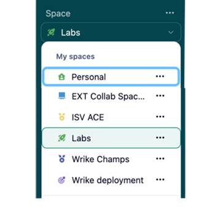
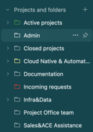
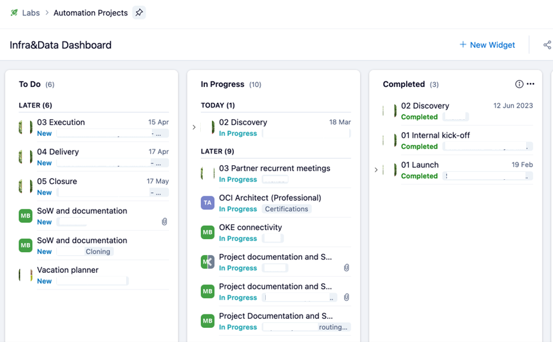
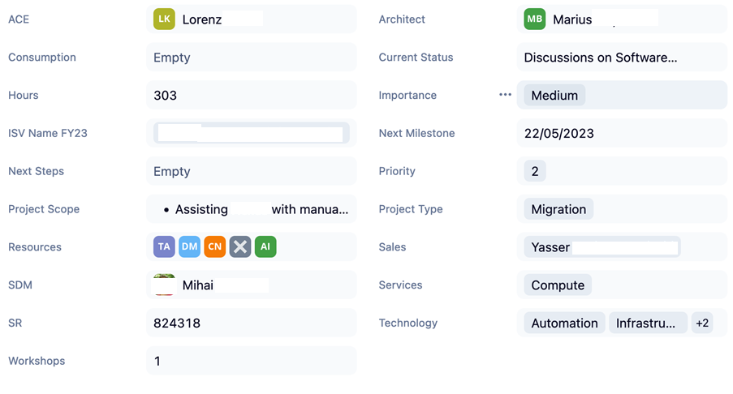
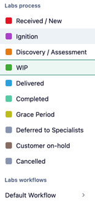
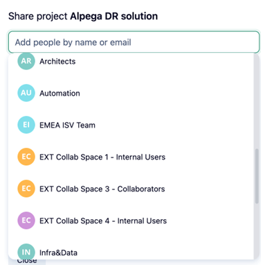
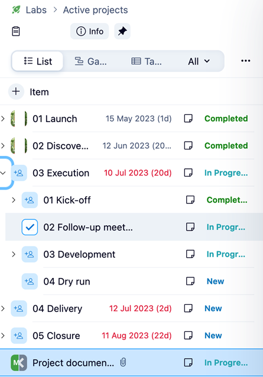
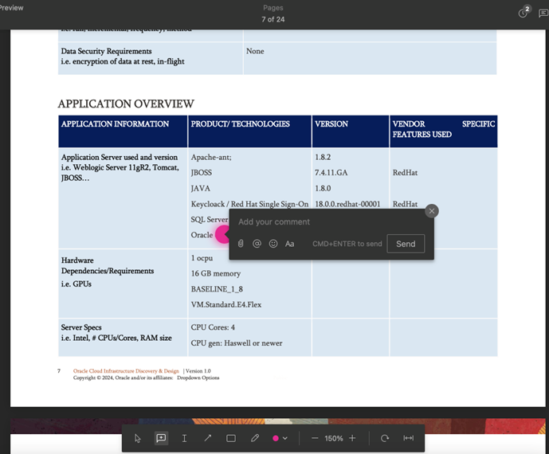

# Authors

| Name          | eMail | Role                                    | Company |
|:--------------|:------|:----------------------------------------|:--------|
| Andrew Bond   |       | CTO and Specialist Leader               | Oracle  |
| Anca Hotaranu |       | ISV Technology Cloud Engineering Leader | Oracle  |
| Tudor Popa |       | EMEA ISV Cloud Migration Leader         | Oracle  |

# History

| Version | Authors       | Date                  | Comments                   |
|:--------|:--------------|:----------------------|:---------------------------|
| 1.0     | Tudor Popa | 27th of Febraury 2024 | Created the first version. |

# Wrike Best Practices

Wrike offers a high level of customization and features like workspaces, folders, reports, automation, custom fields, and user management. Making it a great tool for managing project deliveries.

## How we use it

### Workspaces

We have dedicated workspaces for each team for better segregation between team projects and better user management.

In some cases, we can link projects from different workspaces. Example: An ACE project with the Implementation project for the same customer.

Also, workspaces are used to grant access to external customers to their projects.

### Folders

We use folders to categorize projects by status and team allocation.

For the status, this could include:

-   Incoming requests
-   Active projects
-   Closed Projects

For the teams, this could include:

-   Cloud Native & Automation
-   Infra & Data
-   Project Office team

### Reports and Dashboards

Different reports and dashboards can be customized based on the work item status, assignment, or team. Active project reports, used for weekly management meetings, offer a great overview of active projects, including their status, priorities, type, etc. The reports are customizable, giving us the possibility to add new columns, reorder them, sort and group on different custom fields, on the fly, making it a very handy tool for reporting.

The team’s dashboard, used in daily meetings, offers an overview of our team member allocations.

### Customization

#### Custom Fields

Based on our team's needs we added custom fields for projects. Custom fields can be of different types: Wrike user, free text, list of values, number, multiple or single choices, and more.

#### Custom Statuses

Work items (projects, tasks) can have custom statuses and workflows, depending on each team's needs. For Labs, we have the following statuses for projects:

### Groups

To manage users and their access to different workspaces, groups were created based on the team organization.

### Forms and Blueprints

To streamline the process, we created a custom request form that ACEs use to engage us. Once the form is filled in and submitted, a new project is created in the Implementation (Labs) Workspace. Based on a project blueprint, a template contains the base folders and tasks for a new project. The project then gets created in the Incoming Projects folder. In addition, we also receive an alert by email.

### Document Management

Wrike offers a built-in tool for viewing and annotating documents, easing the collaboration between different team members. It also has an approval system.

## Wrike Benefits for our Team

Summarizing the above, here are some of the most important benefits of Wrike for our team:

-   Possibility to share workspaces with external customers, thus enhancing better and faster communication with the customer as well as offering a real-time project status.
-   Possibility to assign tasks and deadlines to open topics on a project.
-   A high-level view of the project status is available at any moment of the day.
-   Easy access to the tool - either web interface, desktop, or mobile application that can be customized based on the end user’s needs and preferences.
-   Possibility to tailor the tool based on the requirements for each project.

## What more can be done?

Oracle security policies forbid integration with Oracle applications and the wider ecosystem. Wrike offers integrations with over 400+ applications using an API or via Wrike Integrate. If installed on Oracle Cloud, we could connect Wrike and improve the workflows with tools like internal GitLab repositories, Time Management, Slack, or Outlook.
