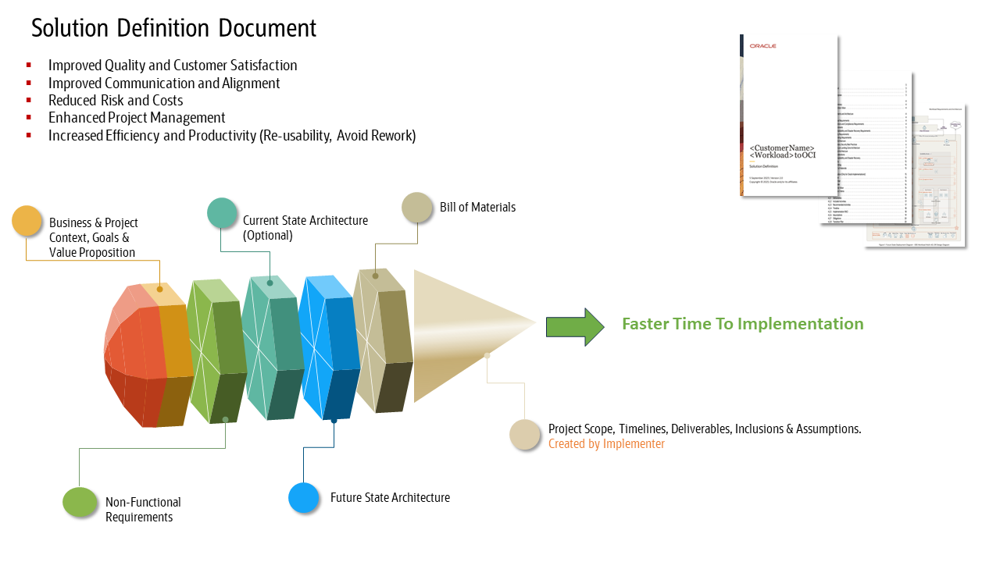

# Benefits of the Solution Definition Document for You

## What is a Solution Definition Document?

The Solution Definition Document (SDD) is a high-level technical architecture document focusing on the Oracle Cloud Infrastructure (OCI) architecture for a solution. Low-level design details are created later in the delivery phase of the project by the delivery team typically the Oracle partner.

The SDD is created by Oracle Technology (Cloud) Engineering teams as an investment by Oracle for our customers and partners. The SDD should provide just enough architecture to ensure a successful handover of Oracle's best practices to the implementer. 

It has four main sections:

- Context of the solution at hand
- As-Is on-premises architecture (Optional)
- Logical and physical to-be architecture
- Bill of materials

## Where Can I Find SDD Templates and Related Resources?

The base templates can be found in the sub-folders of this repository. There are two versions, [Mandatory](./solution-definition-mandatory/) and [Complete](./solution-definition-complete/). The mandatory version contains fewer chapters than the complete version. 

In addition, we provide a range of predefined templates for various different use cases and applications.

- [Application Integration (Simple)](../../oci-and-db/cloud-native/app-integration-and-automation/shared-assets/starter-packs/application-integration-simple/)
- [Application Integration (Complex)](../../oci-and-db/cloud-native/app-integration-and-automation/shared-assets/starter-packs/application-integration-complex/)
- [Application Integration (Oracle ERP)](../../oci-and-db/cloud-native/app-integration-and-automation/shared-assets/starter-packs/application-integration-oracle-erp/)
- [Microsoft Dynamics365 CRM](../../oci-and-db/technology-solutions/3rd-party-and-isv-applications/d365crm/dynamics-365-solution-description/)
- [MS SQL Server Resources Solution Description](../../oci-and-db/technology-solutions/custom-apps-and-consolidation/3rd-party-databases/ms-sql-always-on-solution-description/)
- [Database Migration Solution Description](../../oci-and-db/technology-solutions/custom-apps-and-consolidation/db-migration/solution-description/)
- [Oracle Database Consolidation to ExaDB-CC Workload Solution Definition](../../oci-and-db/technology-solutions/custom-apps-and-consolidation/oracle-db-consolidation/solution-definition-exadb-cc/)
- [WebLogic for OKE](../../oci-and-db/technology-solutions/custom-apps-and-consolidation/weblogic/weblogic-for-oke/)
- [E-Business Suite](../../oci-and-db/technology-solutions/apps-to-oci/e-business-suite/ebs-starterpack/)
- [JD Edwards](../../oci-and-db/technology-solutions/apps-to-oci/jd-edwards/jde-starterpack/)
- [PeopleSoft](../../oci-and-db/technology-solutions/apps-to-oci/peoplesoft/psft-starterpack/)
- [Primavera](../../oci-and-db/technology-solutions/apps-to-oci/giu/construction-engineering/primavera-solution-definition/)
- [Flexcube](../../oci-and-db/technology-solutions/apps-to-oci/giu/financial-services/flexcube-solution-definition/)
- [Opera](../../oci-and-db/technology-solutions/apps-to-oci/giu/hospitality/opera-solution-definition/)
- [Retail Applications](../../oci-and-db/technology-solutions/apps-to-oci/giu/retail/retail-solution-definition/)
- [Essbase](../../oci-and-db/technology-solutions/apps-to-oci/hyperion-essbase/essbase-solution-definition/)
- [Hyperion](../../oci-and-db/technology-solutions/apps-to-oci/hyperion-essbase/hyperion-solution-definition/)
- [Siebel](../../oci-and-db/technology-solutions/apps-to-oci/siebel/siebel-solution-definition/)
- [Red Hat OpenShift](../../oci-and-db/virtualization/openshift-on-oci/openshift-solution-definition-document/)
- [Oracle Cloud Migrations / VMware](../../oci-and-db/virtualization/oracle-cloud-migrations/ocm-solution-definition-document/)
- [Oracle Cloud VMware Solution – Disaster Recovery](../../oci-and-db/virtualization/oracle-cloud-vmware-solution/disaster-recovery-to-ocvs-solution-definition/)
- [Oracle Cloud VMware Solution – Migration](../../oci-and-db/virtualization/oracle-cloud-vmware-solution/vmware-migration-solution-definition/)
- [Oracle Secure Desktops](../../oci-and-db/virtualization/oracle-secure-desktops/secure-desktops-solution-definition/)
- [Oracle Database@AWS Cloud SDD](../../oci-and-db/database/multicloud/oracle-database@aws/solution-defination/)
- [Oracle Database@Azure Cloud SDD](../../oci-and-db/database/multicloud/oracle-database@azure/solution-defination/)
- [Database at Google Solution Definition](../../oci-and-db/database/multicloud/oracle-database@google/design-workshop/solution-definition/)
- [Landing Zone Solution Definition](../../oci-and-db/foundation/landing-zones/)
- [Cloud Analytics with OAC Standalone](../../ai/analytical-data-platform-lakehouse/shared-assets/workload-architecture-documents/cloud-analytics-with-oac-standalone/)
- [Oracle DWH Analytics for IT](../../ai/analytical-data-platform-lakehouse/shared-assets/workload-architecture-documents/data-warehouse-analytics-for-IT/)
- [Oracle DWH Analytics for LoB](../../ai/analytical-data-platform-lakehouse/shared-assets/workload-architecture-documents/dwh-analytics-for-lob/)
- [In-Database Machine Learning](../../ai/analytical-data-platform-lakehouse/shared-assets/workload-architecture-documents/in-database-machine-learning/)
- [Oracle BI Applications with Informatica PowerCenter Migration to OCI with Informatica IDMC, OAC and ADW](../../ai/analytical-data-platform-lakehouse/shared-assets/workload-architecture-documents/obia-with-informatica-to-oci-with-idmc/)
- [Oracle BI Applications 11g with ODI Migration to OCI with ODI, OAC and Oracle DB](../../ai/analytical-data-platform-lakehouse/shared-assets/workload-architecture-documents/obia-with-odi-migration-to-oci/)
- [Oracle Database and OBIEE Migration to Autonomous Data Warehouse and Oracle Analytics Cloud](../../ai/analytical-data-platform-lakehouse/shared-assets/workload-architecture-documents/obiee-db-migration-to-oac-adw/)
- [Lakehouse for HR](../../ai/analytical-data-platform-lakehouse/shared-assets/workload-architecture-documents/serverless-lakehouse/)
- [Stand-alone Data Science](../../ai/analytical-data-platform-lakehouse/shared-assets/workload-architecture-documents/stand-alone-oci-data-science/)

Other related useful external portals are the OCI Documentation with our [Cloud Adoption Framework](https://www.oracle.com/uk/cloud/cloud-adoption-framework/), as well as the [Architecture Center](https://docs.oracle.com/solutions/?q=&cType=reference-architectures%2Csolution-playbook%2Cbuilt-deployed&sort=date-desc&lang=en) which outlines best reference architectures and practices, and includes the [Well-Architected Framework for OCI](https://docs.oracle.com/en/solutions/oci-best-practices/index.html). 

[The OCI Architecture Diagram Toolkit](https://docs.oracle.com/en-us/iaas/Content/General/Reference/graphicsfordiagrams.htm) is another useful resource when creating architecture diagrams.

## What are the Benefits of Adopting an SDD for Our Customers and Partners?

**1. Improved Quality and Satisfaction:**

A standardized SDD ensures that the solution meets your specific needs and requirements. This leads to a higher quality product or service that is more likely to meet your expectations.

**2. Improved Communication and Alignment:**

A standardized SDD ensures that all stakeholders involved in a project (you, Oracle partners, IT teams, and vendors) are using the same language and understanding of the solution. This reduces ambiguity and misinterpretations, leading to better alignment between expectations and outcomes.

The document acts as a central repository of information, making it easier for everyone to stay informed about the solution definition progress and any changes during the solutioning phase of the project. Version control is important to record changes and evolution of solution definition.

**3. Reduced Risk and Costs:**

By providing a comprehensive overview of the solution definition, the SDD helps to identify potential problems or challenges before they become major issues. This allows for proactive risk mitigation and can help to avoid costly rework or delays later in the project lifecycle.

A well-defined SDD can also help to reduce the overall cost of the project by ensuring that the solution is designed and implemented efficiently leveraging Oracle's best practices and standards.

**4. Enhanced Project Management:**

A standardized SDD provides a clear roadmap for the project, outlining the initial scope, objectives, timelines, and deliverables. This helps IT teams manage the project effectively, track progress, and identify potential risks or issues early on. The document can also serve as a basis for creating project plans, resource allocation, and budget estimations.

**5. Increased Efficiency and Productivity:**

The use of a standardized SDD can streamline the design and development process, leading to increased efficiency and productivity for you, your IT teams, and Oracle partners. 

The document can also be reused for future similar project architectures, saving time and effort. The SDD also helps with the handover of resources coming in and out of the project.

**Summary:**

The adoption of a standardized SDD offers numerous benefits for you, including improved communication, enhanced project management, reduced risk and costs, improved quality and satisfaction, and increased efficiency and productivity helping reduce project delivery timelines. By ensuring that all stakeholders are on the same page and that the project is well-defined and managed, the SDD can help to ensure that IT projects are successful and deliver the desired outcomes.

# License

Copyright (c) 2026 Oracle and/or its affiliates.

Licensed under the Universal Permissive License (UPL), Version 1.0.

See [LICENSE](https://github.com/oracle-devrel/technology-engineering/blob/main/LICENSE) for more details.