# Adding a Group to an OCI IAM Admin Role

## Overview

Within OCI IAM, seven pre-defined administrative roles are provided, which provide varying levels of administrative access to the identity domain.

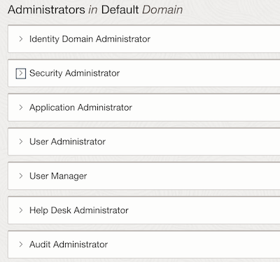

Through the OCI console, it is possible a add users to each of the admin roles.

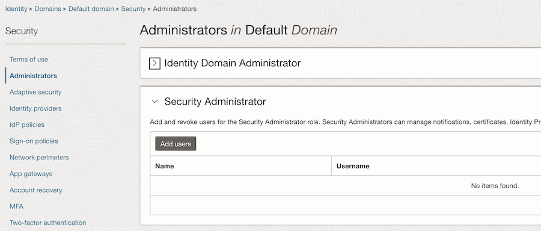

However, in many cases, there is a requirement to be able to assign an IAM group to an administrative role, rather than individual users. Currently, this cannnot be done through the OCI console, but it can be done through the REST API.

In this tutorial, I will explain how to add a group to an admin role, and also how to remove a group from an admin role, both using the REST API.

For this tutorial, I will be using POSTMAN and the collection provided by Oracle. 

> **Note:** This tutorial assumes that you have a working knowledge of REST APIs and are familiar with Postman.

## Pre-requisites

- Administrative access to an OCI IAM identity domain (or its predecessor, IDCS)
- Configuration of Postman and the OCI IAM collection as explained [here](https://www.oracle.com/webfolder/technetwork/tutorials/obe/cloud/idcs/idcs_rest_postman_obe/rest_postman.html)
- Obtained an OAUTH Access Token through the REST API to enable authenticated REST API calls to IAM

## Adding a Group to an Admin Role

However, before you can execute the API to add a user to a group, you need to obtain a number of identifiers, which will be used to populate the variables within the appropriate request.

### Obtaining the Group ID

The first identifier that you need to obtain is the ID of the group that you want to add to the admin role. In this tutorial, I have created a group called `SecurityAdmins`, which I will assign to the Security Administrators admin role.

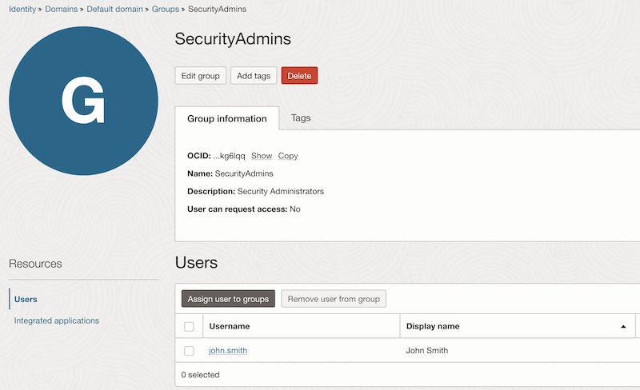

To obtain the identifier for the group:

1. Within the Postman collection, navigate to **Groups** -> **Search** -> **Search all groups (with search criteria)**.

2. Enter the search criteria in the URL. In my example my filter is `filter=displayName sw "Security"`.

> **Note** I have also added the query parameter **attributes** containing `displayname,id` so that the API only returns the attributes I need.

3. **Send** your query and you should get a results containing your group name and identifier.

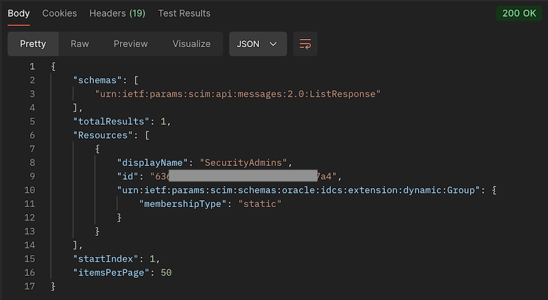

4. Using Postman's inbuilt support for global variables, highlight the `id`, right click, and add it to the `groupId` global variable.

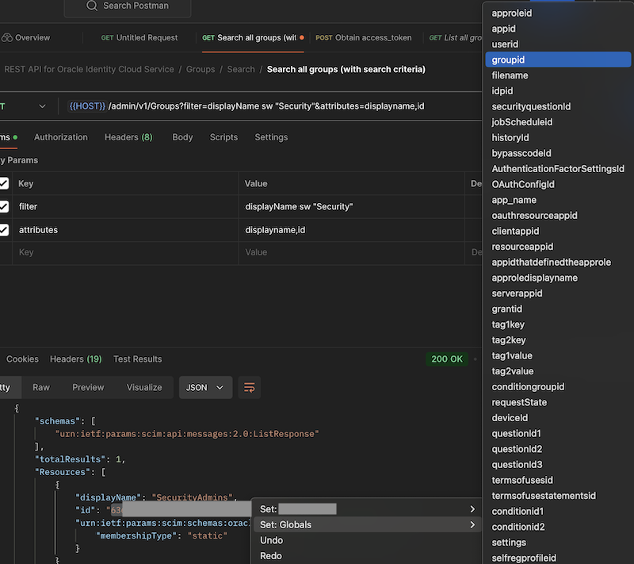

You now have the first variable that you need.

### Obtaining the Admin Role (App Role) ID

The next identifier you need is for the admin role that you want to assign the group to. In OCI IAM, these are referred to as App Roles. As mentioned above, for this tutorial, I will be adding my `SecurityAdmins` group to the `Security Administrators` admin (app) role.

To obtain the identifier for the app role:

1. Within the Postman collection, navigate to **AppRoles** -> **Search** -> **Search all AppRoles**.

2. As before, we will add a search filter `filter=displayName sw "Security"` and return attributes `attributes=displayName,id`

3. **Send** your query and you should get a results containing your App Role name and identifier.

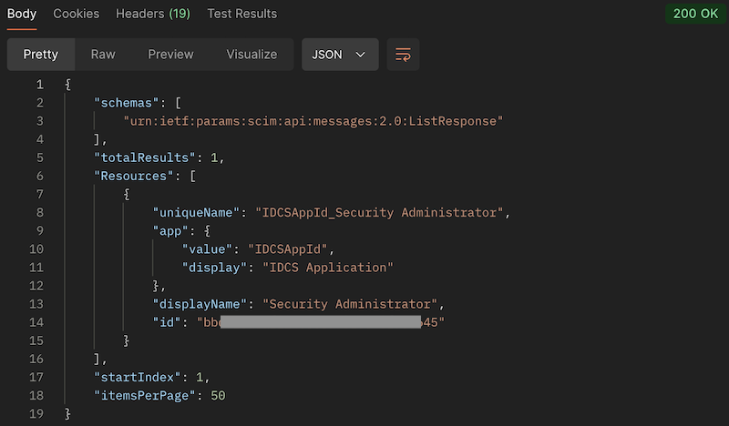

4. Follow the same process as above to highlight the `id` of the app role and add it to the `appRoleId` global variable.

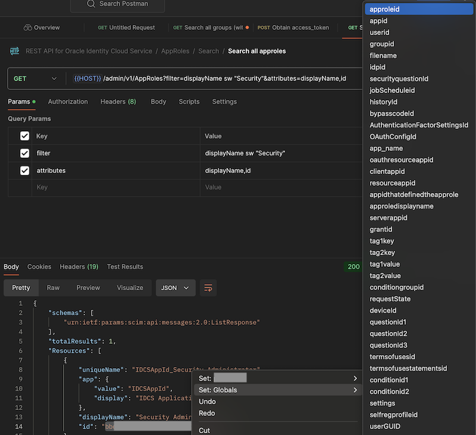

You now have the second variable that you need.

### Adding the Group to the Admin Role

You are now ready to add your group to your Admin Role.
 
1. Within the Postman collection, navigate to **Grants** -> **Grant an approle to a group**. This is the API that you will use to add a group to an admin role.

You will see that it takes three variables as inputs. We have two of them (`groupId` and `appRoleId`) already stored in our global variables. For the `appId`, IAM uses a special, inbuilt value for admin roles.

2. Change the value of **app** from `{{appId}}` to `IDCSAppId`.

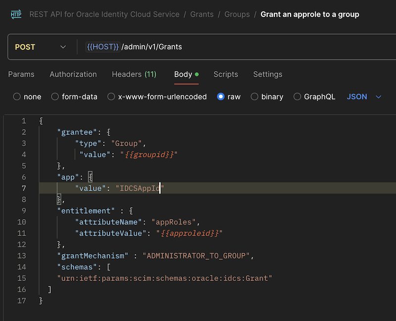

3. **Send** your query and you should get a **201 Created ** status message, showing that you request was successful.

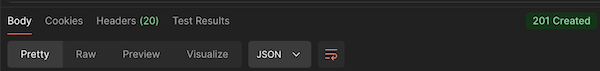

Your group is now assigned to your admin role.

## Validating your Assignment

Let's check that our group has been assigned.

1. Within the OCI console, in your identity domain, navigate to **Security** -> **Administrators**.

2. Expand the **Security Administrators** group and you should see that **John Smith** (who is a member of our **SecurityAdmins** groups) is now assigned this admin role.

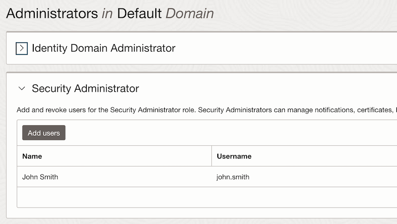

Let's change membership of the group to see the change reflected in the admin role.

3. Within your test group (**SecurityAdmins**), remove `John Smith` and add `James Peters` (or whatever test users you are using).

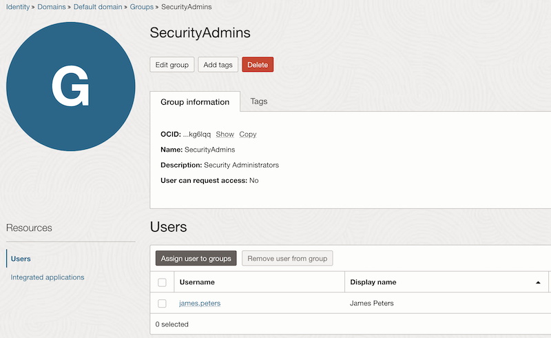

4. Navigate back to your **Security Administrators** and you will see that `James Peters` is now an administrator and `John Smith` isn't.

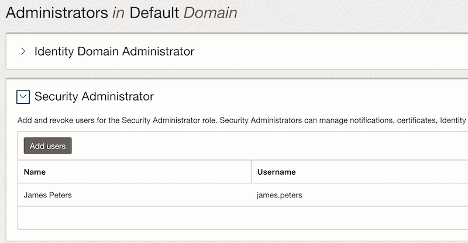

## Removing a Group from an Admin Role

Now, I want to remove my `SecurityAdmins` group from my `Security Administrators` admin role.

This is a two stage process. First, you need to obtain the grantID for that assignment.

1. Within the Postman collection, navigate to **Grants** -> **Search for all groups that have grants of a specific app**.

2. Add a filter to the query parameters similar to the one you used previously (e.g., `filter=displayName sw "SecurityAdmins"`).

3. Change the `{{appId}}` value in the query to `IDCSAppId`.

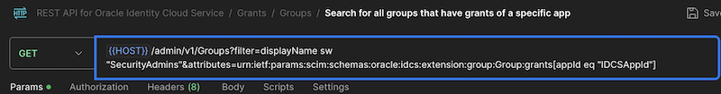

4. **Send** your query and you should get a the result showing the **SecurityAdmins** group grant.

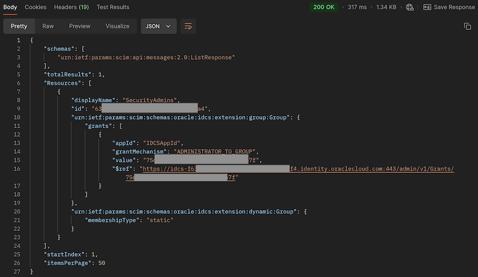

5. Follow the same process as above to highlight the `value` of the grant and add it to the `grantId` global variable.

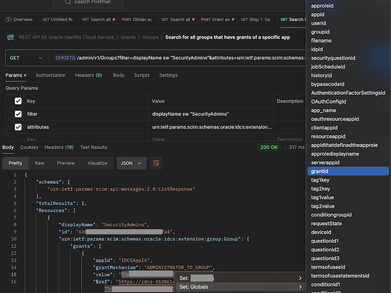

Now that you have the `grantId`, we can execute the final step to revoke that grant.

6. Within the Postman collection, navigate to **Grants** -> **Groups** -> **Revoke an AppRole from a Group** -> **Step 2: Delete each grant**.

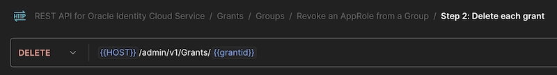

Since you already have the `grantId` in your global variables, you can execute this script.

7. **Send** your query and you should get a **201 Created ** status message, showing that you request was successful. 

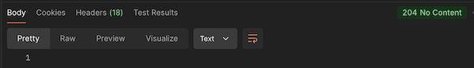

## Validating the revocation

Let's check that our group has been revoked.

1. Within the OCI console, in your identity domain, navigate to **Security** -> **Administrators**.

2. Expand the **Security Administrators** group and you should see that the role has no members, since the group has been revoked from the admin role.

# License

Copyright (c) 2024 Oracle and/or its affiliates.

Licensed under the Universal Permissive License (UPL), Version 1.0.

See LICENSE for more details.