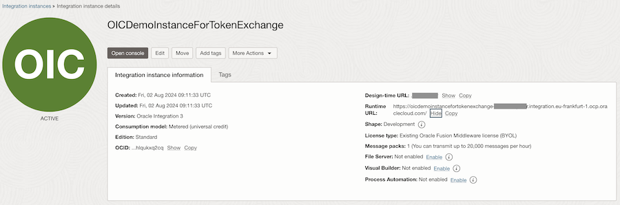
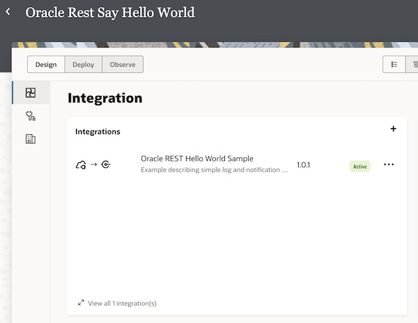
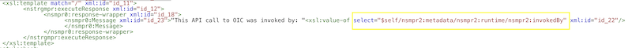
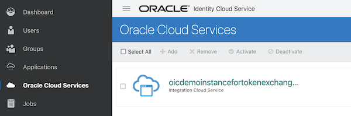
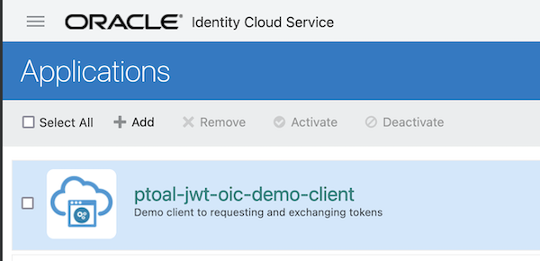
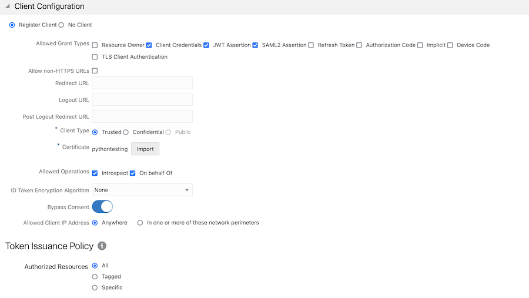
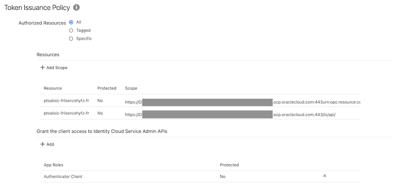
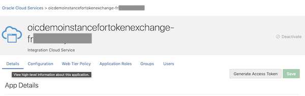
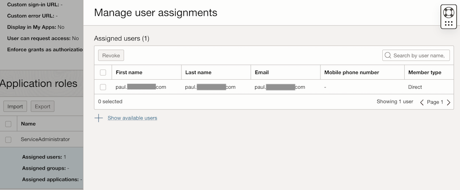
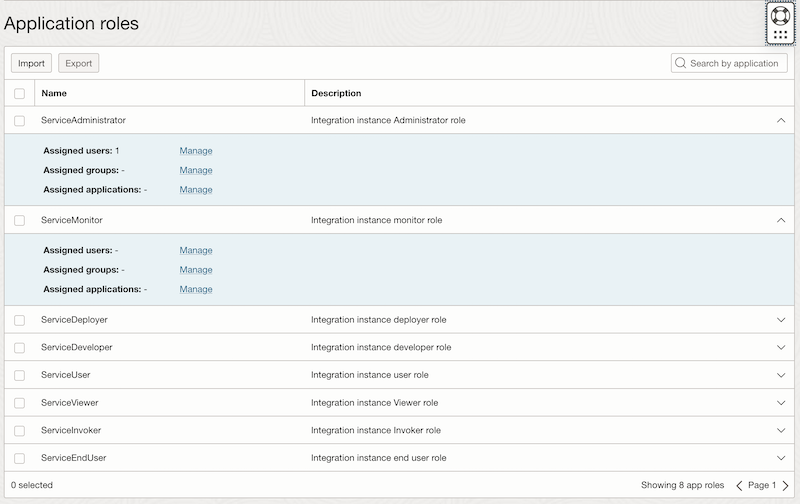

# Setup

This script requires OCI IAM and OIC to be configured prior to the script being executed.

## Oracle Integration Cloud Configuration

1. Create an instance of Oracle Integration Cloud (OIC) within your tenancy.

2. Deploy a sample integration within your OIC instance. For this example, I deployed the sample Hello World integration.

3. Within the Hello World integration, I customised the response message to return the username of the invoking user. This enabled me to show that the user being passed in the token was been authenticated by OIC.

Once this was configured, I made it active within OIC.

## IAM Trusted Application Configuration

When your create your OIC instance, it will automatically register within IAM, since OIC is tightly coupled to IAM for authentication and authorization.

Next, you need to create a Trusted Application in IAM to represent your test client (the python script).

1. Create a Confidential Application.

2. Configure the confidential client as per these settings:

   **Client Configuration**

   - Allowed Grant Types: `Client Credentials`, `JWT Assertion`, `SAML2 Assertion`
   - Client Type: `Trusted`
   - Certificate: Import your certificate.
   - Allowed Operations: `Introspect`, `On behalf of`
   - Bypass Consent: `True`
   - Resources:
      - Click `Add Scope`, find your OIC instance from the list and select the two resources within them, e.g.
         - `https://sssssssss.integration.eu.xxxxxxx.ocp.oraclecloud.com:443/urn:opc:resource:consumer::all`
         - `https://sssssssss.integration.eu.xxxxxxx.ocp.oraclecloud.com:443/ic/api`
      - Grant the client access to Identity Cloud Service Admin APIs
         - Click `Add` and select `Authenticator Client`

    **Leave all other settings as default**

When complete, your confidential application should look like this.

3. Save your confidential application.

4. Activate your confidential application.

## Assign Test Users to OIC

The final step within IAM is to assign some test users to your OIC instance and grant them a role.

1. Within IAM, navigate to your OIC instance and select it to view the details.

2. Navigate to **Application Roles** and assign a test user to a role.

For this test, I assigned myself to the `Service Administrators` role.

