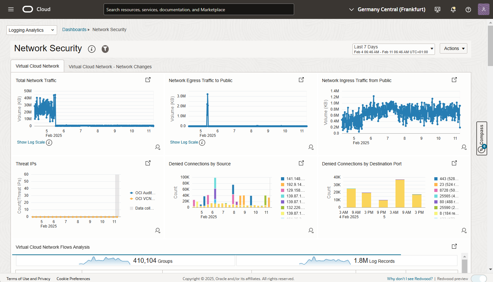

# Generation of Securty Alarms from OCI logs

Oracle Cloud Infrastructure (OCI) and its services provide effective and manageable security that enables you to run mission-critical workloads and store your data with confidence. To achieve cloud security operational excellence, it is crucial to continuously protect, detect, and in the event of a potentially risky configuration change or potential attack, respond. For protection of the environment, a strong security posture and essential cyber hygiene practices are imperative.
  
Creating alarms to be passed to the security responsible organization or individuals is a key requirement in order to gain early detection of a Advanced Persistent Threat type of attack. 
  
# Security Protection, Detection, and Response
  
 A common set of best practices for protection, detection, and response are:
-	**Security posture management** - Oracle [Cloud Guard](https://www.oracle.com/uk/security/cloud-security/cloud-guard/) provides strong security posture management, configuration change management, threat intelligence and unsecure configuration detection and remediation.
-	**Security monitoring** - For customers navigating the dynamic cloud security landscape without a dedicated Security Information and Event Management (SIEM) system, the Security Fundamentals Dashboards are set to support our customers in building and maintaining strong security monitoring, observability and governance around the OCI cloud. The [Security Fundamentals Dashboards](https://blogs.oracle.com/observability/post/oracle-cloud-infrastructure-security-fundamentals-dashboards-using-oci-logging-analytics) proactively aggregate and analyse OCI logs.
-	**Compliance Checking** - It is important to check your tenancy against industry best practices. The Centre of Information Security (CIS) produces a [Benchmark for Oracle OCI](https://www.cisecurity.org/benchmark/oracle_cloud). This benchmark builds a foundation for minimum protection and detection within your OCI tenancy. Oracle Cloud Guard providers detectors for the CIS Controls related to protection.
-	**Security metrics and alerts** - With Oracle [Metrics](https://docs.public.oneportal.content.oci.oraclecloud.com/en-us/iaas/Content/managed-access/metrics.htm) and [Alarms](https://docs.oracle.com/en-us/iaas/Content/Monitoring/Tasks/managingalarms.htm), you may configure alarms that are triggered, and notifications created when a security-related metric exceeds a threshold. For configuration changes, Cloud Guard provides standard responders for notification in the event of unsecure configuration changes, with the option in many cases to remediate the change.
  
The scope of this post is to show how the Security Fundamentals Dashboard can be enhanced with alarms and notifications.


For this example, egress traffic peak value, from the production VCN, will be used. One common sign of data loss is the unusually large increase in egress traffic as attackers exfiltrate data they have found. To mitigate this, monitoring a flux or large amount of egress traffic can be used as a detective security control.  

As a security foundation, the following minimum are recommended
- Ensure Cloud Guard is enabled and configured. It is not a requirement for the Security Fundamentals Dashboard, but it is industry best practice (as identified by CIS), and every organization is recommended to actively use Oracle Cloud Guard. It is included in all OCI subscriptions with no additional costs being incurred. [(Cloud Guard documentation)](https://docs.oracle.com/en-us/iaas/cloud-guard/using/part-start.htm)
-	Revisit [CIS Benchmark](https://www.cisecurity.org/benchmark/oracle_cloud) for OCI. The [OCI Security Health Check](https://github.com/oracle-devrel/technology-engineering/tree/main/security/security-design/shared-assets/oci-security-health-check-standard) is a freely available script that can be used to compare an existing tenancies configuration against the CIS benchmark, producing a report with findings and recommendations.
-	Deploy the [Security Fundamentals Dashboard](ttps://github.com/oracle-quickstart/oci-o11y-solutions/tree/main/knowledge-content/MAP/security-fundamentals-dashboards). After the few initial prerequisites, such as enabling a VCN Flow log, the dashboard is built as a terraform script that can be run directly as a stack. 

Below are sample screenshots from the two Security Fundamentals Dashboards: Identity and Network

**Security Fundamentals Dashboard - Identity Security**
  
<sub>Example Identity Dashboard</sub>  

**Security Fundamentals Dashboard - Network Security**
  
  
<sub>Example Network Dashboard</sub>  
  
# Implementation flow
  
Let's now focus on the case for creating a security alarm and adding it to the dashboard. The building blocks and flow for security alarm creation are:
- **OCI Observability & Management, with Logging Analytics** - Ingest OCI Flow Logs into Log Analytics, and use Log Analytics Explorer to create a query. The query may be run at ingestion time or at a scheduled interval. The query is saved as a custom Log Explorer query.
The Security Fundamentals Dashboard automatically creates the ingestion from OCI Logging. Please review the [documentation](https://github.com/oracle-quickstart/oci-o11y-solutions/tree/main/knowledge-content/MAP/security-fundamentals-dashboards) on GIT.

- **OCI Metric services, detection rules** - The query result can be defined as a custom metric by defining a detection rule on the saved query. In this example below, the detection rule is run at a scheduled interval.  
- **Create an OCI Notification service** - The Notification service creates a subscribeable Notification Topic. The topic is fired when an alarm threshold is exceeded.
- **OCI Metric Alarm** - Triggers a notification based on a threshold.
  
# Required IAM policies

There are two set of IAM policies that need to be defined:
- Policies for enabling the Security Fundamentals Dashboard
- Policies for enabling a detection rule

For the policies required for the Security Fundamentals Dashboard, please refer to the [documentation](https://github.com/oracle-quickstart/oci-o11y-solutions/tree/main/knowledge-content/MAP/security-fundamentals-dashboards).

The policy definitions for detector rules, which require a dynamic group, are defined in the [documentation](https://docs.public.oneportal.content.oci.oraclecloud.com/en-us/iaas/logging-analytics/doc/create-schedule-run-saved-search.html).

Below is an example of dynamic group membership rule and the policies for enabling detection rules:

```
ALL {resource.type='loganalyticsscheduledtask'}
```

Example root level policy definition
  
  ```
  
allow dynamic-group myloganalytics-detection-group to use metrics in tenancy
allow dynamic-group myloganalytics-detection-group to read management-saved-search in tenancy
allow dynamic-group myloganalytics-detection-group to {LOG_ANALYTICS_QUERY_VIEW} in tenancy
allow dynamic-group myloganalytics-detection-group to {LOG_ANALYTICS_QUERYJOB_WORK_REQUEST_READ} in tenancy
allow dynamic-group myloganalytics-detection-group to READ loganalytics-log-group in tenancy
allow dynamic-group myloganalytics-detection-group to read compartments in tenancy
```
  
# Define custom metrics query

Once we have the IAM pre-requisites in place, we can start by defining our custom metrics query.
 
Navigate to `Observability & Management->Logging analytics->Dashboards` and select Network Dashboard.  
  
  
<sub>Network Dashboard from Securty Fundamentals Dashboard</sub>  
 
Expand Egress traffic widget and you will see the Log Explorer

  
<sub>Piture of log explorer</sub>  

Run the modfied query:
```
'Log Source' = 'OCI VCN Flow Unified Schema Logs' | where 'Destination IP' = 'Public IP' | eval vol = 'Content Size Out' / 1024 | timestats span = 10minute sum(vol) as 'Volume (KB)
```  
  
<sub>Picture of exection of modified query</sub>  

  
<sub>Picture of save query as</sub>  

Pull the list of saved queries
   
  
<sub>Picture of modified query</sub>   
    
 
# Create detection rule 
Having created the custom query, we now need to create the detection rule.

Navigate to `analytics->dashboard->saved query`, and pull up the saved query.
  
  
<sub>Picture of saved query screen</sub>  

Create the Detection rule. In the detection rule creation screen, select the folowing:
- "Scheduled Detection Rule" is the method for running the log analytic query
- "Rule Name" is self-describing
- "Saved search name" - Select the correct compartment and saved Log Analytics query for the metric
- "Target service" - Select type **monitoring** (which the alarms are a function of), Metric namespace, name and frequency.
> The metric namespace is either an existing customer namespace or a new one. The new one will be created if the namespace name doesn't exist. If this is the first alarm, create a new descriptive name, otherwise select an existing name. If you want to group several alarms in the same namespace. 
- "Minimum interval" is 5 minutes, normally a good choice for security alarms.

  
<sub>Picture of first rule creation step</sub>

  
<sub>Picture of 2. step</sub> 

When the detection rule is created verify the detection rule  
  

<sub>Picture of rule validation</sub>  

# Topic Creation

Topics are the transport of an alarm to a target and needs to be present before the alarm can be created. 

After the creation of a topic, one or many subscriptions needs to be added, which are the receivers of the topic.

The topic creation is straightforward, as illustrated below. Within the OCI console, navigate to `Developer Services -> Application Integration -> Notifications`  

  
<sub>Topic creation, step 1</sub>  

  
<sub>Topic creation, step 2</sub>  

  
<sub>Topic creation, step 3</sub>  

After the topic is created, a subscription is reasonable to create, the receiver of the alarm.
  
  
<sub>Topic creation, step 4</sub>  

  
<sub>Topic creation, step 5</sub>  

When the subscription is created, the subscriber will receive an email with a link to a confirmation.
> N.B. If a different type of subscription is chosen, the receiving user will receive a confirmation through that notification channel, e.g., Slack.

Use the link in the notification to confirm the subscription.

  
<sub>Confirmation link mail</sub>  

The subscription will then change to Active.

  
<sub>Final status after successful confirmation of the subscription</sub>   

# Define the alarm

The final configuration step is to build an alarm. The Alarm is defined within the OCI console under 

`Observability & Management -> Monitoring -> Alarm Definitions`  
.
The alarm requires a metric, in a metric namespace, a threshold value of the metric and a notification topic to trigger when the threshold is exceeded.

Ensure the fields are completed accurately:
- "Metric namespace" - This is the link back to the saved query/detection rule from above
- "Interval" - Matches the query interval
- "Dimension" - Select Saved Search and dimension value, the name of the search.
- "Statistics" - Select max(), the formula used to calculate the current value of the alarm
- "Operator" - greater than, and the value 1000000

This will create an alarm that trigger if the last 5 minutes egress traffic exceed 1000000 bytes.

  
<sub>Alarm definitions</sub>  

  
<sub>Create Alarm definition</sub>  

  
<sub>Create Alarm definition continued</sub> 

Here is an example of a mail alarm received when the egress volume exceeds 1000000 bytes within 5 min. This might indicate a potential data loss.

  
<sub>Mail received when alarm is fired</sub> 

# Summary

In this post, I have shown you how a single widget in the Securty Fundamentals Dashboard can be enhanced to create a custom alarm on a custom metric.

The natural next step is to assess which alarms will be required based on your risk assessment, and with Terraform, create all the required alarms.

When the alarms are created and triggers, it is important to have defined runbooks and procedures to determine what response and action to take.


# License

Copyright (c) 2025 Oracle and/or its affiliates.

Licensed under the Universal Permissive License (UPL), Version 1.0.

See [LICENSE](https://github.com/oracle-devrel/technology-engineering/blob/main/LICENSE) for more details.
