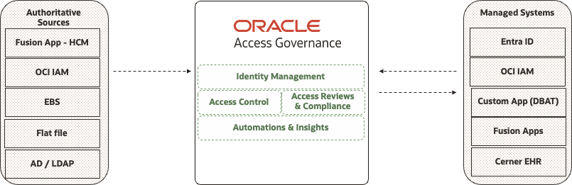

# Oracle Access Governance

Access Governance is a cloud native identity governance and administration (IGA) service that provides enterprisewide visibility to govern access to cloud and on-premises environments. With an intuitive user experience, dynamic access control, and a prescriptive analytics-driven access review process, it helps customers automate access provisioning, get insights into access permission and cloud infrastructure policy reviews, identify anomalies, and remediate security risks.

Oracle Access Governance enables integration with a wide range of authoritative sources (trusted source of identities and their attributes) and managed systems (applications containing account and permissions). **For the most common integration patterns, please see the [Reusable Assets Overview](#reusable-assets-overview) section below**.

Reviewed: 20.03.2025

# Useful Links

## General Product Links

- [Oracle Access Governance Product Page](https://www.oracle.com/in/security/cloud-security/access-governance/)
- [Oracle Access Governance Documentation](https://docs.oracle.com/en/cloud/paas/access-governance/index.html)
- [FAQs](https://www.oracle.com/uk/security/cloud-security/access-governance/faq/)
- [Product Tour](https://www.oracle.com/webfolder/s/quicktours/paas/pt-sec-access-governance/index.html)
- [Introducing Oracle Access Governance (Video)](https://www.youtube.com/watch?v=wnhiRRAPqho)
- [OAG Demo Recording](https://www.youtube.com/watch?v=GJEPEJlQOmQ)

## Blog Posts & Technical Overviews

- [Oracle Access Governance: Securing the identity posture for enterprise and cloud applications](https://blogs.oracle.com/cloud-infrastructure/post/securing-identity-posture)
- [Intelligent Cloud Delivered Access Governance with Prescriptive Analytics](https://blogs.oracle.com/cloudsecurity/post/intelligent-cloud-delivered-access-governance-with-prescriptive-analytics)

## OAG Training & Live Labs

- [Cloud Coaching - Oracle Access Governance - Identity Governance and Access Reviews (Video)](https://www.youtube.com/watch?v=9reHN697x6g)
- [Demo & Labs](https://luna.oracle.com/lab/6345863c-42c4-4f17-96fc-130278ac4b1f/steps)

# Reusable Assets Overview

**Note:** The below assets are provided for reference purposes only and for use in demos/PoC activities where required.

| **No.**   | **Business Use Case** | **Components** | **Use Case Scope** | **Reusable Asset(s)** |
|-----------|-----------------------|----------------|--------------------|-----------------------|
| 1 | Access Governance for Active Directory with user, access  management & **who has access to what** of users, groups, permissions. | • OAG - HCM, EBS and Active Directory | • **Authoritative Sources - Fusion HCM & EBS**  • **Managed System - Active directory**  • On-boarding and Mover  • Self-service request, approval workflows  • Access review/re-certification and close loop remediation | • [Fusion HCM & EBS to MS AD integration for OAG](fusion-hcm-ebs-msad/README.md) |
| 2 | Oracle Access Governance Manages **complete Identity Life cycle** in terms Administration and governance for Entra ID using HCM and Flat file as source of authority. | • OAG - HCM, Flat File  • Entra ID | • **Authoritative Sources - Fusion HCM for employees and Flat file for contractor**  • **Managed System - Entra ID**  • Employee and Contractor On-boarding  • Transfer and Request based access  • Access review/re-certification, Self-service request, approval workflows, close loop remediation | • [Fusion HCM to Entra ID integration for OAG](fusion-hcm-msentraid/README.md) |
| 3 | Access Governance for Oracle Cloud Infrastructure (OCI) - **continuous discovery** of users, groups, roles, applications, permissions and policies | • OAG - OCI IAM | • **Authoritative Sources - EBS HRMS**  • **Managed System - OCI IAM**  • Intelligent access reviews & Deep visibility  • Review of users, groups, role, applications, permissions, and policies in OCI compartments and OCI IAM domains  • User and groups management in OCI IAM | • [EBS HRMS to OCI IAM integration for OAG](ebs-hrms-oci-iam/README.md) |
| 4 | Access Governance for **disconnected systems** | • OAG - DBAT (**D**ata**B**ase **A**pplication **T**ables) | • **Authoritative Sources - DBAT**   • **Managed System - DBAT**  • Managing Disconnected system(s) with database tables using the DBAT connector  • User provisioning and Access reviews | • [DBAT OS Account Sample integration for OAG](dbat-os-accounts-sample/README.md)   • [DBAT integration tutorial for OAG](https://www.youtube.com/watch?v=SNyyI0vO_yw) |

# License

Copyright (c) 2025 Oracle and/or its affiliates.

Licensed under the Universal Permissive License (UPL), Version 1.0.

See [LICENSE](https://github.com/oracle-devrel/technology-engineering/blob/main/LICENSE) for more details.
