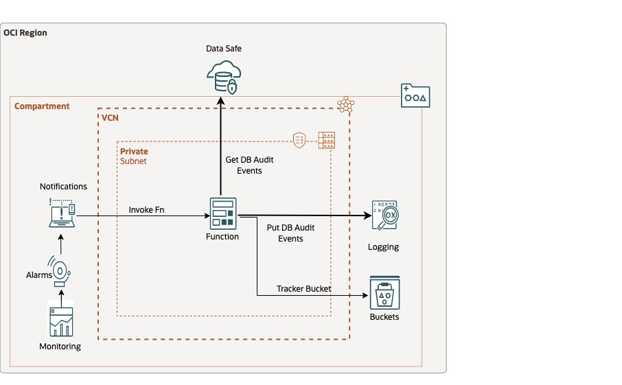

# Data Safe Audit DB to OCI Logging
Oracle Data Safe is a fully-integrated, regional Cloud service focused on data security. It provides a complete and integrated set of features of the Oracle Cloud Infrastructure (OCI) for protecting sensitive and regulated data in Oracle databases.

Oracle Data Safe delivers essential security services for Oracle Autonomous Database, Exadata Database on Dedicated Infrastructure, Oracle Base Database and Oracle Databases running in OCI. Data Safe also supports on-premises Oracle Databases, Exadata Database on Cloud@Customer, and multicloud deployments. All Oracle Database customers can reduce the risk of a data breach and simplify compliance by using Data Safe to assess configuration and user risk, monitor and audit user activity, and discover, classify, and mask sensitive data.

Oracle Functions is a serverless, highly scalable, fully managed Functions-as-a-Service platform built on Oracle Cloud Infrastructure and powered by the open-source Fn Project engine. Developers can use Oracle Functions to write and deploy code that delivers business value without worrying about provisioning or managing the underlying infrastructure. Oracle Functions is container-native, with functions packaged as Docker container images.

This Reference Architecture describes OCI Logging based solution for collecting Oracle Datasafe Oracle DB Audit Logs for continuous monitoring and troubleshooting. An OCI Function pulls audit logs from Data Safe REST API Endpoints regularly and ingest them in OCI Logging. 
From OCI Logging Data Safe DB Audit Logs, can be send to OCI Logging Analytics, external SIEM and OCI Object Storage. See [Design Guidance for SIEM Integration](https://docs.oracle.com/en-us/iaas/Content/cloud-adoption-framework/siem-integration.htm)

## Prerequisites

- Configure Data Safe to get DB Audit Events from Oracle DataBase.

- Configure OCI Registry username (your OCI username) and OCI Registry user password (your OCI user authtoken), See [Generating an Auth Token to Enable Login to Oracle Cloud Infrastructure Registry](https://docs.oracle.com/en-us/iaas/Content/Functions/Tasks/functionsgenerateauthtokens.htm)

- Create and/or Check IAM Policies to permit Oracle Cloud Infrastructure Registry username to push function image in OCI Registry. See [Policies to Control Repository Access](https://docs.oracle.com/en-us/iaas/Content/Registry/Concepts/registrypolicyrepoaccess.htm)

- Permission to `manage` the following types of resources in your Oracle Cloud Infrastructure tenancy: `IAM policies`, `Dynamic Group`, `vcns`, `services-gateways`, `route-tables`, `security-lists`, `subnets`, `functions`, `Monitor Alarms`, and `Notifications`.

- Quota to create the following resources: 1 VCN, 1 subnets, 1 Service Gateway, 1 route rules, 1 function, 1 dynamic group, 1 policy in root compartment, 1 Monitor Alarm, and 1 Notification Subscription.

If you don't have the required permissions and quota, contact your tenancy administrator. See [Policy Reference](https://docs.cloud.oracle.com/en-us/iaas/Content/Identity/Reference/policyreference.htm), [Service Limits](https://docs.cloud.oracle.com/en-us/iaas/Content/General/Concepts/servicelimits.htm), [Compartment Quotas](https://docs.cloud.oracle.com/iaas/Content/General/Concepts/resourcequotas.htm).

## Deploy Using Oracle Resource Manager

1. Click [](https://cloud.oracle.com/resourcemanager/stacks/create?region=home&zipUrl=https://github.com/oracle-devrel/technology-engineering/security/security-design/fn-datasafe-dbaudit-to-oci-logging/zip/latest.zip)

2. If you aren't already signed in, when prompted, enter the tenancy and user credentials.

3. Review and accept the terms and conditions.

4. Select the region where you want to deploy the stack.

5. Follow the on-screen prompts and instructions to create the stack.

6. After creating the stack, click **Terraform Actions**, and select **Plan**.

7. Wait for the job to be completed, and review the plan.

8. To make any changes, return to the Stack Details page, click **Edit Stack**, and make the required changes. Then, run the **Plan** action again.

9. If no further changes are necessary, return to the Stack Details page, click **Terraform Actions**, and select **Apply**.

## Deploy Using the Terraform CLI

### Clone the Module
Now, you'll want a local copy of this repo. You can make that with the commands:

    git clone https://github.com/oracle-devrel/technology-engineering.git
    cd security/security-design/fn-datasafe-dbaudit-to-oci-logging
    ls

### Prerequisites
First off, you'll need to do some pre-deploy setup for Docker and Fn Project inside your machine:

```
sudo su -
yum update
yum install yum-utils
yum-config-manager --enable *addons
yum install docker-engine
groupadd docker
service docker restart
usermod -a -G docker opc
chmod 666 /var/run/docker.sock
exit
curl -LSs https://raw.githubusercontent.com/fnproject/cli/master/install | sh
exit
```

OR

you'll use [Oracle Linux Cloud Developer Image](https://docs.oracle.com/en-us/iaas/oracle-linux/developer/index.htm). The Oracle Linux Cloud Developer image provides the latest development tools, languages, and Oracle Cloud Infrastructure Software Development Kits (SDKs) to rapidly deploy, that include Podman instead of Docker.
The Oracle Linux Cloud Developer image don't include Fn Project but it easy to setup:

```
curl -LSs https://raw.githubusercontent.com/fnproject/cli/master/install | sh
```

Also, please follow this [note](https://docs.oracle.com/en-us/iaas/Content/Functions/Tasks/functionsinstalldocker.htm#Install_Docker_for_Use_with_Oracle_Functions__section_podman_instead_of_docker). By default, Fn Project (and by extension, OCI Functions) assumes the use of Docker to build and deploy function images. However, Fn Project also supports Podman as an alternative to Docker. When using Fn Project CLI version 0.6.12 and above, you can set a configuration setting to specify that you want to use Podman instead of Docker. 


### Set Up and Configure Terraform

1. Complete the prerequisites described [here](https://github.com/cloud-partners/oci-prerequisites).   

2. Create a `terraform.tfvars` file, and specify the following variables:

```
# Authentication
tenancy_ocid         = "<tenancy_ocid>"
user_ocid            = "<user_ocid>"
fingerprint          = "<finger_print>"
private_key_path     = "<pem_private_key_path>"

# Region
region = "<oci_region>"

# Compartment
compartment_ocid = "<compartment_ocid>"

# OCIR
ocir_user_name         = "<ocir_user_name>"  <- OCI Registry username (your OCI username)
ocir_user_password     = "<ocir_user_password>" <- OCI Registry user password (your OCI user authtoken)

# Deployment name is used in resource names
deployment_name="test"

```

### Create the Resources
Run the following commands:

    terraform init
    terraform plan
    terraform apply

### Test the stack 

You can test the stack by login/logout in the DB already integrated with Data Safe that generates DB audit log. The function will load the logs in 1 minutes and you can see it in Logging Console.


### Destroy the Deployment
When you no longer need the deployment, you can run this command to destroy the resources:

    terraform destroy

If there is error in destroying the object storage bucket, manually delete the bucket and run "terraform destroy" again.

### Architecture Diagram


## License
Copyright (c) 2023 Oracle and/or its affiliates.

Licensed under the Universal Permissive License (UPL), Version 1.0.

See [LICENSE](LICENSE) for more details.

ORACLE AND ITS AFFILIATES DO NOT PROVIDE ANY WARRANTY WHATSOEVER, EXPRESS OR IMPLIED, FOR ANY SOFTWARE, MATERIAL OR CONTENT OF ANY KIND CONTAINED OR PRODUCED WITHIN THIS REPOSITORY, AND IN PARTICULAR SPECIFICALLY DISCLAIM ANY AND ALL IMPLIED WARRANTIES OF TITLE, NON-INFRINGEMENT, MERCHANTABILITY, AND FITNESS FOR A PARTICULAR PURPOSE.  FURTHERMORE, ORACLE AND ITS AFFILIATES DO NOT REPRESENT THAT ANY CUSTOMARY SECURITY REVIEW HAS BEEN PERFORMED WITH RESPECT TO ANY SOFTWARE, MATERIAL OR CONTENT CONTAINED OR PRODUCED WITHIN THIS REPOSITORY. IN ADDITION, AND WITHOUT LIMITING THE FOREGOING, THIRD PARTIES MAY HAVE POSTED SOFTWARE, MATERIAL OR CONTENT TO THIS REPOSITORY WITHOUT ANY REVIEW. USE AT YOUR OWN RISK. 