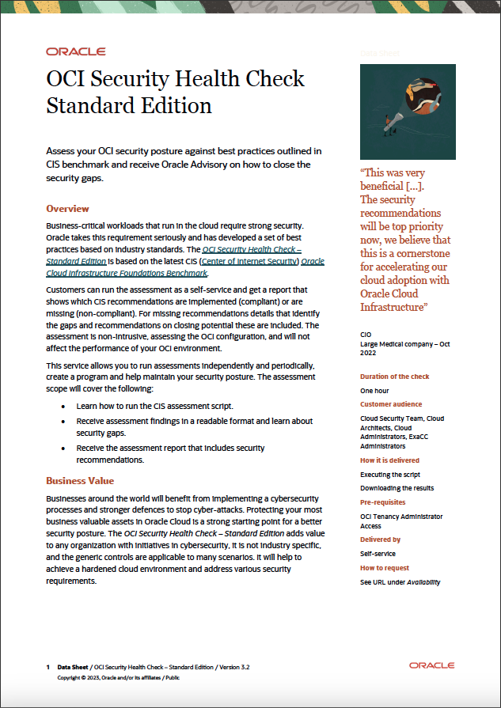

# OCI Security Health Check - Standard Edition

Owner: Olaf Heimburger

Version: 240130

## Introduction


[Download the flyer](./files/resources/OCI%20Security%20Health%20Check%20-%20Standard%20-%20Flyer.pdf)

### When to use this asset?

The *OCI Security Health Check - Standard Edition* checks an OCI tenancy for [CIS Oracle Cloud Infrastructure Foundations Benchmark](https://www.cisecurity.org/benchmark/Oracle_Cloud) compliance.

### Complete Runtime Example

See the *OCI Security Health Check - Standard Edition* in action and watch the [OCI Health Checks - Self Service video](https://www.youtube.com/watch?v=EzjKLxfxaAM).

### Sample Output

After a completed run you will find a directory with a name starting with your tenancy name followed by a timestamp in your working directory (like tenancy_name_YYYYMMDDHHmmss_standard). A zip archive for easier download using the same name will be created, too. Both hold data files for your review.

To start with reviewing the results, open the file named [cis_html_summary_report.html](files/resources/cis_html_summary_report.html)(sample report).
:
      ```
      allow group 'Default'/'grp-auditors' to inspect all-resources in tenancy
      allow group 'Default'/'grp-auditors' to read instances in tenancy
      allow group 'Default'/'grp-auditors' to read load-balancers in tenancy
      allow group 'Default'/'grp-auditors' to read buckets in tenancy
      allow group 'Default'/'grp-auditors' to read nat-gateways in tenancy
      allow group 'Default'/'grp-auditors' to read public-ips in tenancy
      allow group 'Default'/'grp-auditors' to read file-family in tenancy
      allow group 'Default'/'grp-auditors' to read instance-configurations in tenancy
      allow group 'Default'/'grp-auditors' to read network-security-groups in tenancy
      allow group 'Default'/'grp-auditors' to read resource-availability in tenancy
      allow group 'Default'/'grp-auditors' to read audit-events in tenancy
      allow group 'Default'/'grp-auditors' to read users in tenancy
      allow group 'Default'/'grp-auditors' to read vss-family in tenancy
      allow group 'Default'/'grp-auditors' to read dns in tenancy
      allow group 'Default'/'grp-auditors' to use cloud-shell in tenancy
      ```
  - Assign a user to the `grp-auditors` group
  - Log out of the OCI Console

### Run the OCI Security Health Check in OCI Cloud Shell

For a detailed description go to [Run the OCI Security Health Check in OCI Cloud Shell](https://github.com/oracle-devrel/technology-engineering/blob/main/security/security-design/oci-security-health-check-standard/files/oci-security-health-check-standard/README.md#run-the-oci-security-health-check-in-cloud-shell)

## Credits

The *OCI Security Health Check - Standard Edition* streamlines the usage of the bundled [Compliance Checking Script](https://github.com/oracle-quickstart/oci-cis-landingzone-quickstart/blob/main/compliance-script.md) provided by the [CIS OCI Landing Zone Quick Start Template](https://github.com/oracle-quickstart/oci-cis-landingzone-quickstart).

The *OCI Security Health Check - Standard Edition* would not be possible without the great work of the [CIS OCI Landing Zone Quick Start Template Team](https://github.com/oracle-quickstart/oci-cis-landingzone-quickstart/graphs/contributors).

# License

Copyright (c) 2022-2024 Oracle and/or its affiliates.

Licensed under the Universal Permissive License (UPL), Version 1.0.

See [LICENSE](https://github.com/oracle-devrel/technology-engineering/blob/folder-structure/LICENSE) for more details.
