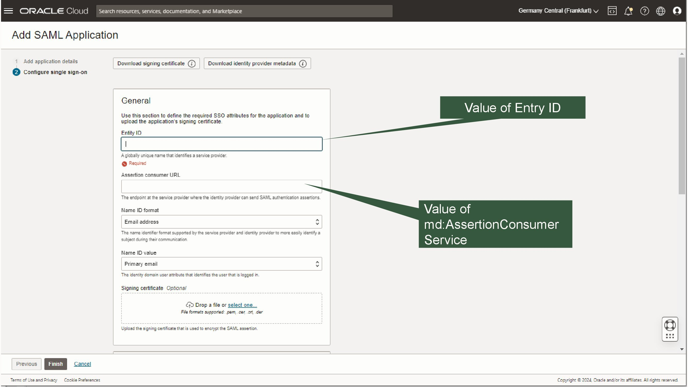
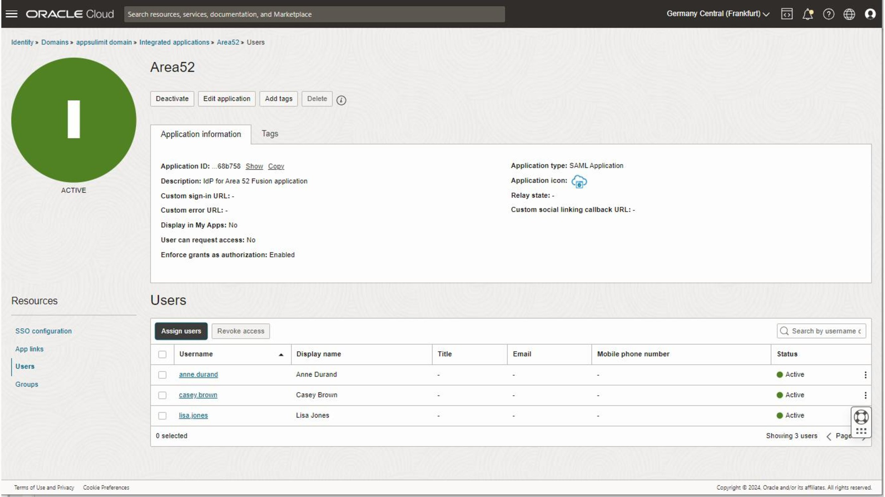
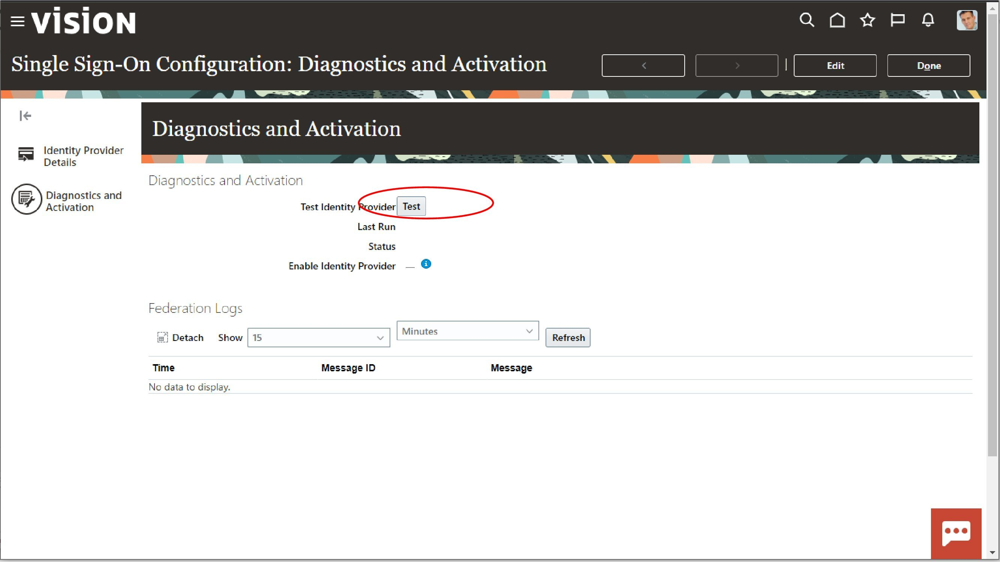

# SSO configuration for Oracle Fusion ERP, Fusion HCM, or Fusion SCM  

Author: Inge Os

The aim is to show how you may configure SSO between an Oracle Fusion Application instance and an instance of  Oracle OCI IAM Domain.  
In the text below the scope of Oracle Fusion Applications is ERP, HCM and SCM.  

In the context of identity integration two interlinked but distinct concepts arise:  
- Federation, runtime SSO, between a service Provider SP and an Identity provider IdP.  
- Provisioning or user synchronization. A process of create, update activate, deactivate, or delete users in one user store, whit a second user store as master.

In the scope of this example, the following terms are used:
- Oracle OCI IAM, abbreviated form of a  Oracle OCI IAM Domain instance
- IDCS, abbreviation for the older IAM solution, Oracle Identity Cloud Service
- Oracle Fusion Apps, Any of Oracle Fusion ERP, Oracle Fusion SCM or Oracle Fusion HCM

Below it will be demonstrated and shown how to configure Single Sign On, SSO, from Oracle Fusion Apps to IAM Domain, with the SAML 2.0 standard as integration protocol. 
  
From a security point of view, there is several security advantages of linking Oracle Fusion Apps to Oracle OCI IAM:
- Oracle OCI IAM offers dynamic risk assessment of the user, with step up authentication and account lockout, if the risk of the user is calculated to exceed a given level. Risk factors includes number of failed logons, rapid change in IP addresses, just to mention a few.
- Oracle OCI IAM offers multi factor authentication. From comments on the internet, it seems that one major reasons for accounts breach, is bad password hygiene, like reuse of password and stolen password. By enabling multi factor authentication, the risk of account theft or account hijacking is severely reduced.
- Simplified integration with 3. Party IdPs like Entra-ID
- One common user store and authentication mechanism across several Oracle Fusion Apps like oracle Fusion EPM, Oracle Fusion ERP and Oracle Fusion extensions with Visual Builder
- Easy integration with Oracle OCI IaaS/PaaS Cloud Services.
OCI IAM offers different Domain types, and the two most significant in the context of Oracle Fusion Apps are Free and Oracle Apps Premium.  
For the pure SSO scenario, Oracle IAM Domain free type might be sufficient, but for dynamic risk evaluation, provisioning, Just-in-time SSO provisioning, Oracle IAM Domain Apps Premium is recommended. Please refer to the Documentation section at the end for details.  

The workflow outlined here, creates the SAML federation only, provisioning is not in the scope. In case you want to add a provision workflow as well,
you may select the <ins>Oracle Fusion Applications Release 13</ins> from the application catalog. In this example we will use a standard SAML application within Oracle OCI IAM.  

The steps are basically the same for Oracle IDCS and Oracle OCI IAM. There are on subtle difference, in IDCS, you may choose the App Catalog, </ins>Oracle Fusion Applications Release 13</ins>, as it does not mandate configuration of provisioning. The Oracle OCI IAM version of *<ins>Oracle Fusion Applications Release 13</ins> app do mandate that provisioning is configured in addition.

A typical authentication flow for Oracle Fusion Apps is like:
- The user connects the browser to her Oracle Fusion Apps welcome page
- Oracle Fusion Apps, if any SSO token is available it is verified
- If the verification fails, or the token does not exist, the browser is redirected to the IdP, Oracle OCI IAM
- Oracle OCI IAM request the user credentials, and if authentication succeeds, and the user is assigned to the correct application within Oracle OCI IAM, a valid SAML assertion is issued, and the browser is redirected back to Oracle Oracle Fusion Apps
- Oracle Fusion Apps verifies the SAML assertion, and if it succeeds, issues a valid Oracle Fusion Apps token
- A valid session is created for Oracle Fusion Apps  
  

Configuration of SSO for Oracle Fusion Apps

The configuration follows a few steps, as outlined below:

1) Oracle OCI IAM: Add a SAML application to the Oracle OCI IAM, added from the app Catalogue in Oracle OCI IAM
2) Download IdP Metadata, for later upload to the Fusion Apps
3) Fusion: Define SAML IdP in the Oracle Fusion Apps security console
4) Fusion: Upload earlier downloaded Oracle OCI IAM metadata
5) Fusion: Download Oracle Fusion Apps metadata to Oracle OCI IAM
6) Oracle OCI IAM Domain: Extract the proper certificate from the Oracle Fusion Apps metadata XML file
7) Oracle OCI IAM Domain: Extract attributes from Oracle Fusion Apps Metadata
8) Oracle OCI IAM Domain: Update Oracle OCI IAM with the extracted values
9) Oracle OCI IAM: Activate the SAML Application and assign users to it
10) Fusion: Test SAML federation with Oracle OCI IAM
11) Fusion: Enable Federation
12) Fusion: Post Configuration of Oracle Fusion Apps

The diagrams below visualize the process 

  
  
  

# Full outline

The process is a little bit back and forth between Oracle OCI IAM console and Oracle Fusion Apps Security Console, for a smooth experience open two incognito windows,
one for each. The test stage, step 10 requires a clean sheet.  

## 1) Oracle OCI IAM Domain: Add a SAML application to the Oracle OCI IAM Domain, added from the app Catalogue in Oracle OCI IAM Domain

First navigate to the applicable Oracle OCI IAM Domain, and select <ins>Integrated Applications</ins>  
  
  
  
Select <ins>SAML application</ins> tab and launch the workflow

  
  
  

You have now entered the main screens for IDP configuration, do not leave the screens before it is completed.
Without valid values for mandatory fields like <ins>Entity ID</ins>, the configuration will not be saved.  
Enter a descriptive name and some meaningful descriptions

  

## 2) Download IdP Metadata, for later upload to the Oracle Fusion Apps

The next step is to download the metadata to a XML file, for later upload to Oracle Fusion Apps. Do not click finish. You may, in the continuation, jump between this screen and the previous screen.  

  

## 3) Fusion: Define SAML IdP in the Oracle Fusion Apps security console

Sign-on to Fusion with an account with access to the <ins>Security Console</ins>  

  

  
  
  Navigate to tools, <ins>Security Console</ins>  

  

Select <ins>Single Sign-on</ins>

  
  
and <ins>Create Identity provider</ins>  

  

## 4) Fusion: Upload earlier downloaded Oracle OCI IAM Domain metadata

Select <ins>Edit</ins> to start configuration

  

Select upload and upload the XML file downloaded earlier. Oracle Fusion Apps will sanity check the XML file, and when accepted the fie name will be shown in the screen.  

  
  
  
  
  
  
Select <ins>Done<ins>, to save the configuration  

  

## 5) Fusion: Download Oracle Fusion Apps metadata to Oracle OCI IAM Domain

Download and save the metadata XML file by click on the download symbol.    
  

## 6) Oracle OCI IAM Domain: Extract the proper certificate from the Oracle Fusion Apps metadata XML file
  
OCI IAM does not have a feature to upload a metadata file directly and automatically extract the values.  
This is a bit of minor work. You need to download the Oracle Fusion Apps metadata file and open it in a tool like Visual Code, Crome or Firefox, to be able to search for the correct attributes. 

Create an empty text file with the following text:  
``
-----BEGIN CERTIFICATE-----
-----END CERTIFICATE-----
``

First step is to create a proper CER file for upload to Oracle OCI IAM 
Locate the <md:KeyDescriptor use="signing"> XML element, and find <dsig:X509Certificate>  
From the md:IDPSSODescriptor element  copy/paste between <dsig:X509Certificate> and </dsig:X509Certificate>  

  
  
Copy the value into the editor:  
``
-----BEGIN CERTIFICATE-----
MIIEDzCCYDVQQDExBZjANBYDVQQDExw0BAYDVQQDExSgwJgYDVQQDEx91Y2YzLXpYDVQQDEx
-----END CERTIFICATE-----
``
and save to a .cer file

## 7) Oracle OCI IAM Domain: Extract attributes from Oracle Fusion Apps Metadata

The values you will need to extract from the Oracle Fusion Apps metadata file are:  
  
|OCI IAM Attribute| XML Path |Attribute name|Example value|
|-----------------|---------|--------------|-------------|
|Relay State|md:SPSSODescriptor/md:AssertionConsumerService|Location|https://login-esss-saas1.ds-fa.oraclepdemos.com/oam/server/fed/sp/sso|
|Enity ID|md:EntityDescriptor|entityID|https://login-esss-saas1.ds-fa.oraclepdemos.com/oam/server/fed/sp/sso|
|AssertionConsumerURL|md:SPSSODescriptor/md:AssertionConsumerService|Location|https://login-esss-saas1.ds-fa.oraclepdemos.com/oam/server/fed/sp/sso|
|SingleLogoutURL|md:SPSSODescriptor/md:SingleLogoutService|Location|https://login-essss-saas1.ds-fa.oraclepdemos.com/oamfed/sp/samlv20|
|LogoutResponseURL|md:SPSSODescriptor/md:SingleLogoutService|ResponseLocation|https://login-essss-saas1.ds-fa.oraclepdemos.com/oamfed/sp/samlv20|

An example table of attributes required by Oracle OCI IAM:  

  

<ins>Entity ID</ins> location within Oracle Fusion Apps metadata  
  

<ins>AssertionConsumerUR</ins>L and <ins>SingleLogoutURL</ins> location within Oracle Fusion Apps metadata  
  

<ins>ResponseLocatio</ins>n Attribute    
  

## 8) Oracle OCI IAM Domain: Update with the extracted values

Navigate back to the first page in the workflow of creating a SAML application within Oracle OCI IAM, click <ins>Next</ins>, all configurations will be on this page  
   

In the general page add 
EntityId and Assertion consumer URL  
Leave the default values for Name ID format and Name ID value  
  

Upload the previously created certificate file .cer file  
  
  
  

Finally add values for Single logout URL and Logout response URL  
  

## 9) Oracle OCI IAM Domain: Activate the SAML Application and assign users to it

The integrated application needs to be activated before any SAML requests are accepted, and only users (or via groups) assigned to the integrated application will be authenticated against it.  

First activate the application  

  
  
  

Assign users, when it is active  

  
  
  

## 10) Fusion: Test SAML federation with Oracle OCI IAM Domain
  
Oracle Fusion Apps will not allow the SSO to be activated before it is tested and the test is successful. The task is undertaken in the Federation configuration screen.  

As a preliminary step, you may open, in a different browser session (incognito window) a separate session and turn on Oracle OCI IAM Diagnostics  
The diagnostic can be useful if the Oracle Fusion Apps to Oracle OCI IAM test fails. 
    
  
  
  
  
To enable federation from Oracle Fusion Apps, you need to run a successful test, from the same browser session.  
Edit the Oracle Fusion Apps SSO configuration  
  
  
  

  
<ins>Select Diagnostics and activation</ins>   
  

Select <ins>test</ins>. The test will bring up a new tab in your current browser window.  
  

  
  
  
 
  
If SSO is correctly configured it will open a new page in the current browser. The current browser shall not have any valid IDCS or Oracle OCI IAM session.  
You need to have the username with the same userid predefined in both Oracle OCI IAM and Oracle Fusion Apps, and the user needs to be either in a assigned group or signed-on directly to the integrated application.  If the userids on both sides of the federation don't match, the federation will fail.  

  

The status screen returned should look like this, with **Authentication Successful**
  

When the tab is closed, the status field in the Oracle Fusion Apps configuration screen is updated, and the SSO federation can be activated.  
  

## 11) Fusion: Enable Federation
  
Click <ins>Edit</ins> in the Oracle Fusion Apps configuration page, to enable federation  
  
  
    
Check the flag <ins>Enable identity provider</ins>  
  
  
  
Save the change  

  

## 12) Fusion: Post Configuration of Oracle Fusion Apps 

The final step is to decide if SSO shall be visible, label <ins>Company Single Sign-on</ins>, and to decide if SAML federation is the only option.

First add Company Single Sign-on to the logon page   

Navigate to the Single Sign-on configuration page  
  

Select <ins>edit</ins>, and check Enable Chooser Login Page, and save   
   

Then select the Identity provider defined earlier  

  

Select <ins>Edit</ins>  
  

If the default identity provider box is checked, the logon page will not be displayed and only federated sign-on is allowed.  

  
  
  
**Piece of advice, keep an independent browser window open, signed-on and open the security center, so the configuration can be reverted before it is put in production.**  

# Documentation Links

Oracle OCI IAM Domain, license types
  
  
Oracle OCI IAM Domain, App catalog
  
  
  
Oracle OCI IAM Domain, SAML configuration  
  
  
Oracle Fusion SSO Configuration

# License

Copyright (c) 2024 Oracle and/or its affiliates.

Licensed under the Universal Permissive License (UPL), Version 1.0.
