# Bypassing MFA within OCI IAM for Service Accounts

Owner: Paul Toal

During authentication, it is widely recognised that Multi-Factor Authentication (MFA) should be used to increase the security of a user's credential and reduce the chance of a brute force attack. However, there are certain use cases where it may be necessary to disable MFA for a particular account.

One common use case is when using an OCI IAM account as a service account to call IAM protected endpoints. For example, Oracle Integration Cloud (OIC) allows users to build integrations and expose them as REST endpoints (amongst other things). When calling that REST endpoint, either BASIC or OAUTH authentication can be used to authenticate the requestor to the REST API.

Whilst the recommended approach is to always use OAUTH authentication, there are situations where this can't be used and BASIC authentication must be used instead. If MFA is enabled on that user account, then BASIC authentication cannot be used as the REST endpoint returns a 401 Unauthorised status code.

This tutorial will show you how to configure OCI IAM sign-on policies to bypass MFA for specific accounts accessing specific resources/applications. The use case is to enable a client (which only supports BASIC authentication) to call a deployed integrations REST endpoint on OIC.

> ***Note*** MFA should only be disabled for specific users and for specific use cases, such as the one described above. As best practice, MFA should be enabled and enforced for all users.

## Prerequisites

 - An OCI tenancy.
 - An OCI Administrator with appropriate permissions manage your IAM Identity Domain.
 - An OIC instance.
 - A sample integration with a REST endpoint deployed within OIC.
 - A test user within IAM with an appropriate OIC app role to call the integration endpoint.

 # Testing User Authentication

 This use case assumes that there is a sign-on policy configured within OCI IAM that enforces MFA for your users (including your test user) and therefore your users get challenged for MFA when they access OIC.

 Let's first test this by logging into the OIC service console as our test user (Marty McFly)...

 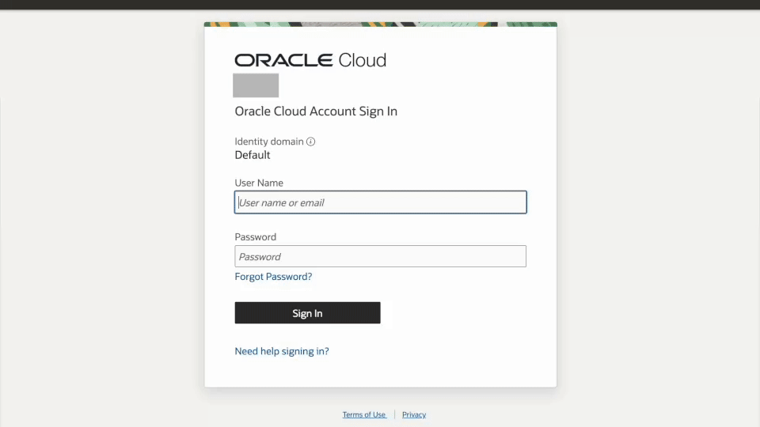

Now that we know MFA is being enforced for our test user, we can show that we are unable to call an OIC integration endpoint using basic authentication. The screenshot below show the 401 Unauthorised status code being returned by Postman.

 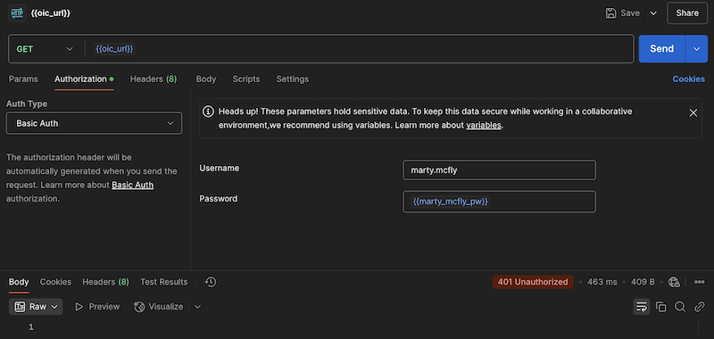

 # Amending the Sign-On Policy

 To allow the service account to be able to call the REST API, changes need to be made to the OCI IAM sign-on policy so that MFA can be bypassed for the service account (marty.mcfly) when accessing the OIC application.

 > ***Note*** The aim is not to disable MFA for the service account for all applications as that introduces unnecessary risk. Therefore, MFA will only be disabled for the service account for the OIC application.

 In this example, MFA for OIC is being enforced by its own sign-on policy. It may be the case that the Default Sign-On policy has been amended to force MFA for all users and all applications by default. If this is the case, then, the recommendation would still be to create an application-specific sign-on policy, just for OIC (or whatever your target application is).

 Looking at the current list of sign-on policies, there are two out-of-the-box policies and the additional OIC policy.

 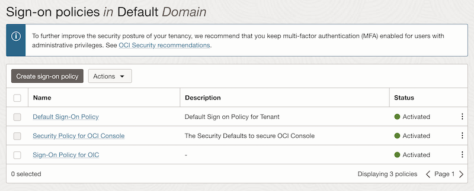
 
 Editing the OIC policy and looking at the rule within it, we can see that it has no conditions current set.

 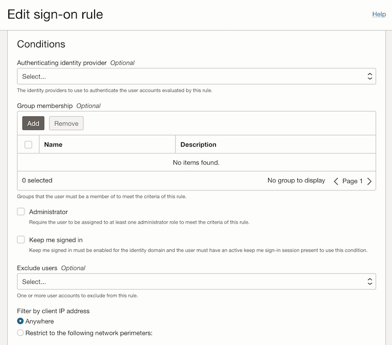

We can also see that the actions are enforcing MFA.

 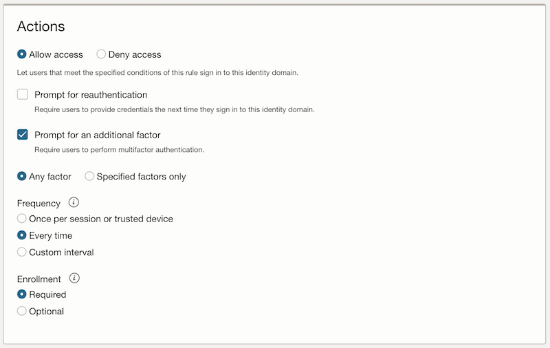

Finally, we can see that the sign-on policy is attached to the OIC application.

 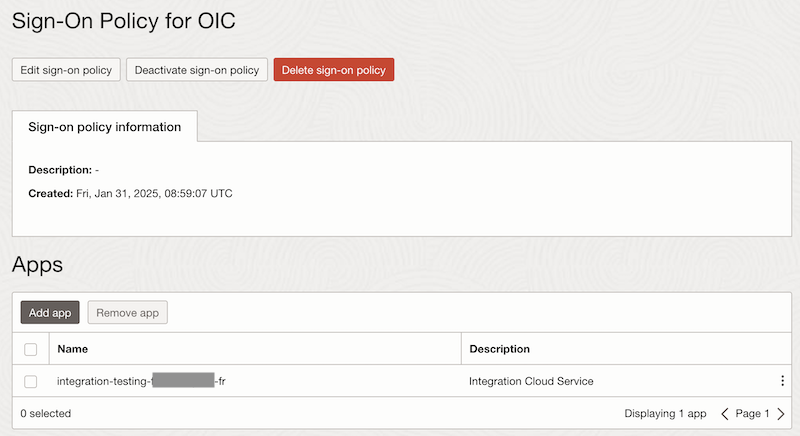

Based on the above policy, all users accessing OIC will be challenged for MFA everytime they authenticate.

However, we need to exclude our service account from MFA. Since your number of service accounts that fall into this use case will typically be a small number, the easiest way of doing this is to add your list of service accounts to the "Exclude Users" condition, i.e.,

 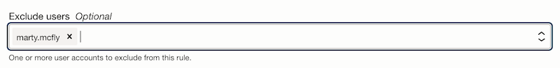

Save those changes and that's it!

 # Testing the API call

 The final step is to test the API call again.

 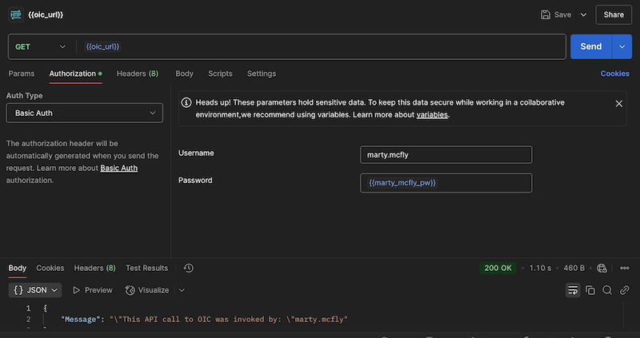

 We can see that our API call is now successful for our service account and it is able to obtain a response.

 # Other Considerations

 The example above shows how easy it is to exclude service accounts from MFA in order to enable this use case. This approach is fine on a small scale, where you only have one or two service accounts. It may be the case that you have many service accounts, or that they are being managed by an external identity service and provisioned into OCI IAM. For example, you might have a group containing all of the OIC service accounts that is populated and managed by an external service. In this situation, since the sign-on policy conditions can only exclude individual users (not groups), you can't take quite the same approach.
 
The above approach is also only appropriate when you have an application-specific sign-on policy enforcing MFA. If the Default Sign-On Policy has been amended so that MFA is being enforced for all users against all applications, then just exluding the user in an app specific policy won't work, as the Default policy will then apply and the user will still be challenged for MFA.

  However, the good news is that you can still meet your use case in either of the above cases. The approach needed is slightly different. In these circumstances we build our application-specific sign-on policy slightly differently.

 Let's build a sign-on policy where the service accounts are contained in a group.

> ***Note*** The sign-on policy has been reverted back to its original state, i.e., removed Marty McFly from the Excluded Users so that MFA is enforced for all users accessing OIC, including Marty.

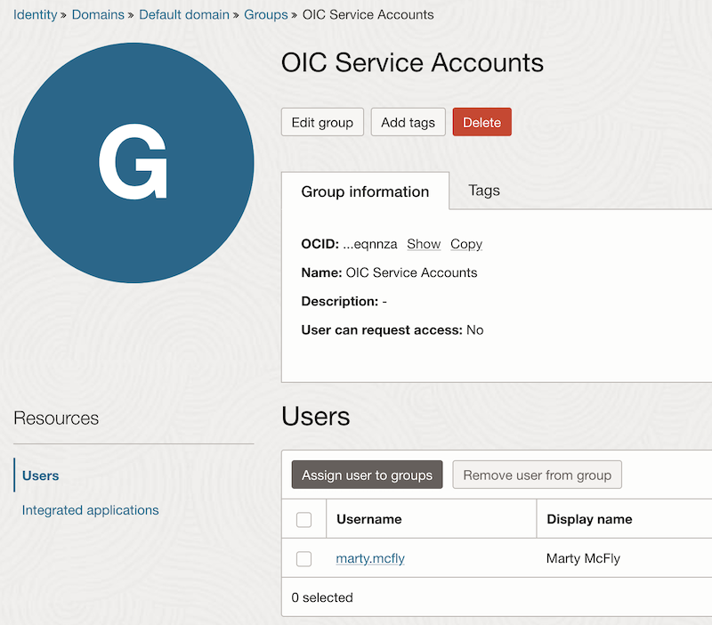

As you can see, I now have created a group containing the service account(s).

Within the sign-on policy, add a new rule (in addition to the existing rule enforcing MFA). This rule will allow any user in the `OIC Service Accounts` group to access OIC, but the actions won't force an additional factor.

Adding a new rule to the existing `Sign-On Policy for OIC`, within the conditions, I add my service accounts group.

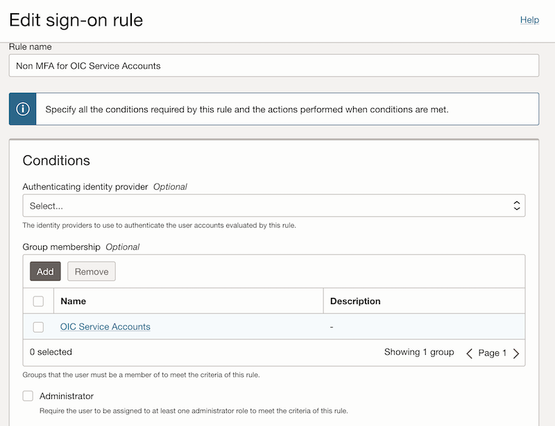

The actions allow access without the additional factor.

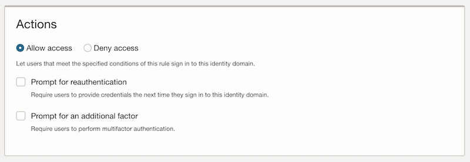

Lastly, the rules within the sign-on policy need to be reordered so that the more specific rule containing the group condition is executed first. This is done using the `Edit Priority` button on the list of rules.

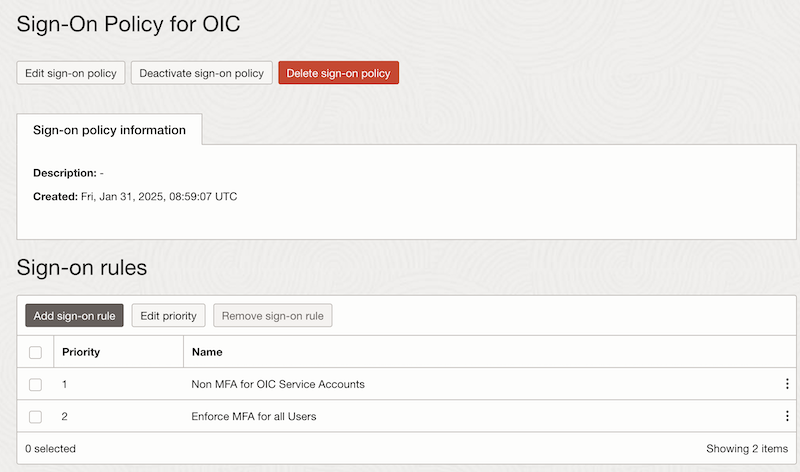

That's it! I can re-test the API call and it is still successful using this alternative approach.

# Summary

In this tutorial, I have explained how you can configure IAM to bypass MFA for service accounts. 

As stated at the top of this tutorial, OAUTH is the preferred mechanism for authenticating to REST APIs. However, for situations where that isn't possible and BASIC authentication must be used, hopefully this tutorial will help you to achieve this.

# License

Copyright (c) 2024 Oracle and/or its affiliates.

Licensed under the Universal Permissive License (UPL), Version 1.0.

See [LICENSE](https://github.com/oracle-devrel/technology-engineering/blob/main/LICENSE) for more details.