# Pyhton Example of Python app with OCI IAM Domainas Identity Provider  

Author: Inge Os

The aim is to show how you may configure SSO between an Pyhton app an instance of  Oracle OCI IAM Domain,
using the OCI IAM SDK for Python.

The example builds on an earlier Oracle By Example post, and the download of the Python SDK from an OCI IAM Domain.

The example has been updated to Python 3.0 and PyJWT 2.x.  

The instructions is based on [Use Oracle Identity Cloud Service's Software Development Kit (SDK) for Authentication in Python Web Applications](https://www.oracle.com/webfolder/technetwork/tutorials/obe/cloud/idcs/idcs_python_sdk_obe/idcs-python-sdk.html) or [Use_OCI_IAM_Domain_SDK_for_Authn.pdf](files/Use_OCI_IAM_Domain_SDK_for_Authn.pdf) but note the changes below. 

Also consult the README.md in the [git repo](https://github.com/oracle-samples/idm-samples/tree/master/idcs-sdk-sample-apps/python/sampleapp) for details on the sampleapp. 
  
## Requirements
This version of the oracle By Example is updated to and requires:
- Python 3.x
- sqlite3 > sqlite3 3.9
- pip upgraded to latest version
- rust
- python setuptool_rust   ```pip install setuptool_rust```

## Envrionment variables  

In the text below the following environment variables are used:
- ```$SDK_HOME=/home/idssdk/iam-sdk```
- ```$APP_HOME=/home/idcsapp```
- ```$PYTHON_VENV_HOME=/home/idcssdk/py38```

## Prepare the environment, and download the SDK and the SDK Application 

- Install Python 3.x and create a virtual environment
- Enable your virtual environment
- Download or clone the git repo https://github.com/oracle-samples/idm-samples/
- Copy all files under https://github.com/oracle-samples/idm-samples/tree/master/idcs-sdk-sample-apps/python or your local clone to a local app directory

The structure should look like:
```
(py36) [idcssdk@iosjumpv3 iam-sample-app]$ find -O1 .
.
./config.json
./db.sqlite3
./LICENSE.md
./manage.py
./python
./python/__init__.py
./python/settings.py
./python/urls.py
./python/wsgi.py
./README.md
./sampleapp
./sampleapp/__init__.py
./sampleapp/admin.py
./sampleapp/apps.py
./sampleapp/migrations
./sampleapp/migrations/__init__.py
./sampleapp/migrations/__pycache__
./sampleapp/migrations/__pycache__/__init__.cpython-36.pyc
./sampleapp/models.py
./sampleapp/static
./sampleapp/static/css
./sampleapp/static/css/sample-app.css
./sampleapp/static/font
./sampleapp/static/font/UniversLTStd-Ex.ttf
./sampleapp/static/font/good times rg.ttf
./sampleapp/static/images
./sampleapp/static/images/oracle.gif
./sampleapp/static/images/oracle.jpg
./sampleapp/templates
./sampleapp/templates/sampleapp
./sampleapp/templates/sampleapp/about.html
./sampleapp/templates/sampleapp/home.html
./sampleapp/templates/sampleapp/includes
./sampleapp/templates/sampleapp/includes/leftmenu.html
./sampleapp/templates/sampleapp/includes/publicheader.html
./sampleapp/templates/sampleapp/index.html
./sampleapp/templates/sampleapp/login.html
./sampleapp/templates/sampleapp/myProfile.html
./sampleapp/tests.py
./sampleapp/urls.py
./sampleapp/views.py
./solution
./solution/.DS_Store
./solution/python_sdk_sample_app.zip
./THIRD_PARTY_LICENSES.txt
```

## Download SDK and Python application  

Download the SDK from the OCI IAM Domain

Navigation to the download pages in your OCI IAM Domain

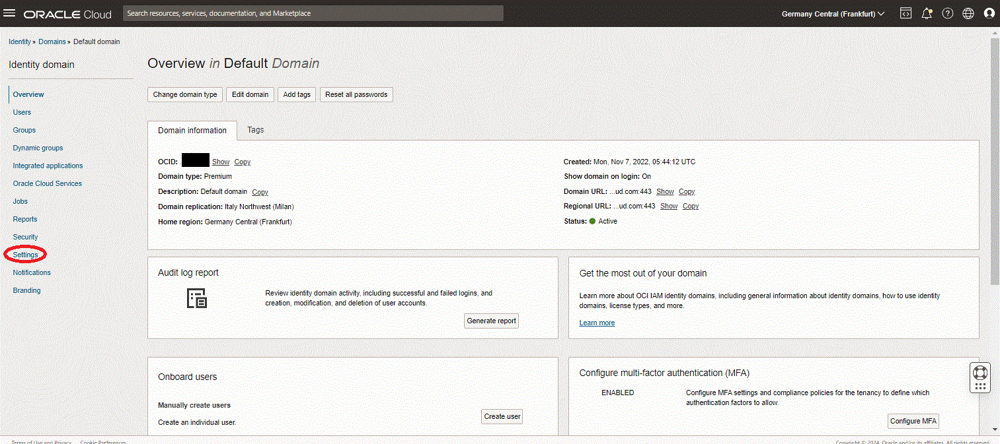 

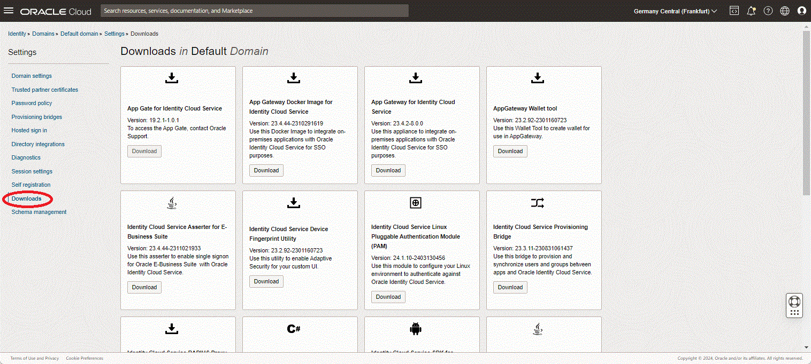  

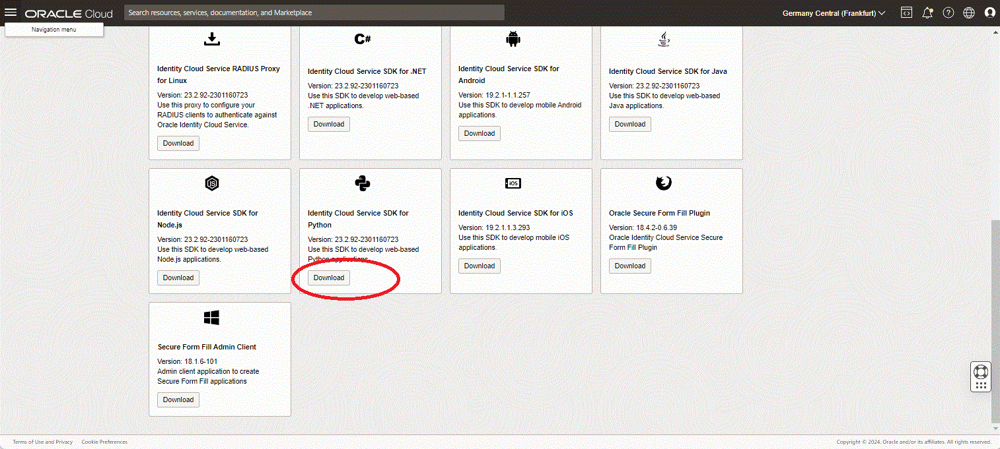  

Unzip the downloaded SDK, and save it, in this example to ```$SDK_HOME``` folder:  

```cd $SDK_HOME unzip /usr/tmp/python-23.2.92-2301160723.zip
Archive:  /usr/tmp/python-23.2.92-2301160723.zip
  inflating: requirements.txt
   creating: src/
  inflating: src/IdcsClient.py
  inflating: src/Constants.py
  inflating: .devops_metadata.json
  inflating: README.txt
  inflating: FileInfo.json
```
  
## Modified files for Python 3.x and PyJWT 2.x compatibility

First the requirements.txt file requests specific versions. For Python 3.x the package specific should be removed.  
A ammened version of [requirements.txt](files/requirements.txt) is added to the repo.  
The requirement.txt should look like:  

```
requests
six
simplejson
PyJWT
lru-ttl
cryptography
```

The [IdcsClient.py](files/IdcsClient.py) uses depreciated features of PyJWT. Use the modified version of [IdcsClient.py](files/IdcsClient.py)  
views.py uses Python 2.x print syntax without ```()```` . Use the ammended version of [views.py](files/views.py)  

Download or clone this repo, or download the individual files.  
Substitute the files in the $SDK_HOME directory above with these files.

## Summary of code changes

- In requrements.txt remove reference to specific versions, use [requirements.txt](files/requirements.txt)
- In [IdcsClient.py](files/IdcsClient.py) change any references to jwt.decode
 ```
 # Change from
jwt.decode(token, verify=False)
 # to
jwt.decode(token, options={"verify_signature": False},algorithms=['RS256'])```
```
These changes is done in [IdcsClient.py](files/IdcsClient.py)
- In view.py, a part for the sample app, Python V2 print syntax is used, without ```()```,  
change print statements to Python V3 syntax.
Use the updated version [views.py](files/views.py)  
  


## Create a confidential application in your OCI IAM Domain

The screens are changed from IDCS look&feel to OCI IAM look&feel, but the functionality is exactly the same.  
The only difference is that, despite you may check the box, OCI IAM Domains will require HTTPS.

The simple Python app is configured with HTTP, it is recommended to use the OCI Load Balancer as termination point for TLS.

Navigate to your OCI IAM Domain, and select integrated applications  

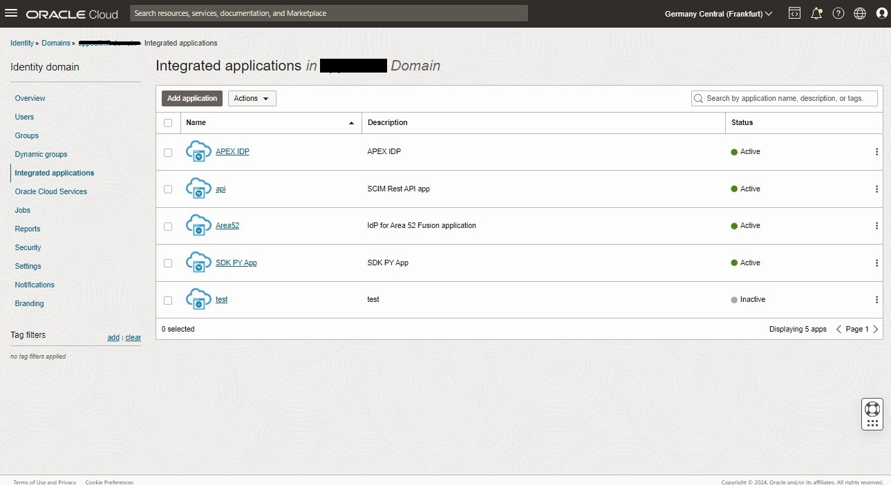

Select create application and select create confidential application


Fill inn name, leave the others 

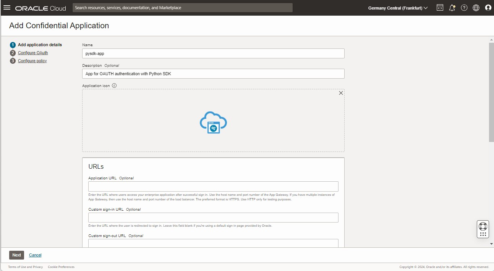

Select configure oauth  

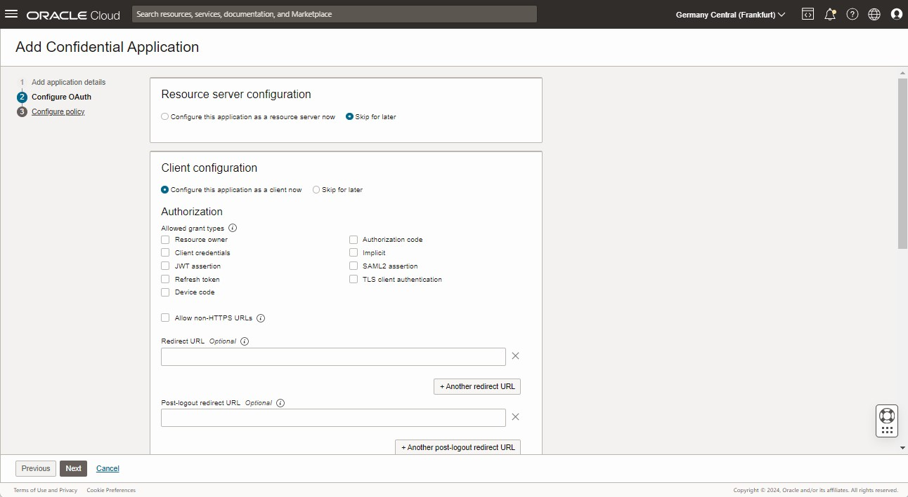

Tick off Authorization Code and Client Credentials, ticking off HTTP only is not recommended, it will still require HTTPS  

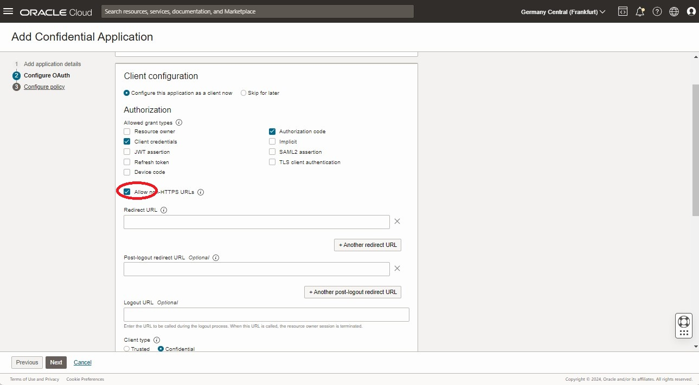

Enter redirect ULR (user server/callback) and Post-logout redirect 

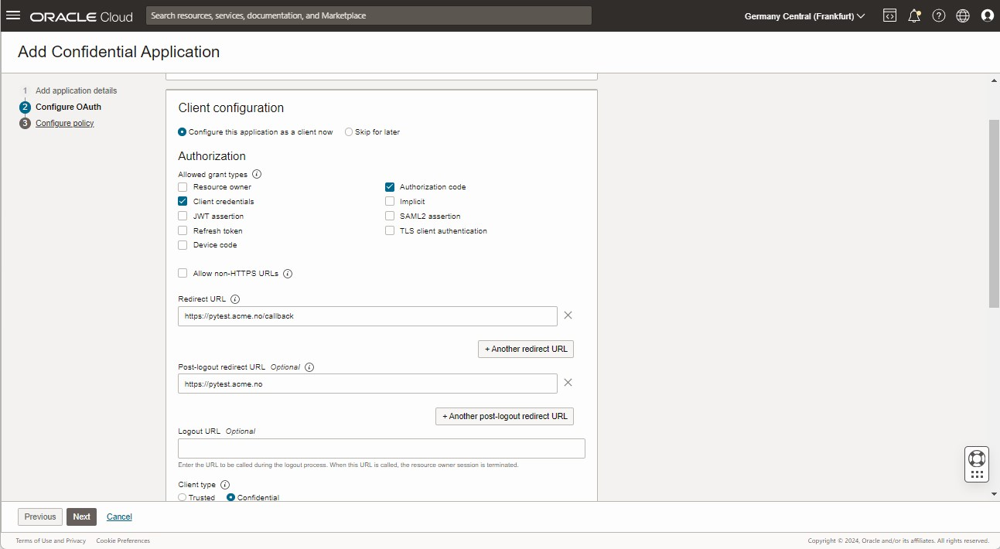

copy the client-id and client-secret. They will be required in the client app configuration

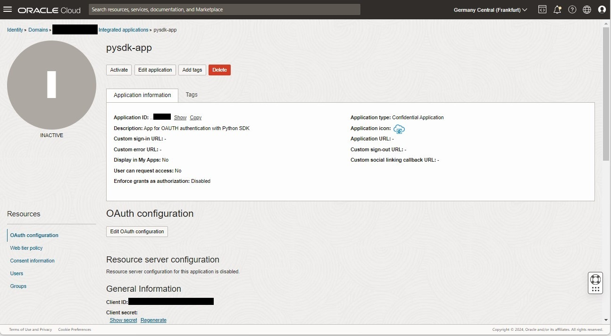

Activate the application

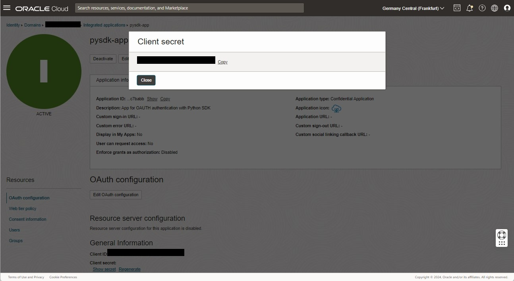

## Prepare the python environment

Activate the Python 3.x virtual environment previously created, and then add all the required Python packages.
Navigate to the directory with the unzipped version of the Python SDK, and edit the file requirements.txt and remove all hard version dependencies.
(modified version of [requirements.txt](file/requirements) )  

(These are Python 2.x specific) as follows:
Change from:
```
requests==2.21.0
six==1.12.0
simplejson==3.16.0
PyJWT==2.4.0
lru-ttl==0.0.7
cryptography==3.3.2
```
to:
```
requests
six
simplejson
PyJWT
lru-ttl
cryptography
```
Install the requirements with ```pip install -r requirements.txt``` 
Please note ```setuptools_rust``` needs to be installed prior to installing the requirements

 ## Prepare Application

 Navigate to the directory where the Python app is unpacked
 Clone this repo or download the files as follows:
 -  to two locations, ```$APP_HOME/.``` and ```$APP_HOME/sampleapp/.```
 -  to ```$APP_HOME/sampleapp/.```
 -  to ```$APP_HOME/sampleapp/.```

 Finally, if the version of sqlite3 installed is below the required version, you may either upgrade sqlite3 or patch the file: 

 ```$PYTHON_VENV_HOME/lib64/python3.6/site-packages/django/db/backends/sqlite3/base.py``` line 66  

 ```if Database.sqlite_version_info < (3, 9, 0):``` to the sqlite3 version you have installed  

## Update the application 

Edit $APP_HOME/config.json, and fill inn the clientid, client secret from the confidential application created above, and add in the URL to the OCI IAM Domain.

```
  cat config.json
{
  "ClientId" : "8caf8caf8caf8caf8caf8caf8caf",
  "ClientSecret" : "d11fb-d11fb--d11fb-d11fb-d11fb",
  "BaseUrl" : "https://idcs-myociiamservice.identity.oraclecloud.com",
  "AudienceServiceUrl" : "https://idcs-myociiamservice.identity.oraclecloud.com",
  "scope" : "urn:opc:idm:t.user.me openid",
  "TokenIssuer" : "https://identity.oraclecloud.com/",
  "redirectURL": "http://localhost:8000/callback",
  "logoutSufix":"/oauth2/v1/userlogout",
  "LogLevel":"INFO",
  "ConsoleLog":"True"
}
```

 ## Initial run of the application

Initially the application require a migration step:
```
cd $APP_HOME
python manage.py migrate
```
 ## Startup of the application

 ```
cd $APP_HOME
python manage.py run server
```
Output from the start command
```
 python manage.py runserver 10.10.0.144:8080
Watching for file changes with StatReloader
Performing system checks...

System check identified no issues (0 silenced).
October 07, 2024 - 19:24:54
Django version 3.2.25, using settings 'python.settings'
Starting development server at http://10.10.0.144:8080/
Quit the server with CONTROL-C.
```

View the server output from the test server, demonstrates the callback from the OCI IAM Domain.  
   
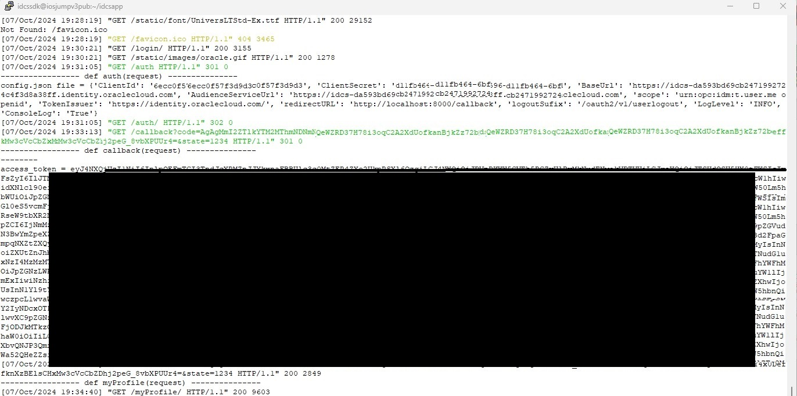

 ## Test through the browser

Start the application

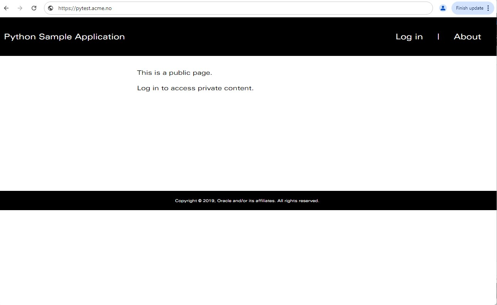  
  
Select login
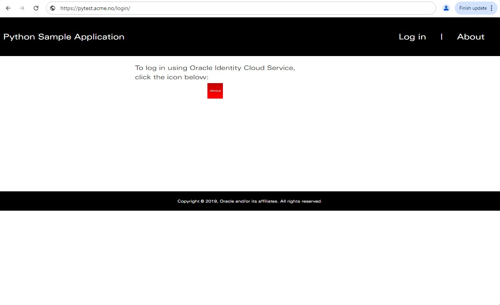  
  
Redirected to OCI IAM Domain as IDP
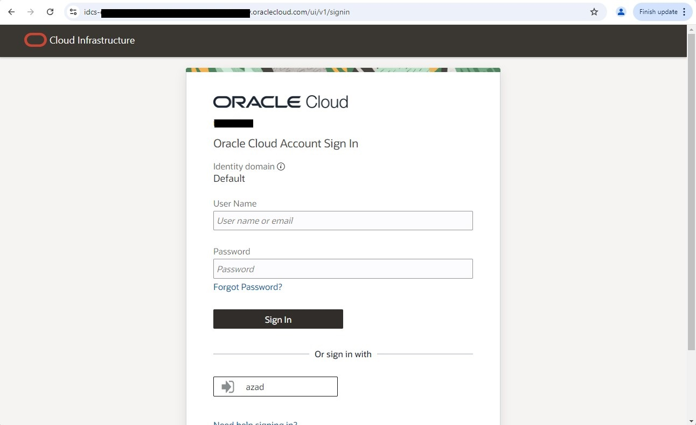  
  
Logged on, select my profile
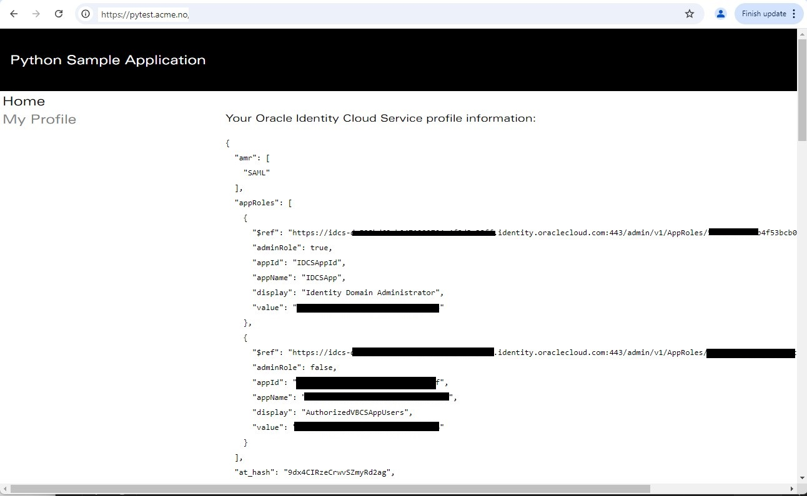  
  

# Documentation Links

Oracle OCI IAM Domain, license types:  
[OCI IAM Domain Types](https://docs.oracle.com/en-us/iaas/Content/Identity/sku/overview.htm)  
  
Use Oracle Identity Cloud Service's Software Development Kit (SDK) for Authentication in Python Web Applications,
original article:  
[idcs_python_sdk_obe](https://www.oracle.com/webfolder/technetwork/tutorials/obe/cloud/idcs/idcs_python_sdk_obe/idcs-python-sdk.html)

Git repo for OCI IAM Domain Python Samples:  
[idcs-sdk-sample-apps/python](https://github.com/oracle-samples/idm-samples/tree/master/idcs-sdk-sample-apps/python)


# License

Copyright (c) 2024 Oracle and/or its affiliates.

Licensed under the Universal Permissive License (UPL), Version 1.0.

See LICENSE for more details.
