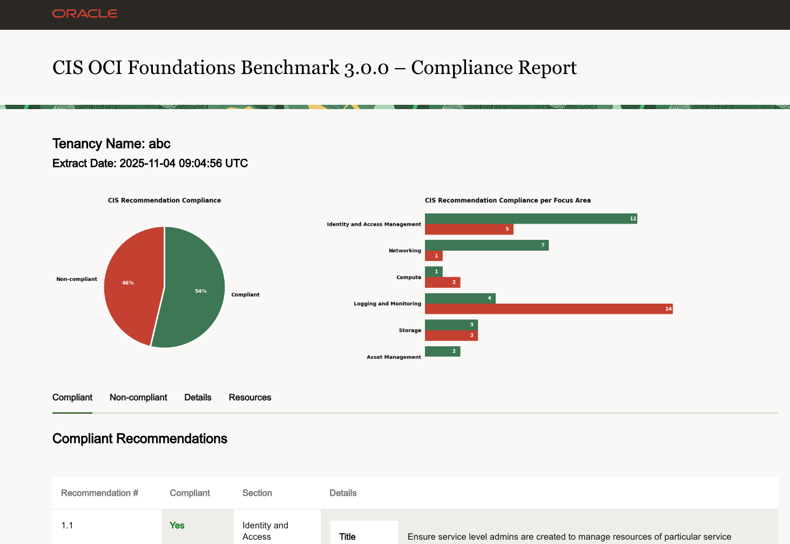

# OCI Security Health Check - Standard Edition

Owner: Olaf Heimburger

Version: 260105 (cis_report.py version 3.1.1.1) for CIS OCI Foundation Benchmark 3.0.0

# Introduction


[Download the flyer](./files/resources/OCI%20Security%20Health%20Check%20-%20Standard%20-%20Flyer.pdf)

## When to use this asset?

The *OCI Security Health Check - Standard Edition* checks your OCI tenancy for [CIS Oracle Cloud Infrastructure Foundations Benchmark](https://www.cisecurity.org/benchmark/Oracle_Cloud) compliance.

## Disclaimer

This asset covers the OCI platform as specified in the *CIS Oracle Cloud Infrastructure Foundations Benchmark*, only. Any workload provisioned in Databases, Compute VMs (running any Operating System), the Container Engine for Kubernetes, or in the VMware Solution is *out of scope* of the *OCI Security Health Check*.

**This is not an official Oracle application and it is not supported by Oracle Support.**

## Before you begin

The main goals of this script are:

- Make the run as easy and smooth as possible.
- Do not affect your desktop whenever possible.
- The required policy statements have been updated. **Please review and update your configuration.**
- **For a successful run, this script requires an Internet connection.**

## Benefits of this package

The file `standard.sh` acts as the main entry point and does the following:

- Automatic check for Python runtime version
- Automatic venv creation and activation
- Automatic installation of required Python libraries
- Automatic **OCI Cloud Shell** and tenancy name detection
- Automatic creation of timestamped output directory
- Call of `cis_reports.py`
- Automatic output archive (ZIP file) creation
- Automatic runtime protocol
- Support for encrypted archive (ZIP file)

This package includes *two* files
- standard.sh
- scripts/cis_reports/cis_reports.py

It was tested on **OCI Cloud Shell** with **Public network**, **Oracle Linux**, **MacOS 12** and higher.

## Complete Runtime Example

See the *OCI Security Health Check - Standard Edition* in action and watch the [OCI Health Checks - Self Service video](https://www.youtube.com/watch?v=EzjKLxfxaAM).

# Getting Started with the *OCI Security Health Check - Standard Edition*

## Download and verify the release file

Before running the *OCI Security Health Check - Standard Edition* you should download and verify it.

  - Download the latest distribution [oci-security-health-check-standard-260105.zip](https://github.com/oracle-devrel/technology-engineering/raw/main/security/security-design/shared-assets/oci-security-health-check-standard/files/resources/oci-security-health-check-standard-260105.zip).
  - Download the respective checksum file:
    - [oci-security-health-check-standard-260105.sha512](https://github.com/oracle-devrel/technology-engineering/raw/main/security/security-design/shared-assets/oci-security-health-check-standard/files/resources/oci-security-health-check-standard-260105.sha512).
    - [oci-security-health-check-standard-260105.sha512256](https://github.com/oracle-devrel/technology-engineering/raw/main/security/security-design/shared-assets/oci-security-health-check-standard/files/resources/oci-security-health-check-standard-260105.sha512256).
  - Verify the integrity of the distribution. Both files must be in the same directory (for example, in your downloads directory).

    On MacOS:
    ```
    cd <your_downloads_directory>
    shasum -a 512256 -c oci-security-health-check-standard-260105.sha512256
    ```

    On Linux (including Cloud Shell):
    ```
    cd <your_downloads_directory>
    sha512sum -c oci-security-health-check-standard-260105.sha512
    ```

**Reject the downloaded file if the check fails!**

### In OCI Cloud Shell

In OCI Cloud Shell you can do a short cut without downloading the files mentioned above to your desktop:

1. Login to your OCI console.
2. Open Cloud Shell
3. Run these commands in your Cloud Shell:
  ```
  wget -q https://github.com/oracle-devrel/technology-engineering/raw/main/security/security-design/shared-assets/oci-security-health-check-standard/files/resources/oci-security-health-check-standard-260105.zip
  wget -q https://github.com/oracle-devrel/technology-engineering/raw/main/security/security-design/shared-assets/oci-security-health-check-standard/files/resources/oci-security-health-check-standard-260105.sha512
  sha512sum -c oci-security-health-check-standard-260105.sha512
  unzip -q oci-security-health-check-standard-260105.zip
  ```

## Prepare the OCI Tenancy

### Single Run

You can run the assessment as a member of the OCI `Administrator` group or
create a group for auditing and assign the respective user to it.

Running the assessment script as an OCI `Administrator` is the easiest and
quickest way. If you decide to use this option, please continue reading in
[Run the OCI Security Health Check in Cloud Shell](./files/oci-security-health-check-standard/README.md#run_cloud_shell).

### Recurring usage

For recurring usage, setting up a group for auditing is recommended. For setting this up follow the steps documented in the next section.
This applies for scenarios using the OCI Cloud Shell with public Internet access. For additional usage scenarios see the detailed instructions [README](./files/oci-security-health-check-standard/README.md).

### Setting up an *Auditor* group and policy

Using an auditor group is the recommended way to run the assessment script.
To create a group for auditing do the following steps:

  - Log into OCI Console as OCI administrator.
  - In your Default domain create a group `grp-auditors`
  - Create a policy `pcy-auditing` with these statements (if your tenancy does not have Domains, replace `'Default'/'grp-auditors'` with `grp-auditors`):
    ```
      allow group 'Default'/'grp-auditors' to inspect all-resources in tenancy
      allow group 'Default'/'grp-auditors' to read audit-events in tenancy
      allow group 'Default'/'grp-auditors' to read buckets in tenancy
      allow group 'Default'/'grp-auditors' to read capture-filters in tenancy
      allow group 'Default'/'grp-auditors' to read data-safe-family in tenancy
      allow group 'Default'/'grp-auditors' to read domains in tenancy
      allow group 'Default'/'grp-auditors' to read file-family in tenancy
      allow group 'Default'/'grp-auditors' to read instance-configurations in tenancy
      allow group 'Default'/'grp-auditors' to read instances in tenancy
      allow group 'Default'/'grp-auditors' to read keys in tenancy
      allow group 'Default'/'grp-auditors' to read load-balancers in tenancy
      allow group 'Default'/'grp-auditors' to read logging-family in tenancy
      allow group 'Default'/'grp-auditors' to read nat-gateways in tenancy
      allow group 'Default'/'grp-auditors' to read network-security-groups in tenancy
      allow group 'Default'/'grp-auditors' to read public-ips in tenancy
      allow group 'Default'/'grp-auditors' to read resource-availability in tenancy
      allow group 'Default'/'grp-auditors' to read tag-namespaces in tenancy
      allow group 'Default'/'grp-auditors' to read usage-budgets in tenancy
      allow group 'Default'/'grp-auditors' to read usage-reports in tenancy
      allow group 'Default'/'grp-auditors' to read users in tenancy
      allow group 'Default'/'grp-auditors' to read vaults in tenancy
      allow group 'Default'/'grp-auditors' to read vss-family in tenancy
      allow group 'Default'/'grp-auditors' to use cloud-shell in tenancy
      allow group 'Default'/'grp-auditors' to use cloud-shell-public-network in tenancy
      allow group 'Default'/'grp-auditors' to use ons-family in tenancy where any {request.operation!=/Create*/, request.operation!=/Update*/, request.operation!=/Delete*/, request.operation!=/Change*/}
    ```
  - Assign a user to the `grp-auditors` group.
  - Log out of the OCI Console.

## Run the OCI Security Health Check in OCI Cloud Shell

For a detailed description go to [Run the OCI Security Health Check in OCI Cloud Shell](./files/oci-security-health-check-standard/README.md#run_cloud_shell)

## Sample Output

After a completed run you will find a directory with a name starting with your tenancy name followed by a timestamp in your working directory (like `tenancy_name_YYYYMMDDHHmmss_standard`). A zip archive for easier download using the same name will be created, too. Both hold data files for your review.

To start with reviewing the results, open the file named `tenancy_name_YYYYMMDDHHmmss_standard_cis_html_summary_report.html`.

It may look like this example:


# Advanced Use

The script `standard.sh` supports additional commandline options:

- `-h` prints a summary of supported options
- `-v` prints the versions of the components used
- `--cis 'options'` if you need to pass additional options to the cis-report.py. Always use single qoutes around the options. Examples:
  - `--cis '-h'` prints the options of cis_report.py
  - `--cis '--debug'` runs cis_report.py in debug mode with additional output
- `--zip-protect` asks for a password of your choice. Zero-length passwords are not supported!

# Known Issues

1. Python 3.8 is not supported anymore.
   OCI Cloud Shell is the minimal required environment. The Python version used in OCI Cloud Shell is 3.9.
2. Diagrams are not part of the HTML page.
   This may be because of broken `numpy installation`. The following command should resolve this:
   `pip3 install --upgrade --force-reinstall --user numpy`

# Credits

The *OCI Security Health Check - Standard Edition* streamlines the usage of the [CIS Compliance Script](https://github.com/oci-landing-zones/oci-cis-landingzone-quickstart/blob/main/README.md).

The *OCI Security Health Check - Standard Edition* would not be possible without the great work of the [CIS OCI Landing Zone Quick Start Template Team](https://github.com/oci-landing-zones/oci-cis-landingzone-quickstart/graphs/contributors).

# Certification

The CIS Compliance Script has been certified by the [CIS Center of Internet Security for the OCI Oracle Cloud Foundation Benchmark v3.0.0, Level 1 and 2](https://www.cisecurity.org/partner/oracle).

# License

Copyright (c) 2022-2026 Oracle and/or its affiliates.

Licensed under the Universal Permissive License (UPL), Version 1.0.

See [LICENSE](https://github.com/oracle-devrel/technology-engineering/blob/main/LICENSE) for more details.
